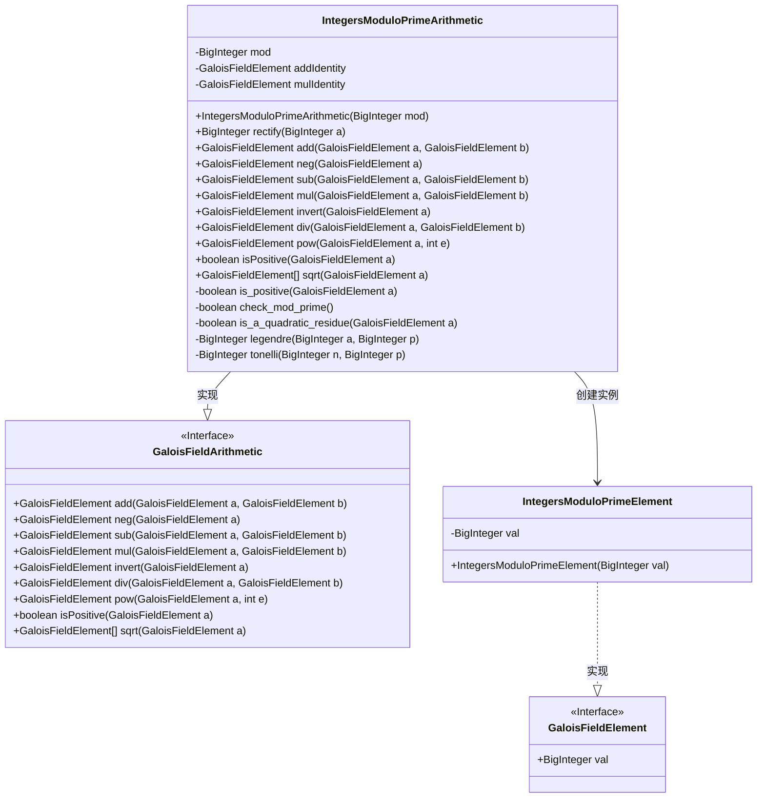
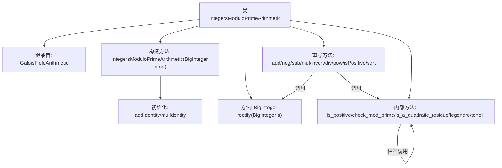
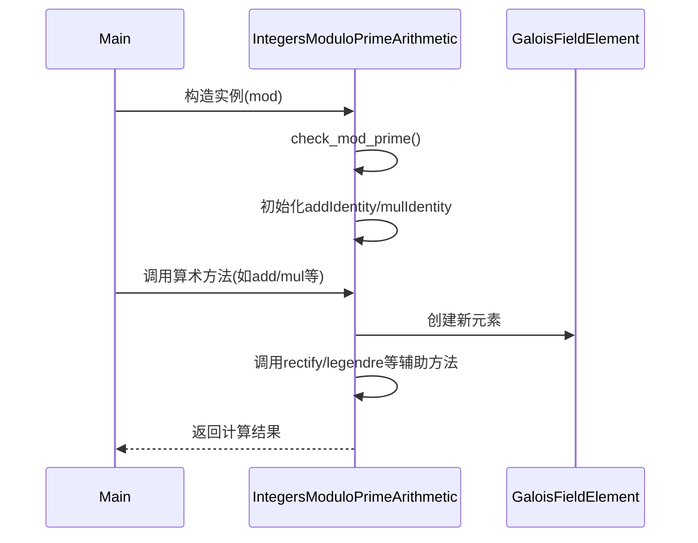

# 基础信息

|      |      |
|------|------|
| 名称 | IntegersModuloPrimeArithmetic |
| 编码语言 | .java |
| 代码路径 | WeFe/mpc/mpc-common/src/main/java/com/welab/wefe/mpc/pir/protocol/nt/field/integers/IntegersModuloPrimeArithmetic.java |
| 包名 | com.welab.wefe.mpc.pir.protocol.nt.field.integers |
| 依赖项 | ['com.welab.wefe.mpc.pir.protocol.nt.field.GaloisFieldArithmetic', 'com.welab.wefe.mpc.pir.protocol.nt.field.GaloisFieldElement', 'java.math.BigInteger'] |
| 概述说明 | 实现了素数模数下的整数运算类，包含加减乘除、幂运算、平方根等操作，确保模数为素数并支持二次剩余判定。 |

# 说明

IntegersModuloPrimeArithmetic类继承自GaloisFieldArithmetic，实现了素数模数下的整数运算。构造函数接收BigInteger模数参数，初始化加法单位元0和乘法单位元1，并检查模数是否为素数。类中定义了加法、减法、乘法、除法、取反、求逆、幂运算等基本运算方法，以及判断元素正负、求平方根等辅助方法。求平方根使用Tonelli-Shanks算法实现，包含Legendre符号计算和二次剩余判断。所有运算结果都通过rectify方法确保在模数范围内。该类完整实现了素数域上的算术运算体系。

# 类列表 Class Summary

| 名称   | 类型  | 说明 |
|-------|------|-------------|
| IntegersModuloPrimeArithmetic | class | 整数模素数算术类，继承自GaloisFieldArithmetic，实现模素数域上的加减乘除、幂运算、平方根等操作，包含Tonelli-Shanks算法求平方根和Legendre符号计算。 |

## 类 IntegersModuloPrimeArithmetic

|      |      |
|------|------|
| 访问范围 | public |
| 类型 | class |
| 名称 | IntegersModuloPrimeArithmetic |
| 说明 | 整数模素数算术类，继承自GaloisFieldArithmetic，实现模素数域上的加减乘除、幂运算、平方根等操作，包含Tonelli-Shanks算法求平方根和Legendre符号计算。 |

### UML类图

这段代码实现了一个基于素数模数的有限域算术类`IntegersModuloPrimeArithmetic`，继承自抽象类`GaloisFieldArithmetic`。该类提供了加、减、乘、除、幂运算等基本算术操作，以及求平方根、判断正数等高级功能。核心使用`BigInteger`进行大数运算，通过`IntegersModuloPrimeElement`封装域元素。类中包含Tonelli-Shanks算法实现平方根计算，Legendre符号判断二次剩余等数论方法，确保在素数模数下的正确运算。整体设计遵循有限域算术接口规范，具有严格的数学正确性保证。

### 内部方法调用关系图

该流程图展示了IntegersModuloPrimeArithmetic类的完整结构，包括其继承关系、核心算术运算方法和内部辅助方法。时序图则描述了从对象构造到方法调用的完整交互过程，突出显示了素数域算术运算中涉及的对象协作和内部方法调用链。该类实现了模素数域上的加、减、乘、除等基本运算，并通过Tonelli-Shanks算法支持平方根计算，所有运算都严格保持模素数域的性质。

### 字段列表 Field List

| 名称  | 类型  | 说明 |
|-------|-------|------|

### 方法列表

| 名称  | 类型  | 说明 |
|-------|-------|------|
| check_mod_prime | boolean | 检查模数是否为素数，使用概率性测试，置信参数为1。 |
| invert | GaloisFieldElement | 该方法重写父类方法，用于计算伽罗瓦域元素的乘法逆元。通过调用BigInteger的modInverse方法实现，返回基于模数的新元素。 |
| pow | GaloisFieldElement | 方法重写，计算GaloisFieldElement的幂。若指数e为0返回乘法单位元，否则返回a的e次方模mod的结果。 |
| is_a_quadratic_residue | boolean | 判断GaloisFieldElement是否为二次剩余，通过Legendre符号等于1确认。 |
| mul | GaloisFieldElement | 该方法实现伽罗瓦域元素乘法，返回两元素值乘积对模数取模后的新元素。 |
| neg | GaloisFieldElement | 该方法重写父类方法，对伽罗瓦域元素取负值，返回模运算后的新元素实例。 |
| rectify | BigInteger | 方法rectify对BigInteger参数a取模mod并返回结果。 |
| is_positive | boolean | 检查GaloisFieldElement值是否为正，通过比较其值与模数一半的大小关系。 |
| isPositive | boolean | 检查伽罗瓦域元素是否为正：比较元素值与模数的一半，小于则为正。 |
| sub | GaloisFieldElement | 该方法实现了伽罗瓦域元素的减法，通过将第二个元素取反后与第一个元素相加来完成。 |
| add | GaloisFieldElement | 该方法实现了伽罗瓦域元素的加法运算，返回两元素值相加后对模数取余的结果。 |
| sqrt | GaloisFieldElement[] | 该方法计算GaloisFieldElement的平方根。若输入是二次剩余，返回两个有序根（较小值在前）；否则返回两个-1。使用Tonelli算法求根并比较大小排序。 |
| div | GaloisFieldElement | 该方法实现了伽罗瓦域元素的除法运算，通过乘法与逆元运算完成。 |
| legendre | BigInteger | 计算勒让德符号的函数，输入a和素数p，返回a的(p-1)/2次方模p的结果。 |
| tonelli | BigInteger | Tonelli算法实现，用于求解模平方根。分解p-1为q*2^s，处理s=1特例，否则寻找z并迭代计算，最终返回模平方根r。 |

