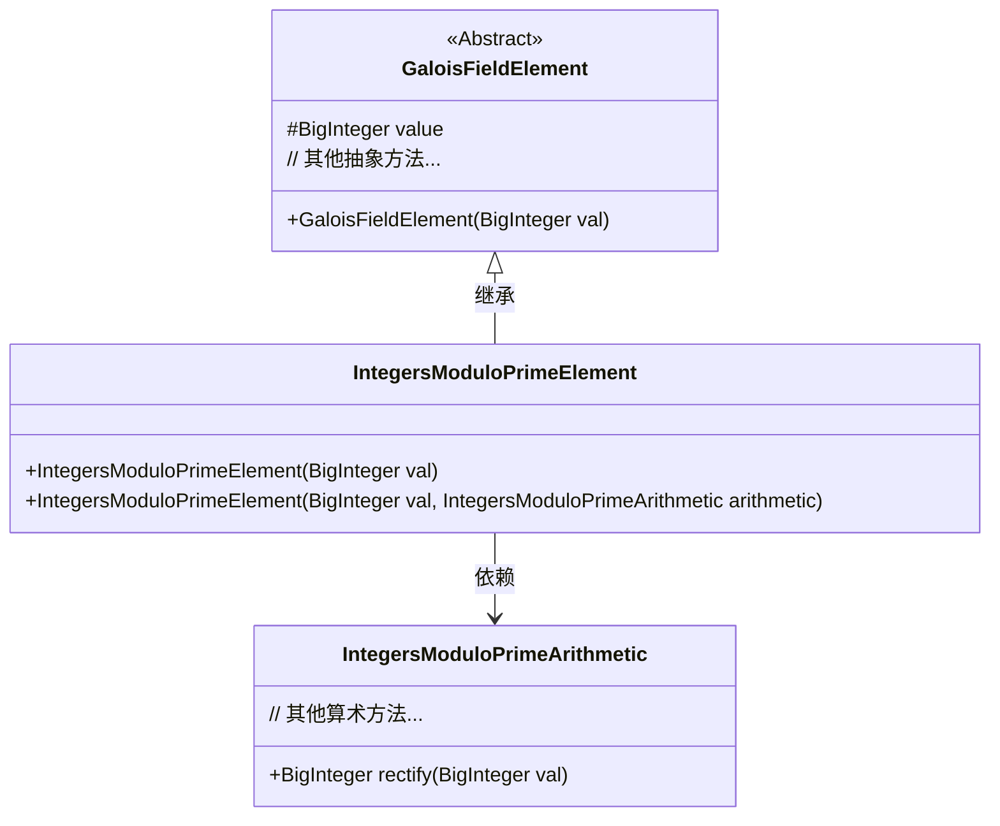
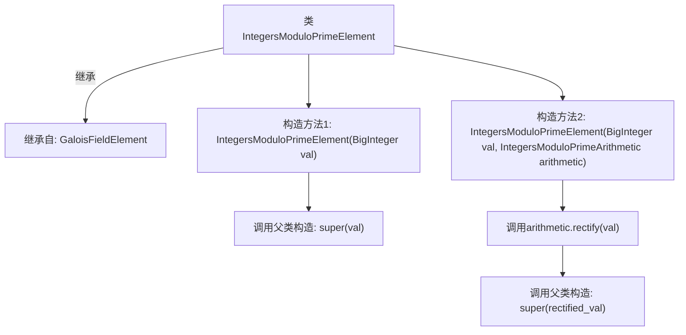

# 基础信息

|      |      |
|------|------|
| 名称 | IntegersModuloPrimeElement |
| 编码语言 | .java |
| 代码路径 | WeFe/mpc/mpc-common/src/main/java/com/welab/wefe/mpc/pir/protocol/nt/field/integers/IntegersModuloPrimeElement.java |
| 包名 | com.welab.wefe.mpc.pir.protocol.nt.field.integers |
| 依赖项 | ['com.welab.wefe.mpc.pir.protocol.nt.field.GaloisFieldElement', 'java.math.BigInteger'] |
| 概述说明 | 整数模素数元素类，继承自伽罗瓦域元素类，提供两种构造方法：直接赋值或通过算术对象校正后赋值。 |

# 说明

IntegersModuloPrimeElement类继承自GaloisFieldElement，用于表示素数模整数域中的元素。该类包含两个构造函数：第一个构造函数接收BigInteger类型的值val并直接调用父类构造函数；第二个构造函数额外接收IntegersModuloPrimeArithmetic类型的算术运算对象，并在调用父类构造函数前先对val进行校正处理。

# 类列表 Class Summary

| 名称   | 类型  | 说明 |
|-------|------|-------------|
| IntegersModuloPrimeElement | class | IntegersModuloPrimeElement类继承自GaloisFieldElement，提供两种构造方法：一种接收BigInteger值，另一种接收BigInteger和算术运算对象。 |

## 类 IntegersModuloPrimeElement

|      |      |
|------|------|
| 访问范围 | public |
| 类型 | class |
| 名称 | IntegersModuloPrimeElement |
| 说明 | IntegersModuloPrimeElement类继承自GaloisFieldElement，提供两种构造方法：一种接收BigInteger值，另一种接收BigInteger和算术运算对象。 |

### UML类图

这段代码展示了一个有限域元素类的继承结构。IntegersModuloPrimeElement 继承自抽象基类 GaloisFieldElement，表示素数模整数域中的元素。它通过两个构造函数初始化：一个直接接收 BigInteger 值，另一个额外依赖 IntegersModuloPrimeArithmetic 类进行值校正（rectify）。类图中清晰地体现了继承关系和跨类协作，其中算术操作被委托给专门的 IntegersModuloPrimeArithmetic 类处理。

### 内部方法调用关系图

这段代码展示了一个继承自GaloisFieldElement的IntegersModuloPrimeElement类，包含两个构造函数。第一个构造函数直接传递BigInteger值给父类构造；第二个构造函数通过IntegersModuloPrimeArithmetic的rectify方法处理输入值后，再将结果传递给父类构造。流程图清晰呈现了类的继承关系和构造函数的调用链，特别突出了第二个构造函数对算术对象的依赖处理过程。

### 字段列表 Field List

| 名称  | 类型  | 说明 |
|-------|-------|------|

### 方法列表

| 名称  | 类型  | 说明 |
|-------|-------|------|

