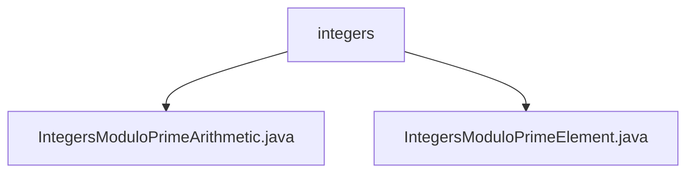

# 基础信息

|      |      |
|------|------|
| 名称 | integers |
| 编码语言 | .java |
| 代码路径 | WeFe/mpc/mpc-common/src/main/java/com/welab/wefe/mpc/pir/protocol/nt/field/integers |
| 包名 | docs.mpc.mpc-common.src.main.java.com.welab.wefe.mpc.pir.protocol.nt.field.integers |
| 概述说明 | IntegersModuloPrimeArithmetic类实现素数模整数运算，包括加减乘除等基本运算和Tonelli-Shanks平方根算法。IntegersModuloPrimeElement类表示素数模整数域元素，提供构造函数和值校正功能。 |

# 说明

## 概述  
该模块实现素数模整数域的算术运算体系，核心职责是提供素数域上的数学运算能力（如加减乘除）和元素表示。接口规范包括构造方法、基本运算（add/subtract/multiply/divide）和辅助运算（negate/invert/pow/sqrt）。关键数据结构为IntegersModuloPrimeElement（域元素）和IntegersModuloPrimeArithmetic（运算器）。外部依赖仅BigInteger类。例如求平方根采用Tonelli-Shanks算法，类似密码学中的素数域运算实现。

## 主要业务场景  
模块适用于安全多方计算场景下的隐私信息检索协议，典型应用包括素数域上的加密运算和零知识证明。交互模式为运算器处理元素对象，例如通过rectify方法确保运算结果在模数范围内。完整支持域运算API，包括求逆（类似分数约分）和幂运算（快速模幂）。集成案例可见于NT协议的字段计算层，构成类似抽象代数库的基础组件。

### 包内部结构视图

该流程图展示了integers目录下的两个Java文件：IntegersModuloPrimeArithmetic.java和IntegersModuloPrimeElement.java。这两个文件都直接隶属于integers目录，没有更深层次的嵌套结构，形成了简单的父子层级关系。

# 文件列表

| 名称   | 类型  | 说明 |
|-------|------|-------------|
| [IntegersModuloPrimeArithmetic.java](IntegersModuloPrimeArithmetic.md) | file | 实现了素数模数下的整数运算类，包含加减乘除、幂运算、平方根等操作，确保模数为素数并支持二次剩余判定。 |
| [IntegersModuloPrimeElement.java](IntegersModuloPrimeElement.md) | file | 整数模素数元素类，继承自伽罗瓦域元素类，提供两种构造方法：直接赋值或通过算术对象校正后赋值。 |

