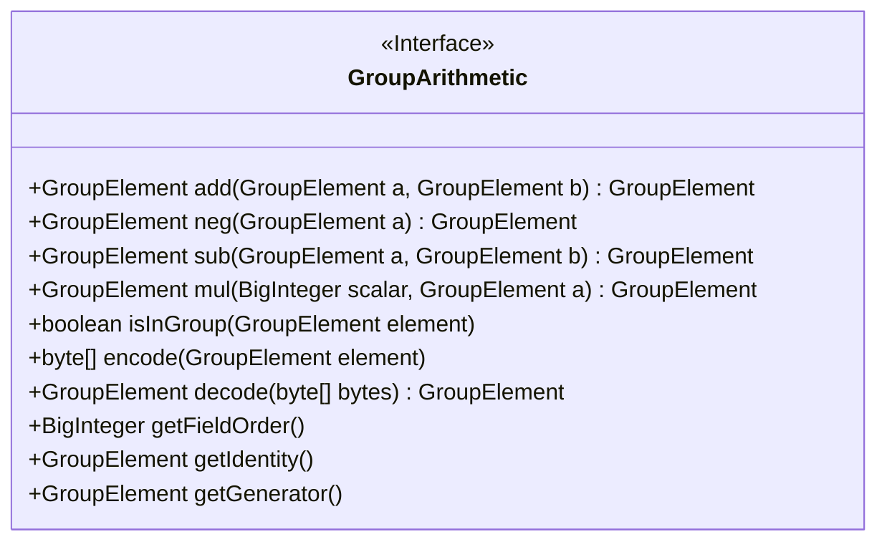
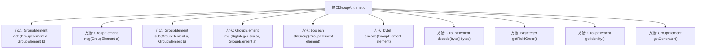

# 基础信息

|      |      |
|------|------|
| 名称 | GroupArithmetic |
| 编码语言 | .java |
| 代码路径 | WeFe/mpc/mpc-common/src/main/java/com/welab/wefe/mpc/pir/protocol/nt/group/GroupArithmetic.java |
| 包名 | com.welab.wefe.mpc.pir.protocol.nt.group |
| 依赖项 | ['java.math.BigInteger'] |
| 概述说明 | GroupArithmetic接口定义了群运算方法，包括加减乘、取反、编解码、群元素验证及获取群属性（阶、单位元、生成元）。 |

# 说明

该接口定义了群运算的核心方法，包括群元素的加法、取反、减法运算，以及标量乘法操作。同时提供了群元素的编解码功能，支持字节数组与群元素间的相互转换。接口还包含群结构查询方法，可获取群的阶、单位元和生成元，并验证元素是否属于该群。这些方法共同构成了抽象代数中群运算的基础功能集。

# 类列表 Class Summary

| 名称   | 类型  | 说明 |
|-------|------|-------------|
| GroupArithmetic | interface | 群运算接口定义，包含加法、取反、减法、标量乘法、群元素验证、编解码、获取域阶、单位元和生成元方法。 |

## 类 GroupArithmetic

|      |      |
|------|------|
| 访问范围 | public |
| 类型 | interface |
| 名称 | GroupArithmetic |
| 说明 | 群运算接口定义，包含加法、取反、减法、标量乘法、群元素验证、编解码、获取域阶、单位元和生成元方法。 |

### UML类图

该接口定义了群运算的核心操作，包括加法、取反、减法、标量乘法等代数运算，以及编解码、群元素验证和获取群属性（阶、单位元、生成元）的方法。所有方法均为抽象公有方法，适用于实现不同数学群结构的类，为密码学或数学计算提供标准化群操作接口。接口通过泛用参数`GroupElement`抽象具体群元素类型，保持实现的灵活性。

### 内部方法调用关系图

该流程图展示了GroupArithmetic接口的所有方法定义，包括群运算（加、取反、减、标量乘）、群元素验证、编解码操作以及获取群属性（阶、单位元、生成元）的方法。每个方法均以独立节点与接口相连，清晰呈现了该代数结构接口的核心功能契约。

### 字段列表 Field List

| 名称  | 类型  | 说明 |
|-------|-------|------|

### 方法列表

| 名称  | 类型  | 说明 |
|-------|-------|------|
| neg | GroupElement | 函数 neg 对群元素 a 取逆元。 |
| getFieldOrder | BigInteger | 获取大整数类型的字段顺序。 |
| getGenerator | GroupElement | 获取群元素的生成器。 |
| getIdentity | GroupElement | 获取群元素的单位元。 |
| isInGroup | boolean | 检查元素是否属于指定组，返回布尔值。 |
| mul | GroupElement | 群元素乘法方法，输入大整数和群元素，返回群元素结果。 |
| decode | GroupElement | 解码字节数组为GroupElement对象。 |
| add | GroupElement | 群元素加法操作，输入两个群元素a和b，返回它们的和。 |
| encode | byte[] | 编码方法，将GroupElement对象转换为字节数组。 |
| sub | GroupElement | 函数sub用于计算两个GroupElement类型元素的差，返回结果仍为GroupElement类型。 |

