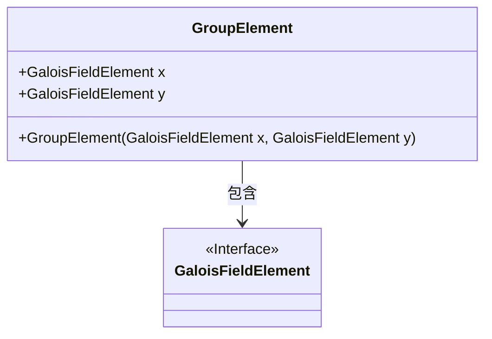
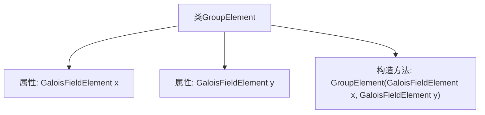

# 基础信息

|      |      |
|------|------|
| 名称 | GroupElement |
| 编码语言 | .java |
| 代码路径 | WeFe/mpc/mpc-common/src/main/java/com/welab/wefe/mpc/pir/protocol/nt/group/GroupElement.java |
| 包名 | com.welab.wefe.mpc.pir.protocol.nt.group |
| 依赖项 | ['com.welab.wefe.mpc.pir.protocol.nt.field.GaloisFieldElement'] |
| 概述说明 | GroupElement类包含x和y两个GaloisFieldElement类型成员变量，通过构造函数初始化这两个变量。 |

# 说明

GroupElement类是一个表示群元素的公开类，包含两个公开的GaloisFieldElement类型属性x和y。该类有一个构造函数，接收两个GaloisFieldElement参数x和y，并将它们分别赋值给对应的类属性。这个类用于存储和操作群元素，其中每个元素由两个伽罗华域元素组成。

# 类列表 Class Summary

| 名称   | 类型  | 说明 |
|-------|------|-------------|
| GroupElement | class | GroupElement类包含两个GaloisFieldElement类型属性x和y，通过构造函数初始化这两个属性。 |

## 类 GroupElement

|      |      |
|------|------|
| 访问范围 | public |
| 类型 | class |
| 名称 | GroupElement |
| 说明 | GroupElement类包含两个GaloisFieldElement类型属性x和y，通过构造函数初始化这两个属性。 |

### UML类图

这段类图展示了GroupElement类与GaloisFieldElement接口之间的关系。GroupElement是一个包含两个GaloisFieldElement类型公有成员(x和y)的类，通过构造函数初始化这两个字段。GaloisFieldElement被标记为接口，表明它定义了一组待实现的方法规范。GroupElement依赖于GaloisFieldElement，这种设计常用于实现代数结构中的群元素表示，其中坐标值需要遵循特定的域运算规则。

### 内部方法调用关系图

这段流程图描述了GroupElement类的结构，包含两个GaloisFieldElement类型的属性x和y，以及一个构造方法用于初始化这两个属性。该类的核心功能是封装椭圆曲线密码学中的群元素坐标点，通过x和y两个域元素表示点的位置。构造方法确保创建对象时必须提供这两个坐标值，为后续的群运算（如点加、倍点）提供基础数据结构支持。

### 字段列表 Field List

| 名称  | 类型  | 说明 |
|-------|-------|------|
| y | GaloisFieldElement | GaloisFieldElement类型的公开变量y。 |
| x | GaloisFieldElement | GaloisFieldElement类型的公共变量x。 |

### 方法列表

| 名称  | 类型  | 说明 |
|-------|-------|------|

