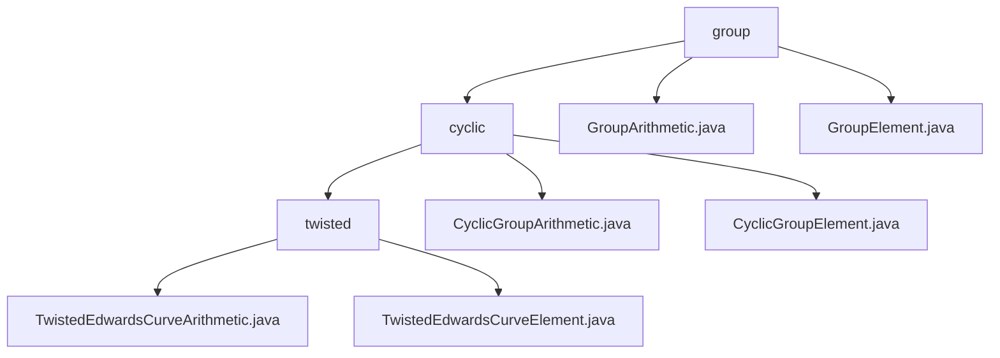

# 基础信息

|      |      |
|------|------|
| 名称 | group |
| 编码语言 | .java |
| 代码路径 | WeFe/mpc/mpc-common/src/main/java/com/welab/wefe/mpc/pir/protocol/nt/group |
| 包名 | docs.mpc.mpc-common.src.main.java.com.welab.wefe.mpc.pir.protocol.nt.group |
| 概述说明 | 该模块实现扭曲爱德华兹曲线群运算，提供点加、标量乘及编解码功能，用于隐私计算如PIR协议，支持自定义参数和默认运算。 |

# 说明

## 概述  
该模块实现扭曲爱德华兹曲线的标准化群运算体系，核心职责是提供椭圆曲线加密的基础运算接口和编解码功能。统一接口规范包括群属性查询、元素合法性校验及点运算（加法/标量乘法），类似密码学原语构建模式。关键数据结构为TwistedEdwardsCurveElement（含x/y坐标）和CyclicGroupElement，依赖Galois域运算库。例如采用2²⁵⁵-19素数域实现默认运算，支持字节数组序列化交互数据。

## 主要业务场景  
模块专用于隐私计算场景（如安全多方计算中的PIR协议），典型流程为：初始化群元素→执行标量乘法→结果编解码，类似密钥派生模式。例如在NT组协议中，通过CyclicGroupArithmetic实现高效倍点运算，支持自定义a/d参数或默认值（a=2²⁵⁵-20）。所有运算基于Galois域算术对象完成，包含群元素加减法、取反及阶/生成元查询功能。例如GroupElement类通过x/y坐标存储曲线点，与字节数组双向转换。

### 包内部结构视图

该流程图展示了MPC协议中NT组的层级结构。根节点"group"包含两个直接子文件（GroupArithmetic/Element）和一个子目录"cyclic"。"cyclic"目录下又分为"twisted"子目录和两个循环群运算文件。最底层的"twisted"目录包含两个扭曲爱德华曲线相关的实现文件，完整呈现了从基础群运算到具体曲线实现的继承关系。

# 文件列表

| 名称   | 类型  | 说明 |
|-------|------|-------------|
| [GroupArithmetic.java](GroupArithmetic.md) | file | GroupArithmetic接口定义了群运算方法，包括加减乘、取反、编解码、群元素验证及获取群属性（阶、单位元、生成元）。 |
| [GroupElement.java](GroupElement.md) | file | GroupElement类包含x和y两个GaloisFieldElement类型成员变量，通过构造函数初始化这两个变量。 |
| [cyclic](cyclic/_module.md) | package | 该模块实现扭曲爱德华兹曲线的算术运算，提供点加法、标量乘法等接口，支持坐标编解码和群属性查询，适用于椭圆曲线加密的隐私计算场景。 |

