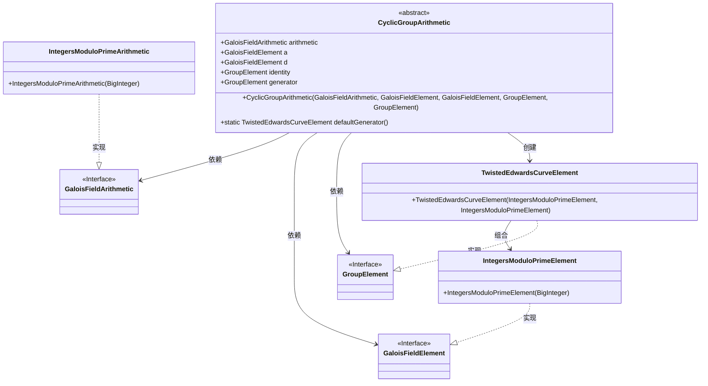
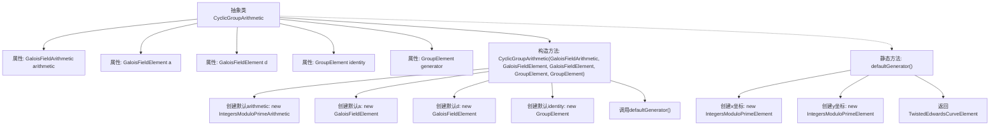

# 基础信息

|      |      |
|------|------|
| 名称 | CyclicGroupArithmetic |
| 编码语言 | .java |
| 代码路径 | WeFe/mpc/mpc-common/src/main/java/com/welab/wefe/mpc/pir/protocol/nt/group/cyclic/CyclicGroupArithmetic.java |
| 包名 | com.welab.wefe.mpc.pir.protocol.nt.group.cyclic |
| 依赖项 | ['com.welab.wefe.mpc.pir.protocol.nt.field.GaloisFieldArithmetic', 'com.welab.wefe.mpc.pir.protocol.nt.field.GaloisFieldElement', 'com.welab.wefe.mpc.pir.protocol.nt.field.integers.IntegersModuloPrimeArithmetic', 'com.welab.wefe.mpc.pir.protocol.nt.field.integers.IntegersModuloPrimeElement', 'com.welab.wefe.mpc.pir.protocol.nt.group.GroupElement', 'com.welab.wefe.mpc.pir.protocol.nt.group.cyclic.twisted.TwistedEdwardsCurveElement', 'java.math.BigInteger'] |
| 概述说明 | 抽象类CyclicGroupArithmetic定义了循环群运算，包含算术、元素、恒等元和生成元，提供默认构造参数和生成器方法。 |

# 说明

CyclicGroupArithmetic是一个抽象类，用于实现循环群的算术运算。它包含五个关键成员变量：arithmetic（Galois域算术对象）、a和d（Galois域元素）、identity（群单位元）和generator（群生成元）。构造函数允许自定义这些参数，未提供时使用默认值：arithmetic默认使用2²⁵⁵-19的整数模素数运算，a默认2²⁵⁵-20，d为特定大整数。identity默认设置为(0,1)，generator默认通过defaultGenerator方法生成，其坐标为两个特定大整数对应的TwistedEdwards曲线点。该类为循环群运算提供了基础框架。

# 类列表 Class Summary

| 名称   | 类型  | 说明 |
|-------|------|-------------|
| CyclicGroupArithmetic | class | 抽象类CyclicGroupArithmetic定义循环群运算，包含算术、元素、恒等元、生成元等属性，构造函数设置默认值，默认生成元为特定坐标点。 |

## 类 CyclicGroupArithmetic

|      |      |
|------|------|
| 访问范围 | public abstract |
| 类型 | class |
| 名称 | CyclicGroupArithmetic |
| 说明 | 抽象类CyclicGroupArithmetic定义循环群运算，包含算术、元素、恒等元、生成元等属性，构造函数设置默认值，默认生成元为特定坐标点。 |

### UML类图

这段代码定义了一个抽象类`CyclicGroupArithmetic`，用于实现循环群的算术运算。该类依赖于`GaloisFieldArithmetic`、`GaloisFieldElement`和`GroupElement`接口，并通过`IntegersModuloPrimeArithmetic`和`IntegersModuloPrimeElement`实现这些接口。`TwistedEdwardsCurveElement`作为`GroupElement`的实现类，表示扭曲爱德华兹曲线上的点。代码提供了默认的生成器方法和构造器参数默认值处理，主要应用于密码学中的椭圆曲线运算场景。

### 内部方法调用关系图

该流程图展示了抽象类CyclicGroupArithmetic的结构和初始化逻辑。类包含5个属性和1个构造方法，构造方法会检查参数是否为null，若为null则使用默认值初始化。其中generator属性通过调用静态方法defaultGenerator()获取默认值，该方法创建并返回一个包含特定x/y坐标的TwistedEdwardsCurveElement实例。流程图清晰呈现了类成员关系和初始化时的条件分支逻辑。

### 字段列表 Field List

| 名称  | 类型  | 说明 |
|-------|-------|------|
| a | GaloisFieldElement | GaloisFieldElement类型的公共变量a。 |
| generator | GroupElement | 群元素生成器 |
| d | GaloisFieldElement | GaloisFieldElement类型的公共变量d。 |
| arithmetic | GaloisFieldArithmetic | GaloisFieldArithmetic类的公共算术实例。 |
| identity | GroupElement | GroupElement类型的identity变量，表示身份元素。 |

### 方法列表

| 名称  | 类型  | 说明 |
|-------|-------|------|
| defaultGenerator | TwistedEdwardsCurveElement | 该方法定义了一个静态函数defaultGenerator，返回TwistedEdwardsCurveElement实例。该实例使用两个大整数构造的IntegersModuloPrimeElement对象作为x和y坐标，分别对应特定的曲线生成点坐标。 |

