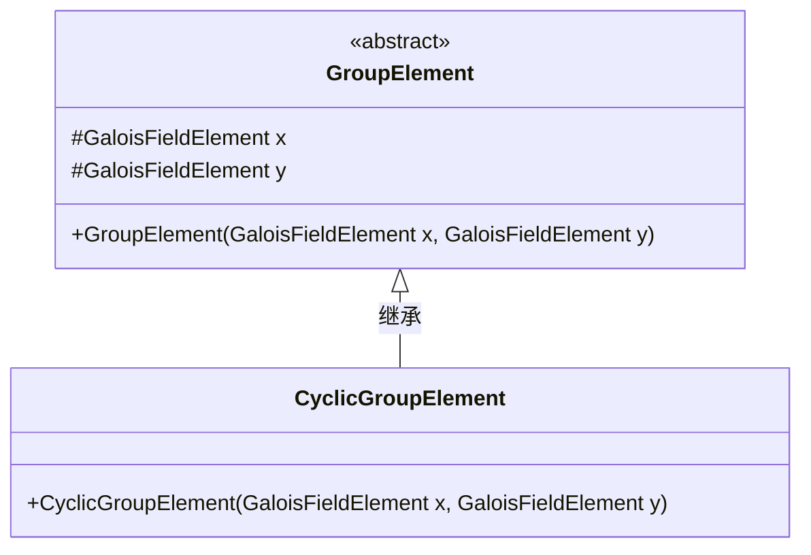
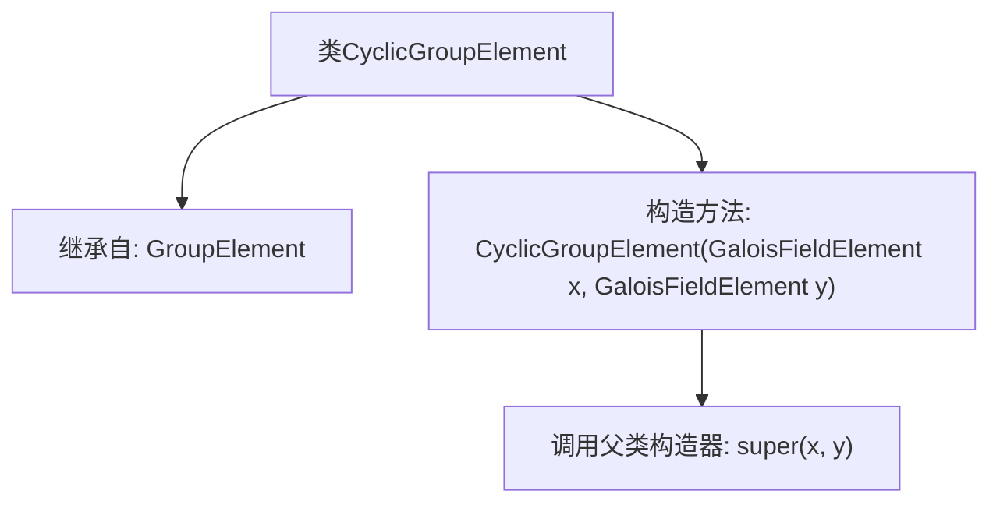

# 基础信息

|      |      |
|------|------|
| 名称 | CyclicGroupElement |
| 编码语言 | .java |
| 代码路径 | WeFe/mpc/mpc-common/src/main/java/com/welab/wefe/mpc/pir/protocol/nt/group/cyclic/CyclicGroupElement.java |
| 包名 | com.welab.wefe.mpc.pir.protocol.nt.group.cyclic |
| 依赖项 | ['com.welab.wefe.mpc.pir.protocol.nt.field.GaloisFieldElement', 'com.welab.wefe.mpc.pir.protocol.nt.group.GroupElement'] |
| 概述说明 | CyclicGroupElement类继承GroupElement，构造函数接收两个GaloisFieldElement参数x和y。 |

# 说明

这段代码定义了一个名为CyclicGroupElement的类，它继承自GroupElement类。该类表示循环群中的一个元素，构造函数接受两个GaloisFieldElement类型的参数x和y，并将它们传递给父类GroupElement的构造函数进行初始化。这个类主要用于处理循环群元素的创建和操作，其核心功能依赖于Galois域上的元素运算。

# 类列表 Class Summary

| 名称   | 类型  | 说明 |
|-------|------|-------------|
| CyclicGroupElement | class | CyclicGroupElement类继承GroupElement，通过GaloisFieldElement参数x和y构造。 |

## 类 CyclicGroupElement

|      |      |
|------|------|
| 访问范围 | public |
| 类型 | class |
| 名称 | CyclicGroupElement |
| 说明 | CyclicGroupElement类继承GroupElement，通过GaloisFieldElement参数x和y构造。 |

### UML类图

这段类图展示了CyclicGroupElement继承自抽象类GroupElement的层级关系。GroupElement作为基类，包含两个受保护的GaloisFieldElement类型成员x和y，以及一个构造方法；CyclicGroupElement作为具体子类，通过super调用父类构造器实现坐标初始化。该设计体现了代数结构中循环群元素对基础群元素特性的扩展，适用于密码学或数学计算场景，子类通过继承复用父类存储结构的同时保持类型特异性。

### 内部方法调用关系图

这段流程图描述了CyclicGroupElement类的结构及其与父类GroupElement的关系。CyclicGroupElement继承自GroupElement，并通过构造方法接收两个GaloisFieldElement参数x和y。在构造过程中，直接调用父类GroupElement的构造器完成初始化。该图清晰地展示了类的继承关系和构造方法的执行流程，突出了子类对父类功能的复用机制。

### 字段列表 Field List

| 名称  | 类型  | 说明 |
|-------|-------|------|

### 方法列表

| 名称  | 类型  | 说明 |
|-------|-------|------|

