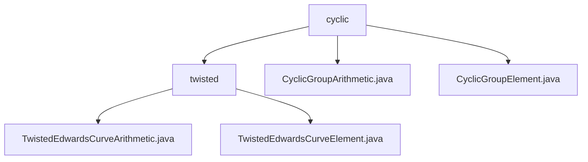

# 基础信息

|      |      |
|------|------|
| 名称 | cyclic |
| 编码语言 | .java |
| 代码路径 | WeFe/mpc/mpc-common/src/main/java/com/welab/wefe/mpc/pir/protocol/nt/group/cyclic |
| 包名 | docs.mpc.mpc-common.src.main.java.com.welab.wefe.mpc.pir.protocol.nt.group.cyclic |
| 概述说明 | 该模块实现扭曲爱德华兹曲线的算术运算，提供点加法、标量乘法等接口，支持坐标编解码和群属性查询，适用于椭圆曲线加密的隐私计算场景。 |

# 说明

## 概述  
该模块实现扭曲爱德华兹曲线的标准化群运算体系，核心职责包括提供点加法、标量乘法等基础运算接口及元素编解码功能。统一接口规范涵盖群属性查询、元素合法性校验等操作，类似密码学原语构建模式。关键数据结构为TwistedEdwardsCurveElement（曲线点坐标）和CyclicGroupElement（循环群元素），依赖Galois域运算库。例如采用2²⁵⁵-19素数域实现默认运算，通过字节数组序列化交互数据。

## 主要业务场景  
模块专用于隐私计算场景的椭圆曲线加密，如安全多方计算中的PIR协议。典型流程为：初始化群元素（默认生成元坐标特定大整数）→执行标量乘法（内置校验）→结果编解码，类似密钥派生模式。例如在NT组协议中，通过CyclicGroupArithmetic框架实现高效倍点运算，支持自定义a/d参数或使用默认值（a=2²⁵⁵-20）。所有运算均基于Galois域算术对象完成。

### 包内部结构视图

该流程图展示了MPC项目中关于循环群和扭曲爱德华兹曲线相关的类文件结构。顶层是cyclic目录，包含两个子类文件和twisted子目录。twisted目录下又包含两个实现扭曲爱德华兹曲线运算的类文件，清晰地呈现了密码学协议中数学运算模块的代码组织方式。

# 文件列表

| 名称   | 类型  | 说明 |
|-------|------|-------------|
| [CyclicGroupArithmetic.java](CyclicGroupArithmetic.md) | file | 抽象类CyclicGroupArithmetic定义了循环群运算，包含算术、元素、恒等元和生成元，提供默认构造参数和生成器方法。 |
| [CyclicGroupElement.java](CyclicGroupElement.md) | file | CyclicGroupElement类继承GroupElement，构造函数接收两个GaloisFieldElement参数x和y。 |
| [twisted](twisted/_module.md) | package | TwistedEdwardsCurveArithmetic类实现扭曲爱德华兹曲线群运算，包括点加减、标量乘等，支持编解码和属性访问。TwistedEdwardsCurveElement类表示曲线点坐标，继承自CyclicGroupElement。 |

