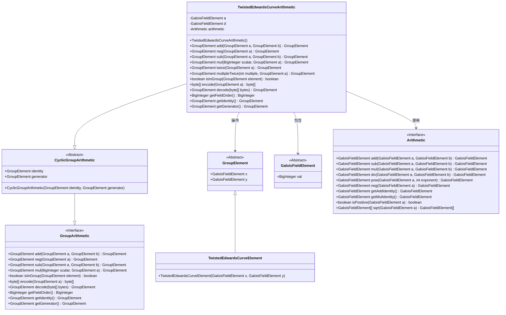
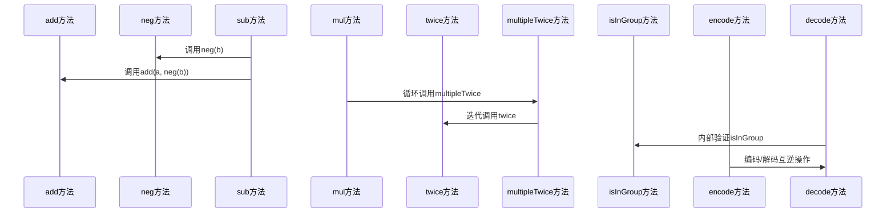

# 基础信息

|      |      |
|------|------|
| 名称 | TwistedEdwardsCurveArithmetic |
| 编码语言 | .java |
| 代码路径 | WeFe/mpc/mpc-common/src/main/java/com/welab/wefe/mpc/pir/protocol/nt/group/cyclic/twisted/TwistedEdwardsCurveArithmetic.java |
| 包名 | com.welab.wefe.mpc.pir.protocol.nt.group.cyclic.twisted |
| 依赖项 | ['com.welab.wefe.mpc.commom.Conversion', 'com.welab.wefe.mpc.pir.protocol.nt.field.GaloisFieldElement', 'com.welab.wefe.mpc.pir.protocol.nt.field.integers.IntegersModuloPrimeArithmetic', 'com.welab.wefe.mpc.pir.protocol.nt.field.integers.IntegersModuloPrimeElement', 'com.welab.wefe.mpc.pir.protocol.nt.group.GroupArithmetic', 'com.welab.wefe.mpc.pir.protocol.nt.group.GroupElement', 'com.welab.wefe.mpc.pir.protocol.nt.group.cyclic.CyclicGroupArithmetic', 'java.math.BigInteger', 'java.util.List'] |
| 概述说明 | TwistedEdwards曲线算术类，实现点加、取反、倍点、标量乘、编解码等群运算。 |

# 说明

TwistedEdwardsCurveArithmetic类实现了扭曲爱德华兹曲线上的群运算，继承自CyclicGroupArithmetic。主要功能包括点加法、取反、减法、标量乘法、倍点运算等。点加法采用标准扭曲爱德华兹曲线公式计算新点坐标。类还包含群元素编解码方法，支持将点坐标转换为字节数组及反向解析。同时提供群属性访问方法，如获取单位元、生成元、有限域阶数等。所有运算均在有限域上进行，并包含群元素合法性校验逻辑。

# 类列表 Class Summary

| 名称   | 类型  | 说明 |
|-------|------|-------------|
| TwistedEdwardsCurveArithmetic | class | TwistedEdwards曲线算术类，实现点加法、取反、倍点、编解码等群运算操作。 |

## 类 TwistedEdwardsCurveArithmetic

|      |      |
|------|------|
| 访问范围 | public |
| 类型 | class |
| 名称 | TwistedEdwardsCurveArithmetic |
| 说明 | TwistedEdwards曲线算术类，实现点加法、取反、倍点、编解码等群运算操作。 |

### UML类图

该图展示了扭曲爱德华兹曲线算术类的继承关系和依赖关系。TwistedEdwardsCurveArithmetic继承自CyclicGroupArithmetic并实现GroupArithmetic接口，包含对GroupElement的操作和GaloisFieldElement的计算。核心类通过Arithmetic接口执行域运算，TwistedEdwardsCurveElement作为GroupElement的具体实现。图中清晰体现了椭圆曲线群运算的数学抽象层级和组件协作关系。

### 内部方法调用关系图

```mermaid
graph TD
    A["类TwistedEdwardsCurveArithmetic"]
    B["构造方法: TwistedEdwardsCurveArithmetic()"]
    C["方法: GroupElement add(GroupElement a, GroupElement b)"]
    D["方法: GroupElement neg(GroupElement a)"]
    E["方法: GroupElement sub(GroupElement a, GroupElement b)"]
    F["方法: GroupElement mul(BigInteger scalar, GroupElement a)"]
    G["方法: GroupElement twice(GroupElement a)"]
    H["方法: GroupElement multipleTwice(int multiple, GroupElement a)"]
    I["方法: boolean isInGroup(GroupElement element)"]
    J["方法: byte[] encode(GroupElement a)"]
    K["方法: GroupElement decode(byte[] bytes)"]
    L["方法: BigInteger getFieldOrder()"]
    M["方法: GroupElement getIdentity()"]
    N["方法: GroupElement getGenerator()"]

    A --> B
    A --> C
    A --> D
    A --> E
    A --> F
    A --> G
    A --> H
    A --> I
    A --> J
    A --> K
    A --> L
    A --> M
    A --> N
```

该流程图展示了TwistedEdwards曲线算术类的方法结构，包含12个核心方法，覆盖了群运算（加法、取反、减法、标量乘法）、点加倍运算、编解码以及群属性验证等功能。时序图重点呈现了方法间的调用关系，如sub方法通过组合neg和add实现减法，mul方法通过multipleTwice进行快速标量乘法，编解码过程与群验证的关联等，体现了椭圆曲线密码学中群运算的数学特性。

### 字段列表 Field List

| 名称  | 类型  | 说明 |
|-------|-------|------|

### 方法列表

| 名称  | 类型  | 说明 |
|-------|-------|------|
| decode | GroupElement | 解码字节数组为群元素：计算y值，通过算术运算求得分母和分子，开方后根据字节首位选择x值，返回扭曲爱德华曲线元素(x,y)。 |
| twice | GroupElement | 该方法计算群元素的倍点运算，通过伽罗瓦域算术操作生成新坐标x3和y3，最终返回新的群元素。 |
| encode | byte[] | 该方法将GroupElement对象编码为字节数组。先根据x的正负设置首字节符号位（0x00或0xFF），再将y值转为字节数组拼接其后，最终返回组合后的字节数组。 |
| mul | GroupElement | 该方法通过二进制表示法实现大整数与群元素的标量乘法。若标量为零返回单位元，否则将标量转为二进制，逐位计算并累加结果。 |
| sub | GroupElement | 该方法实现两个群元素的减法，通过将第二个元素取反后与第一个元素相加来完成。 |
| isInGroup | boolean | 检查元素是否在群组中：计算x、y的平方及组合值，比较左右表达式结果是否相等。 |
| multipleTwice | GroupElement | 方法multipleTwice对GroupElement对象a执行多次twice操作，次数由参数multiple指定。若multiple为0，直接返回a；否则循环调用twice方法并返回结果。 |
| add | GroupElement | 该方法实现了扭曲爱德华兹曲线上两点的加法运算，通过坐标计算和有限域算术操作得出新点坐标(x3,y3)。 |
| neg | GroupElement | Java方法：对群元素取负，返回新对象，x取负，y不变。 |
| getFieldOrder | BigInteger | 方法重写，返回算术模数字段值。 |
| getIdentity | GroupElement | 该方法返回GroupElement类型的identity对象。 |
| getGenerator | GroupElement | 该方法返回一个GroupElement类型的生成器对象。 |

