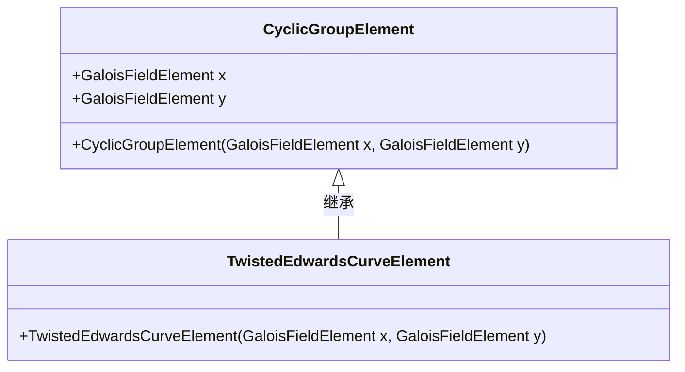
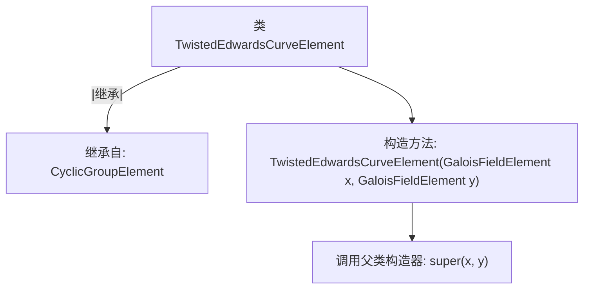

# 基础信息

|      |      |
|------|------|
| 名称 | TwistedEdwardsCurveElement |
| 编码语言 | .java |
| 代码路径 | WeFe/mpc/mpc-common/src/main/java/com/welab/wefe/mpc/pir/protocol/nt/group/cyclic/twisted/TwistedEdwardsCurveElement.java |
| 包名 | com.welab.wefe.mpc.pir.protocol.nt.group.cyclic.twisted |
| 依赖项 | ['com.welab.wefe.mpc.pir.protocol.nt.field.GaloisFieldElement', 'com.welab.wefe.mpc.pir.protocol.nt.group.cyclic.CyclicGroupElement'] |
| 概述说明 | TwistedEdwardsCurveElement类继承CyclicGroupElement，通过x和y坐标构造扭曲爱德华兹曲线元素。 |

# 说明

TwistedEdwardsCurveElement类继承自CyclicGroupElement，表示扭曲爱德华兹曲线上的元素。构造函数接收两个GaloisFieldElement类型参数x和y，并调用父类构造函数进行初始化。该类用于描述曲线点的坐标，不涉及具体运算实现。

# 类列表 Class Summary

| 名称   | 类型  | 说明 |
|-------|------|-------------|
| TwistedEdwardsCurveElement | class | TwistedEdwardsCurveElement类继承CyclicGroupElement，通过x和y坐标构造扭曲爱德华曲线元素。 |

## 类 TwistedEdwardsCurveElement

|      |      |
|------|------|
| 访问范围 | public |
| 类型 | class |
| 名称 | TwistedEdwardsCurveElement |
| 说明 | TwistedEdwardsCurveElement类继承CyclicGroupElement，通过x和y坐标构造扭曲爱德华曲线元素。 |

### UML类图

该图展示了TwistedEdwardsCurveElement继承自CyclicGroupElement的类关系。CyclicGroupElement作为基类包含两个GaloisFieldElement类型的坐标(x,y)，而TwistedEdwardsCurveElement通过构造函数扩展了基类功能，专门用于表示扭曲爱德华兹曲线上的点。这种继承关系体现了椭圆曲线密码学中数学元素的层次化建模。

### 内部方法调用关系图

该流程图展示了TwistedEdwardsCurveElement类的结构及其与父类CyclicGroupElement的继承关系。该类通过构造方法接收两个GaloisFieldElement参数x和y，并直接调用父类构造器完成初始化。图中清晰呈现了类继承链和构造方法的内部调用逻辑，体现了子类对父类功能的直接复用。

### 字段列表 Field List

| 名称  | 类型  | 说明 |
|-------|-------|------|

### 方法列表

| 名称  | 类型  | 说明 |
|-------|-------|------|

