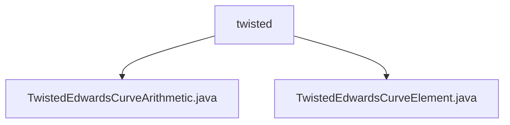

# 基础信息

|      |      |
|------|------|
| 名称 | twisted |
| 编码语言 | .java |
| 代码路径 | WeFe/mpc/mpc-common/src/main/java/com/welab/wefe/mpc/pir/protocol/nt/group/cyclic/twisted |
| 包名 | docs.mpc.mpc-common.src.main.java.com.welab.wefe.mpc.pir.protocol.nt.group.cyclic.twisted |
| 概述说明 | TwistedEdwardsCurveArithmetic类实现扭曲爱德华兹曲线群运算，包括点加减、标量乘等，支持编解码和属性访问。TwistedEdwardsCurveElement类表示曲线点坐标，继承自CyclicGroupElement。 |

# 说明

## 概述  
该模块实现扭曲爱德华兹曲线的算术运算体系，核心职责为提供标准化的群运算接口与元素表示。接口规范涵盖点加法、取反、标量乘法等基础运算，支持坐标编解码及群属性查询。关键数据结构包括TwistedEdwardsCurveElement（存储曲线点坐标）和GaloisFieldElement（有限域元素）。依赖项仅涉及有限域运算库。例如通过标准公式实现点加法，采用字节数组进行序列化交互。

## 主要业务场景  
模块适用于需要椭圆曲线加密的隐私计算场景，如安全多方计算中的PIR协议。典型流程包含群元素初始化→标量乘法运算→结果编解码，类似密码学原语构建模式。例如在NT组协议中，通过倍点运算实现高效密钥派生，所有运算均内置合法性校验确保安全性。

### 包内部结构视图

该流程图展示了在`twisted`目录下的两个Java文件：`TwistedEdwardsCurveArithmetic.java`和`TwistedEdwardsCurveElement.java`。这两个文件属于同一层级，均直接位于`twisted`文件夹内，没有更深层次的嵌套结构。

# 文件列表

| 名称   | 类型  | 说明 |
|-------|------|-------------|
| [TwistedEdwardsCurveArithmetic.java](TwistedEdwardsCurveArithmetic.md) | file | TwistedEdwards曲线算术类，实现点加、取反、倍点、标量乘、编解码等群运算。 |
| [TwistedEdwardsCurveElement.java](TwistedEdwardsCurveElement.md) | file | TwistedEdwardsCurveElement类继承CyclicGroupElement，通过x和y坐标构造扭曲爱德华兹曲线元素。 |

