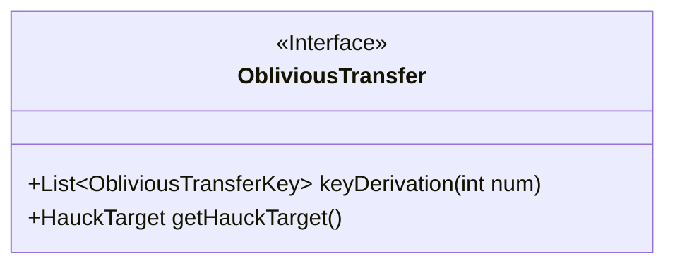
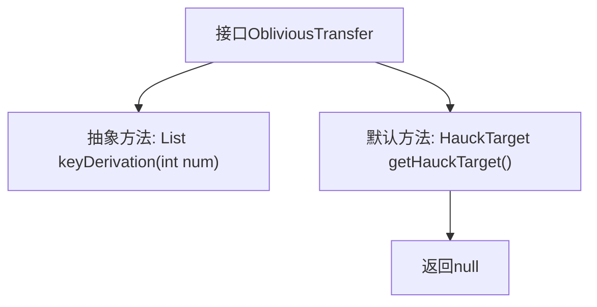

# 基础信息

|      |      |
|------|------|
| 名称 | ObliviousTransfer |
| 编码语言 | .java |
| 代码路径 | WeFe/mpc/mpc-common/src/main/java/com/welab/wefe/mpc/pir/protocol/ot/ObliviousTransfer.java |
| 包名 | com.welab.wefe.mpc.pir.protocol.ot |
| 依赖项 | ['com.welab.wefe.mpc.pir.protocol.ot.hauck.HauckTarget', 'java.util.List'] |
| 概述说明 | ObliviousTransfer接口定义密钥生成方法keyDerivation和默认返回null的getHauckTarget方法。 |

# 说明

该接口定义了一个名为ObliviousTransfer的协议，包含两个核心功能。首先提供了keyDerivation方法，用于生成指定数量的ObliviousTransferKey密钥列表，参数num指定生成密钥的数量。其次包含一个默认实现的getHauckTarget方法，返回HauckTarget对象，默认返回null。该接口主要用于实现不经意传输协议的相关操作。

# 类列表 Class Summary

| 名称   | 类型  | 说明 |
|-------|------|-------------|
| ObliviousTransfer | interface | ObliviousTransfer接口定义密钥生成方法keyDerivation和默认返回null的getHauckTarget方法。 |

## 类 ObliviousTransfer

|      |      |
|------|------|
| 访问范围 | public |
| 类型 | interface |
| 名称 | ObliviousTransfer |
| 说明 | ObliviousTransfer接口定义密钥生成方法keyDerivation和默认返回null的getHauckTarget方法。 |

### UML类图

该类图展示了一个名为ObliviousTransfer的接口，定义了两个方法：keyDerivation用于生成指定数量的密钥列表，返回泛型List<ObliviousTransferKey>；getHauckTarget是默认方法，返回HauckTarget对象。接口使用<<Interface>>标注，方法均为公有，其中keyDerivation带有参数和泛型返回值说明。

### 内部方法调用关系图

该流程图展示了ObliviousTransfer接口的结构，包含一个需要实现的抽象方法keyDerivation和一个默认方法getHauckTarget。keyDerivation方法接收一个整数参数并返回密钥列表，而getHauckTarget默认方法直接返回null。接口定义了基本功能框架，具体实现需由子类完成keyDerivation方法。

### 字段列表 Field List

| 名称  | 类型  | 说明 |
|-------|-------|------|

### 方法列表

| 名称  | 类型  | 说明 |
|-------|-------|------|
| keyDerivation | List<ObliviousTransferKey> | 生成指定数量的不经意传输密钥列表。 |
| getHauckTarget | HauckTarget | 方法getHauckTarget默认返回null。 |

