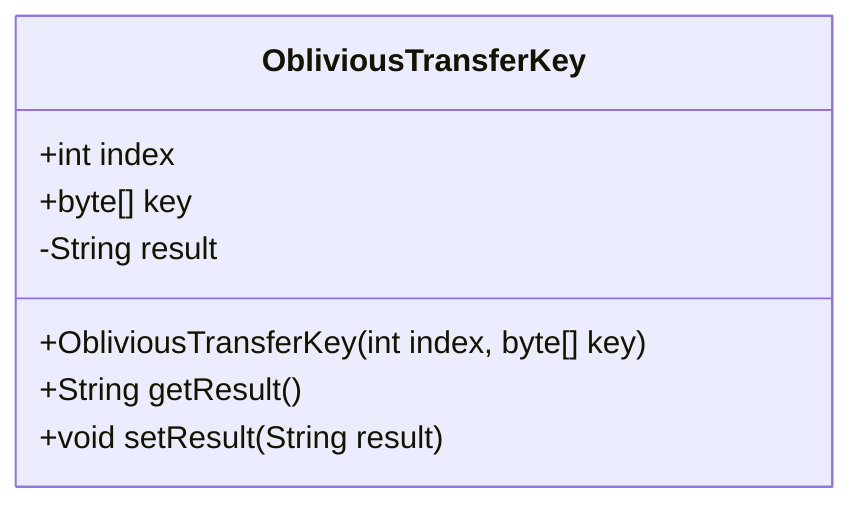
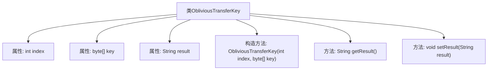

# 基础信息

|      |      |
|------|------|
| 名称 | ObliviousTransferKey |
| 编码语言 | .java |
| 代码路径 | WeFe/mpc/mpc-common/src/main/java/com/welab/wefe/mpc/pir/protocol/ot/ObliviousTransferKey.java |
| 包名 | com.welab.wefe.mpc.pir.protocol.ot |
| 依赖项 | [] |
| 概述说明 | ObliviousTransferKey类包含索引、密钥和结果字段，提供构造方法和结果存取方法。 |

# 说明

ObliviousTransferKey类包含两个公共字段index和key，分别表示索引和密钥字节数组。私有字段result用于存储结果字符串。构造函数接收index和key参数并初始化对应字段。提供getResult和setResult方法用于获取和设置result字段的值。该类主要用于管理不经意传输协议中的密钥和结果数据。

# 类列表 Class Summary

| 名称   | 类型  | 说明 |
|-------|------|-------------|
| ObliviousTransferKey | class | ObliviousTransferKey类包含索引、密钥和结果字段，提供构造方法和结果存取方法。 |

## 类 ObliviousTransferKey

|      |      |
|------|------|
| 访问范围 | public |
| 类型 | class |
| 名称 | ObliviousTransferKey |
| 说明 | ObliviousTransferKey类包含索引、密钥和结果字段，提供构造方法和结果存取方法。 |

### UML类图

这段代码定义了一个名为ObliviousTransferKey的类，用于存储不经意传输协议中的密钥信息。该类包含三个主要成员：一个公有的整型index表示索引，一个公有的字节数组key存储密钥数据，以及一个私有的字符串result用于存储处理结果。提供了构造方法初始化index和key，并通过getter和setter方法访问result字段。这个类可能用于安全通信场景，实现数据的选择性获取而不泄露其他信息。

### 内部方法调用关系图

该流程图展示了ObliviousTransferKey类的结构，包含三个属性(index/key/result)、一个构造方法和两个操作方法(getResult/setResult)。构造方法初始化index和key，私有属性result通过setter和getter进行访问控制，整体构成一个简单的数据传输对象(DTO)模式，用于封装不经意传输协议中的密钥索引和结果数据。

### 字段列表 Field List

| 名称  | 类型  | 说明 |
|-------|-------|------|
| index | int | 整型公共变量index。 |
| result = "" | String | 声明一个私有字符串变量result，初始值为空字符串。 |
| key | byte[] | 声明一个公共字节数组变量key。 |

### 方法列表

| 名称  | 类型  | 说明 |
|-------|-------|------|
| getResult | String | 获取结果字符串的方法。 |
| setResult | void | 设置结果值的方法，将输入字符串赋值给类的result变量。 |

