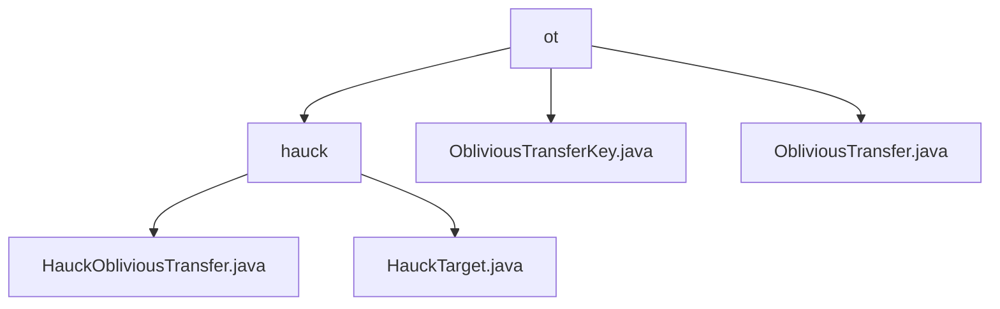

# 基础信息

|      |      |
|------|------|
| 名称 | ot |
| 编码语言 | .java |
| 代码路径 | WeFe/mpc/mpc-common/src/main/java/com/welab/wefe/mpc/pir/protocol/ot |
| 包名 | docs.mpc.mpc-common.src.main.java.com.welab.wefe.mpc.pir.protocol.ot |
| 概述说明 | 该模块实现基于扭曲爱德华曲线的茫然传输协议，核心类提供密码学安全操作，支持隐私信息检索场景，包含密钥管理和目标生成功能。 |

# 说明

## 概述  
该模块实现基于扭曲爱德华曲线的茫然传输协议（Oblivious Transfer），核心职责包括安全密钥派生和隐私数据封装。HauckObliviousTransfer类提供群运算、哈希计算等密码学操作，而HauckTarget作为安全信封结构封装随机标量、群元素等关键数据。主要数据结构含ObliviousTransferKey（管理密钥索引和结果）和HauckTarget三元组。依赖项包括SHA-256算法和椭圆曲线算术模块。例如generateHauckTarget生成验证过的传输目标，ObliviousTransferKey则存储协议执行结果。

## 主要业务场景  
模块支撑安全多方计算中的隐私信息检索，典型流程涵盖密钥派生、目标生成和有效性验证。通过ObliviousTransfer接口实现两种模式：keyDerivation批量生成密钥（类似密钥分发中心），getHauckTarget获取安全载体。交互过程类似零知识证明的承诺-响应机制，例如HauckTarget调试输出确保透明度，而协议核心保障传输安全性。典型应用包括联合风控等场景，其中ObliviousTransferKey作为会话凭证贯穿始终。

### 包内部结构视图

该流程图展示了WeFe项目中OT协议相关的文件结构，顶层为ot目录，包含hauck子目录和两个OT协议实现文件。hauck目录下又包含两个具体实现类，清晰地反映了OT协议模块的层级关系与文件分布。

# 文件列表

| 名称   | 类型  | 说明 |
|-------|------|-------------|
| [ObliviousTransferKey.java](ObliviousTransferKey.md) | file | ObliviousTransferKey类包含索引、密钥和结果字段，提供构造方法和结果存取方法。 |
| [ObliviousTransfer.java](ObliviousTransfer.md) | file | ObliviousTransfer接口定义密钥生成方法keyDerivation和默认返回null的getHauckTarget方法。 |
| [hauck](hauck/_module.md) | package | HauckObliviousTransfer类实现基于扭曲爱德华曲线的茫然传输协议，含群运算、哈希等核心功能，generateHauckTarget方法生成安全传输目标。HauckTarget类封装y、s、t三个参数，提供格式化输出。 |

