# 基础信息

|      |      |
|------|------|
| 名称 | HauckObliviousTransfer |
| 编码语言 | .java |
| 代码路径 | WeFe/mpc/mpc-common/src/main/java/com/welab/wefe/mpc/pir/protocol/ot/hauck/HauckObliviousTransfer.java |
| 包名 | com.welab.wefe.mpc.pir.protocol.ot.hauck |
| 依赖项 | ['com.welab.wefe.mpc.pir.protocol.nt.field.integers.IntegersModuloPrimeElement', 'com.welab.wefe.mpc.pir.protocol.nt.group.GroupArithmetic', 'com.welab.wefe.mpc.pir.protocol.nt.group.GroupElement', 'com.welab.wefe.mpc.pir.protocol.nt.group.cyclic.twisted.TwistedEdwardsCurveArithmetic', 'com.welab.wefe.mpc.pir.protocol.nt.group.cyclic.twisted.TwistedEdwardsCurveElement', 'com.welab.wefe.mpc.pir.protocol.ro.hf.HashFunction', 'com.welab.wefe.mpc.pir.protocol.ro.hf.Sha256', 'com.welab.wefe.mpc.pir.protocol.ro.mac.HashBasedMessageAuthenticationCode', 'com.welab.wefe.mpc.pir.protocol.ro.mac.Sha256MAC', 'java.math.BigInteger', 'java.security.SecureRandom'] |
| 概述说明 | HauckObliviousTransfer类实现基于扭曲爱德华曲线的茫然传输协议，包含随机数生成、哈希计算、MAC初始化和目标生成等功能。 |

# 说明

HauckObliviousTransfer类实现了一种基于扭曲爱德华曲线的茫然传输协议。该类包含UUID标识、群运算、哈希函数和消息认证码等核心组件。构造函数初始化曲线算术模块和SHA-256哈希。提供生成随机标量、群元素哈希计算、MAC初始化和群元素验证等功能。generateHauckTarget方法持续生成符合条件的传输目标，包含随机标量y及其对应的群元素s和哈希结果t，确保s在群内且t的x坐标有效。整个类实现了密码学安全的基础操作和协议核心逻辑。

# 类列表 Class Summary

| 名称   | 类型  | 说明 |
|-------|------|-------------|
| HauckObliviousTransfer | class | HauckObliviousTransfer类实现基于扭曲爱德华曲线的茫然传输协议，包含随机数生成、哈希计算、MAC初始化和目标生成功能。 |

## 类 HauckObliviousTransfer

|      |      |
|------|------|
| 访问范围 | public |
| 类型 | class |
| 名称 | HauckObliviousTransfer |
| 说明 | HauckObliviousTransfer类实现基于扭曲爱德华曲线的茫然传输协议，包含随机数生成、哈希计算、MAC初始化和目标生成功能。 |

### UML类图

```mermaid
classDiagram
    class HauckObliviousTransfer {
        +String uuid
        +GroupArithmetic arithmetic
        +HashFunction hash
        +HashBasedMessageAuthenticationCode mac
        +HauckObliviousTransfer(String uuid)
        +BigInteger genRandomScalar()
        +GroupElement hashTecElement(GroupElement element)
        +void initMac(GroupElement s, GroupElement r)
        +byte[] macTecElement(GroupElement element)
        +GroupElement getGroupElement(Object object)
        +HauckTarget generateHauckTarget()
    }

    class GroupArithmetic {
        <<Interface>>
        +BigInteger getFieldOrder()
        +GroupElement getGenerator()
        +byte[] encode(GroupElement element)
        +GroupElement decode(byte[] bytes)
        +GroupElement mul(BigInteger scalar, GroupElement element)
        +boolean isInGroup(GroupElement element)
    }

    class TwistedEdwardsCurveArithmetic {
        +TwistedEdwardsCurveArithmetic()
    }

    class HashFunction {
        <<Interface>>
        +byte[] digest(byte[] input)
    }

    class Sha256 {
        +Sha256()
    }

    class HashBasedMessageAuthenticationCode {
        <<Interface>>
        +byte[] digest(byte[] input)
    }

    class Sha256MAC {
        +Sha256MAC(byte[] key)
    }

    class GroupElement {
        <<Interface>>
    }

    class TwistedEdwardsCurveElement {
        +TwistedEdwardsCurveElement(IntegersModuloPrimeElement x, IntegersModuloPrimeElement y)
    }

    class IntegersModuloPrimeElement {
        +BigInteger val
        +IntegersModuloPrimeElement(BigInteger val)
    }

    class HauckTarget {
        +BigInteger y
        +GroupElement s
        +GroupElement t
        +HauckTarget(BigInteger y, GroupElement s, GroupElement t)
    }

    HauckObliviousTransfer --> GroupArithmetic : 使用
    HauckObliviousTransfer --> HashFunction : 使用
    HauckObliviousTransfer --> HashBasedMessageAuthenticationCode : 使用
    TwistedEdwardsCurveArithmetic ..|> GroupArithmetic : 实现
    Sha256 ..|> HashFunction : 实现
    Sha256MAC ..|> HashBasedMessageAuthenticationCode : 实现
    TwistedEdwardsCurveElement ..|> GroupElement : 实现
```

这段代码描述了一个HauckObliviousTransfer类，实现了基于椭圆曲线的茫然传输协议。该类包含UUID标识、群运算器、哈希函数和MAC认证等核心组件，提供了生成随机标量、群元素哈希、MAC初始化与计算、群元素转换以及生成Hauck目标等功能。通过TwistedEdwards曲线实现群运算，使用SHA256进行哈希和MAC计算，整体架构遵循密码学协议设计模式，各组件通过接口解耦，具有清晰的层次结构。

### 内部方法调用关系图

```mermaid
graph TD
    A["类HauckObliviousTransfer"]
    B["属性: String uuid"]
    C["属性: GroupArithmetic arithmetic"]
    D["属性: HashFunction hash"]
    E["属性: HashBasedMessageAuthenticationCode mac"]
    F["构造方法: HauckObliviousTransfer(String uuid)"]
    G["方法: BigInteger genRandomScalar()"]
    H["方法: GroupElement hashTecElement(GroupElement element)"]
    I["方法: void initMac(GroupElement s, GroupElement r)"]
    J["方法: byte[] macTecElement(GroupElement element)"]
    K["方法: GroupElement getGroupElement(Object object)"]
    L["方法: HauckTarget generateHauckTarget()"]
    M["内部调用: new TwistedEdwardsCurveArithmetic()"]
    N["内部调用: new Sha256()"]
    O["内部调用: arithmetic.getFieldOrder()"]
    P["内部调用: new SecureRandom()"]
    Q["内部调用: arithmetic.encode()/decode()"]
    R["内部调用: hash.digest()"]
    S["内部调用: System.arraycopy()"]
    T["内部调用: new Sha256MAC()"]
    U["内部调用: mac.digest()"]
    V["内部调用: arithmetic.mul()"]
    W["内部调用: arithmetic.getGenerator()"]
    X["内部调用: arithmetic.isInGroup()"]
    Y["内部调用: new HauckTarget()"]

    A --> B
    A --> C
    A --> D
    A --> E
    A --> F
    F --> M
    F --> N
    A --> G
    G --> O
    G --> P
    A --> H
    H --> Q
    H --> R
    A --> I
    I --> Q
    I --> S
    I --> T
    A --> J
    J --> Q
    J --> U
    A --> K
    A --> L
    L --> G
    L --> V
    L --> W
    L --> H
    L --> X
    L --> Y
```

这段代码实现了基于Hauck协议的茫然传输功能，主要包含密钥生成、哈希计算、MAC初始化和群元素操作等核心功能。流程图展示了类结构、属性关系和方法调用链，特别是generateHauckTarget()方法通过循环生成符合条件的密码学目标对象，涉及随机数生成、椭圆曲线点乘运算和哈希转换等关键步骤。各方法间通过算术运算组件和哈希组件进行协同工作，确保协议的安全性和正确性。

### 字段列表 Field List

| 名称  | 类型  | 说明 |
|-------|-------|------|
| hash | HashFunction | 哈希函数对象声明。 |
| arithmetic | GroupArithmetic | 公共组算术运算对象arithmetic。 |
| mac | HashBasedMessageAuthenticationCode | 哈希消息认证码对象 |
| uuid | String | 公共字符串变量uuid，用于存储唯一标识符。 |

### 方法列表

| 名称  | 类型  | 说明 |
|-------|-------|------|
| generateHauckTarget | HauckTarget | 该方法生成HauckTarget对象，循环生成随机数y，计算s和t，验证s在群中且t.x不为-1时返回包含y、s、t的新对象。 |
| hashTecElement | GroupElement | 该方法对群元素进行哈希处理：先编码为字节数组，再哈希摘要，最后解码回群元素返回。 |
| getGroupElement | GroupElement | 该方法接收一个对象，若为字符串则按逗号分割，使用分割后的两个值创建并返回一个TwistedEdwards曲线上的点元素。 |
| initMac | void | 初始化MAC方法，将s和r编码后拼接为密钥，使用Sha256MAC生成消息认证码。 |
| macTecElement | byte[] | 该方法对输入的GroupElement进行编码，生成字节数组后计算其MAC摘要并返回。 |
| genRandomScalar | BigInteger | 生成随机大整数，范围在0到给定大整数q之间，使用安全随机数生成器。 |

