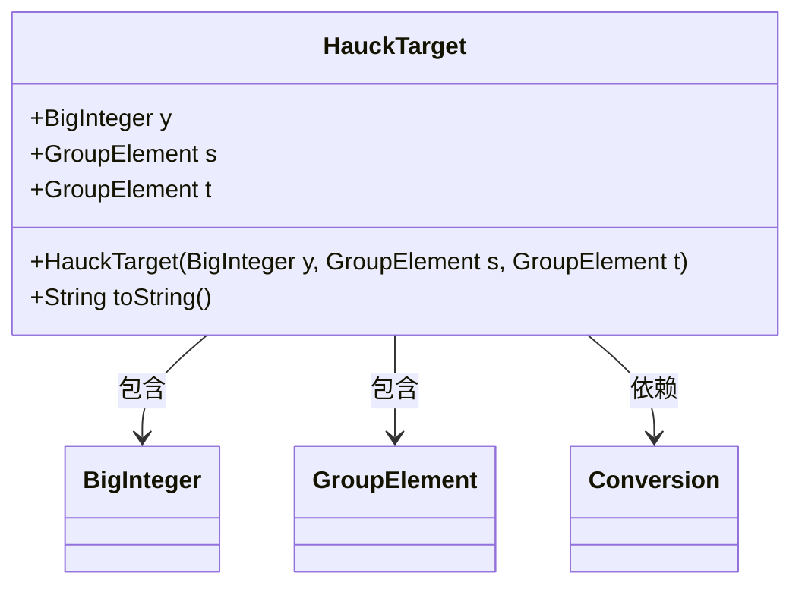
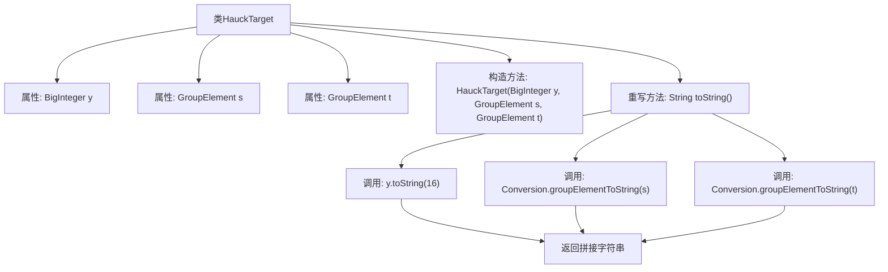

# 基础信息

|      |      |
|------|------|
| 名称 | HauckTarget |
| 编码语言 | .java |
| 代码路径 | WeFe/mpc/mpc-common/src/main/java/com/welab/wefe/mpc/pir/protocol/ot/hauck/HauckTarget.java |
| 包名 | com.welab.wefe.mpc.pir.protocol.ot.hauck |
| 依赖项 | ['com.welab.wefe.mpc.commom.Conversion', 'com.welab.wefe.mpc.pir.protocol.nt.group.GroupElement', 'java.math.BigInteger'] |
| 概述说明 | HauckTarget类包含BigInteger y和GroupElement s、t，提供构造方法和toString输出十六进制y及s、t的字符串表示。 |

# 说明

HauckTarget类包含三个成员变量：BigInteger类型的y，GroupElement类型的s和t。构造函数接收这三个参数并初始化对应成员变量。toString方法返回包含十六进制格式的y值，以及通过Conversion工具类转换为字符串的s和t值的格式化字符串。

# 类列表 Class Summary

| 名称   | 类型  | 说明 |
|-------|------|-------------|
| HauckTarget | class | HauckTarget类包含三个成员变量：BigInteger y和GroupElement s、t，提供构造函数初始化，toString方法以十六进制格式输出y和s、t的字符串表示。 |

## 类 HauckTarget

|      |      |
|------|------|
| 访问范围 | public |
| 类型 | class |
| 名称 | HauckTarget |
| 说明 | HauckTarget类包含三个成员变量：BigInteger y和GroupElement s、t，提供构造函数初始化，toString方法以十六进制格式输出y和s、t的字符串表示。 |

### UML类图

这段代码定义了一个名为HauckTarget的类，用于存储三个公开属性：BigInteger类型的y，以及两个GroupElement类型的s和t。类中包含一个构造方法用于初始化这些属性，并重写了toString()方法以便以十六进制字符串形式输出对象内容。该类依赖于Conversion工具类进行GroupElement到字符串的转换。整体结构简单清晰，主要用于封装与密码学或数学计算相关的目标数据。

### 内部方法调用关系图

该流程图描述了HauckTarget类的结构，包含三个属性（y、s、t）、一个构造方法和重写的toString方法。toString方法通过调用数值转换函数将属性转为十六进制字符串和群元素字符串，最终拼接成特定格式输出。流程清晰展示了数据转换和字符串合成的调用链关系。

### 字段列表 Field List

| 名称  | 类型  | 说明 |
|-------|-------|------|
| y | BigInteger | 公开的大整数变量y。 |
| s | GroupElement | 群元素变量s |
| t | GroupElement | GroupElement类型的公共变量t。 |

### 方法列表

| 名称  | 类型  | 说明 |
|-------|-------|------|
| toString | String | HauckTarget类的toString方法返回对象属性y（16进制）、s和t（转换后的字符串）的格式化字符串。 |

