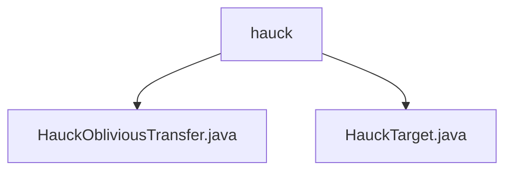

# 基础信息

|      |      |
|------|------|
| 名称 | hauck |
| 编码语言 | .java |
| 代码路径 | WeFe/mpc/mpc-common/src/main/java/com/welab/wefe/mpc/pir/protocol/ot/hauck |
| 包名 | docs.mpc.mpc-common.src.main.java.com.welab.wefe.mpc.pir.protocol.ot.hauck |
| 概述说明 | HauckObliviousTransfer类实现基于扭曲爱德华曲线的茫然传输协议，含群运算、哈希等核心功能，generateHauckTarget方法生成安全传输目标。HauckTarget类封装y、s、t三个参数，提供格式化输出。 |

# 说明

## 概述  
该模块实现基于扭曲爱德华曲线的茫然传输协议，核心类HauckObliviousTransfer提供密码学安全的基础操作，包括群运算、哈希计算和消息认证码生成。HauckTarget作为数据传输载体，封装随机标量y、群元素s和哈希结果t，类似协议中的安全信封结构。依赖项含SHA-256哈希算法和椭圆曲线算术模块。例如，generateHauckTarget方法持续生成已验证的传输目标三元组。

## 主要业务场景  
模块专注于安全多方计算中的隐私信息检索场景，通过生成随机标量及对应群元素实现茫然传输。典型流程包括初始化曲线参数、生成传输目标、验证群元素有效性等步骤。例如，HauckTarget通过格式化输出支持调试，而协议核心逻辑确保传输过程满足密码学安全性要求，类似零知识证明中的承诺机制。

### 包内部结构视图

该流程图展示了Hauck OT协议相关的Java文件层级结构。根节点"hauck"表示协议目录，包含两个实现文件：HauckObliviousTransfer.java实现基础OT协议功能，HauckTarget.java定义协议目标接口。这种结构体现了OT协议在MPC隐私保护中的模块化设计，两个关键类文件直接隶属于协议目录，没有中间层级。

# 文件列表

| 名称   | 类型  | 说明 |
|-------|------|-------------|
| [HauckObliviousTransfer.java](HauckObliviousTransfer.md) | file | HauckObliviousTransfer类实现基于扭曲爱德华曲线的茫然传输协议，包含随机数生成、哈希计算、MAC初始化和目标生成等功能。 |
| [HauckTarget.java](HauckTarget.md) | file | HauckTarget类包含BigInteger y和GroupElement s、t，提供构造方法和toString输出十六进制y及s、t的字符串表示。 |

