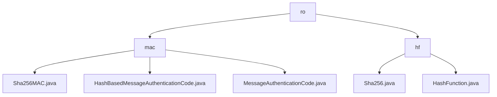

# 基础信息

|      |      |
|------|------|
| 名称 | ro |
| 编码语言 | .java |
| 代码路径 | WeFe/mpc/mpc-common/src/main/java/com/welab/wefe/mpc/pir/protocol/ro |
| 包名 | docs.mpc.mpc-common.src.main.java.com.welab.wefe.mpc.pir.protocol.ro |
| 概述说明 | 模块1实现基于哈希的消息认证码功能，采用三层继承结构支持数据完整性验证，依赖Java加密库生成认证码。模块2提供SHA-256哈希计算服务，通过接口分离设计实现可扩展的摘要功能，适用于数据校验等场景。 |

# 说明

## 概述  
该模块核心职责是为数据安全提供双重保障：基于哈希算法的消息认证码(MAC)和消息摘要功能，分别用于数据真实性验证和完整性校验。采用分层设计模式，MAC功能通过三层继承结构实现（基础框架-抽象方法-具体算法），哈希计算则采用接口隔离原则。  

关键数据结构包括密钥字节数组、消息字节数组及哈希值，通过SecretKeySpec和MessageDigest处理加密转换。外部依赖集中于Java标准库的Mac和加密相关类。例如Sha256MAC使用HmacSHA256算法生成认证码，Sha256类则通过MessageDigest实现标准哈希计算。  

## 主要业务场景  
模块适用于安全通信和数据处理场景，类似HTTPS校验链中的双重验证机制。典型流程分为两种模式：MAC需要密钥初始化后生成认证码，哈希计算则直接处理原始数据。例如多方安全计算中，可组合使用SHA-256哈希和MAC实现传输数据的防篡改闭环验证。  

交互模式统一为"输入-处理-输出"模型，支持字节数组作为通用数据载体。API包含功能接口（HashFunction）和继承体系（MessageAuthenticationCode），集成案例展示异常处理等细节，如哈希计算失败时返回空数组的容错设计。

### 包内部结构视图

该流程图展示了WeFe项目中MPC模块的PIR协议相关文件结构。根节点"ro"下分"mac"和"hf"两个子目录，分别包含MAC(消息认证码)和哈希函数相关的实现类文件。mac目录下有三个MAC实现类，hf目录下有两个哈希函数相关类。

# 文件列表

| 名称   | 类型  | 说明 |
|-------|------|-------------|
| [mac](mac/_module.md) | package | Sha256MAC类继承HashBasedMessageAuthenticationCode，实现SHA-256消息认证码功能，包含密钥和Mac实例，提供digest方法生成认证码。HashBasedMessageAuthenticationCode是抽象类，要求子类实现digest方法。MessageAuthenticationCode是基础框架类，用于消息认证码功能。 |
| [hf](hf/_module.md) | package | Sha256类实现HashFunction接口，提供digest方法用SHA-256算法生成哈希值，异常时返回空数组。HashFunction接口定义了哈希计算功能。 |

