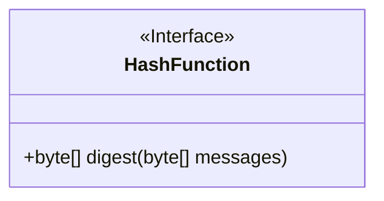
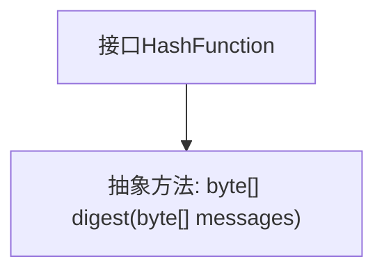

# 基础信息

|      |      |
|------|------|
| 名称 | HashFunction |
| 编码语言 | .java |
| 代码路径 | WeFe/mpc/mpc-common/src/main/java/com/welab/wefe/mpc/pir/protocol/ro/hf/HashFunction.java |
| 包名 | com.welab.wefe.mpc.pir.protocol.ro.hf |
| 依赖项 | [] |
| 概述说明 | 哈希函数接口，定义digest方法，输入输出均为字节数组。 |

# 说明

该内容定义了一个名为HashFunction的公共接口，其中包含一个digest方法。该方法接收一个byte数组类型的参数messages，并返回一个byte数组。该接口用于抽象哈希函数的计算功能，允许实现具体的哈希算法来生成消息摘要。

# 类列表 Class Summary

| 名称   | 类型  | 说明 |
|-------|------|-------------|
| HashFunction | interface | HashFunction接口定义了一个digest方法，输入输出均为字节数组。 |

## 类 HashFunction

|      |      |
|------|------|
| 访问范围 | public |
| 类型 | interface |
| 名称 | HashFunction |
| 说明 | HashFunction接口定义了一个digest方法，输入输出均为字节数组。 |

### UML类图

这段代码定义了一个名为HashFunction的接口，该接口声明了一个digest方法，接收byte数组类型的消息参数并返回byte数组类型的结果。接口在类图中用<<Interface>>标记，表示这是一个抽象类型，仅定义方法签名而不包含实现。该接口可能用于哈希计算场景，由具体实现类完成不同的哈希算法逻辑，如MD5、SHA-1等。接口设计的简洁性使其易于扩展，符合单一职责原则。

### 内部方法调用关系图

这段流程图展示了HashFunction接口的结构，该接口定义了一个名为digest的抽象方法，该方法接收一个byte数组作为输入参数并返回一个byte数组。由于这是一个接口，所有方法默认都是抽象的，因此不需要实现细节。流程图清晰地反映了接口的单一职责——提供消息摘要功能，这是哈希算法的核心操作。

### 字段列表 Field List

| 名称  | 类型  | 说明 |
|-------|-------|------|

### 方法列表

| 名称  | 类型  | 说明 |
|-------|-------|------|
| digest | byte[] | 计算消息的字节数组摘要。 |

