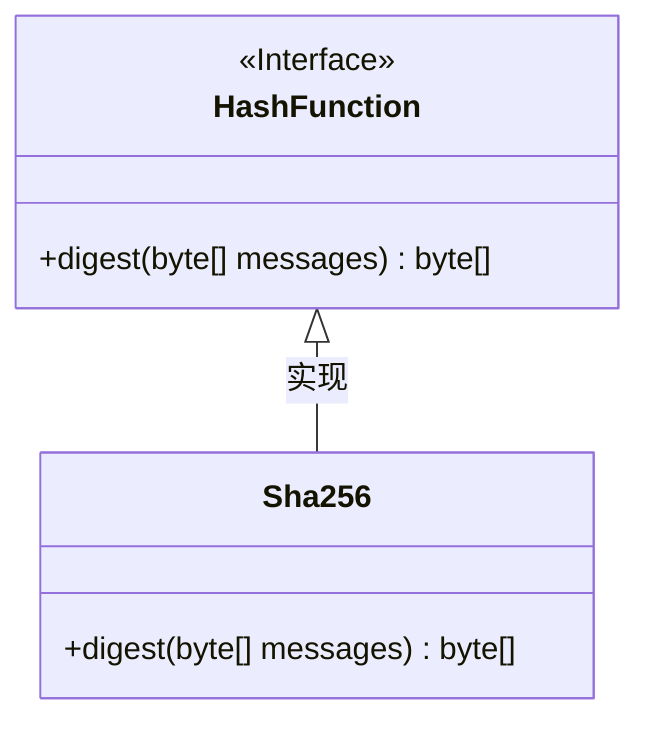
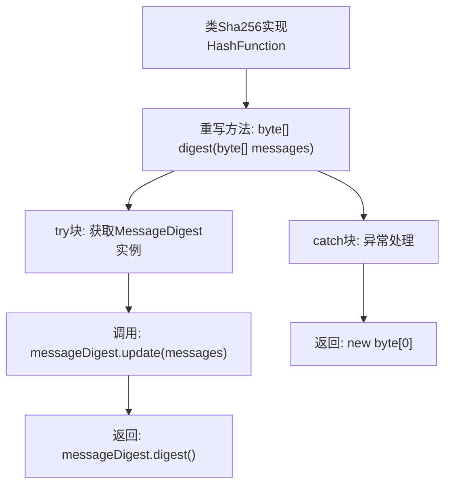

# 基础信息

|      |      |
|------|------|
| 名称 | Sha256 |
| 编码语言 | .java |
| 代码路径 | WeFe/mpc/mpc-common/src/main/java/com/welab/wefe/mpc/pir/protocol/ro/hf/Sha256.java |
| 包名 | com.welab.wefe.mpc.pir.protocol.ro.hf |
| 依赖项 | ['java.security.MessageDigest'] |
| 概述说明 | Sha256类实现HashFunction接口，使用SHA-256算法对输入字节数组生成哈希值，异常时返回空字节数组。 |

# 说明

该内容描述了一个名为Sha256的类，实现了HashFunction接口。该类包含一个digest方法，接收字节数组作为输入消息，使用SHA-256算法生成哈希值。方法内部通过MessageDigest类获取SHA-256实例，更新消息并计算摘要。若出现异常，方法返回空字节数组。整个过程展示了SHA-256哈希功能的基本实现。

# 类列表 Class Summary

| 名称   | 类型  | 说明 |
|-------|------|-------------|
| Sha256 | class | Sha256类实现HashFunction接口，使用SHA-256算法对输入字节数组生成哈希值，异常时返回空数组。 |

## 类 Sha256

|      |      |
|------|------|
| 访问范围 | public |
| 类型 | class |
| 名称 | Sha256 |
| 说明 | Sha256类实现HashFunction接口，使用SHA-256算法对输入字节数组生成哈希值，异常时返回空数组。 |

### UML类图

这段代码展示了一个实现`HashFunction`接口的`Sha256`类，用于计算SHA-256哈希值。`Sha256`类重写了接口中的`digest`方法，通过Java的`MessageDigest`类生成输入字节数组的哈希值。类图清晰地显示了接口与实现类之间的继承关系，`Sha256`作为具体实现提供了哈希计算功能。当输入异常时，方法会返回空字节数组作为容错处理。整个设计符合面向对象原则，接口定义了标准，实现类提供具体算法。

### 内部方法调用关系图

该流程图描述了Sha256类的digest方法执行流程。首先获取SHA-256算法实例，然后更新消息内容并生成摘要，若出现异常则返回空字节数组。整个过程展示了从消息输入到哈希输出的完整处理链，包括正常流程和异常处理路径，体现了密码学哈希函数的安全实现方式。

### 字段列表 Field List

| 名称  | 类型  | 说明 |
|-------|-------|------|

### 方法列表

| 名称  | 类型  | 说明 |
|-------|-------|------|
| digest | byte[] | Java方法：使用SHA-256算法对输入字节数组生成摘要，异常时返回空数组。 |

