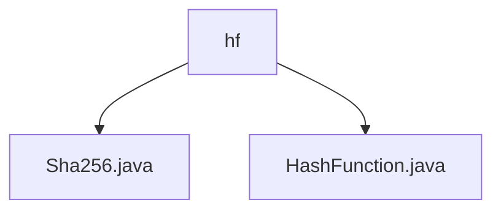

# 基础信息

|      |      |
|------|------|
| 名称 | hf |
| 编码语言 | .java |
| 代码路径 | WeFe/mpc/mpc-common/src/main/java/com/welab/wefe/mpc/pir/protocol/ro/hf |
| 包名 | docs.mpc.mpc-common.src.main.java.com.welab.wefe.mpc.pir.protocol.ro.hf |
| 概述说明 | Sha256类实现HashFunction接口，提供digest方法用SHA-256算法生成哈希值，异常时返回空数组。HashFunction接口定义了哈希计算功能。 |

# 说明

## 概述  
该模块核心职责是实现基于SHA-256算法的哈希计算功能，通过抽象接口与具体实现分离的设计模式提供可扩展的哈希服务。接口规范定义统一的digest方法，接收字节数组输入并返回哈希值，例如Sha256类实现了该接口并处理异常情况。关键数据结构仅为原始字节数组，依赖Java原生MessageDigest类进行加密运算。  

## 主要业务场景  
模块适用于需要消息摘要生成的场景，类似数据完整性校验或数字签名基础操作。典型应用模式为调用方通过HashFunction接口注入具体实现（如Sha256），传入消息后获取哈希值。API类型为单一功能接口，集成案例展示标准SHA-256算法实现，例如处理异常时返回空数组的容错逻辑。交互模式遵循"输入-计算-输出"的简单流程。

### 包内部结构视图

该流程图展示了`hf`目录下的两个Java文件：`Sha256.java`和`HashFunction.java`。这两个文件都直接隶属于`hf`目录，没有更深层级的子目录结构。图中清晰地呈现了文件与父目录之间的从属关系，符合给定的路径信息。

# 文件列表

| 名称   | 类型  | 说明 |
|-------|------|-------------|
| [Sha256.java](Sha256.md) | file | Sha256类实现HashFunction接口，使用SHA-256算法对输入字节数组生成哈希值，异常时返回空字节数组。 |
| [HashFunction.java](HashFunction.md) | file | 哈希函数接口，定义digest方法，输入输出均为字节数组。 |

