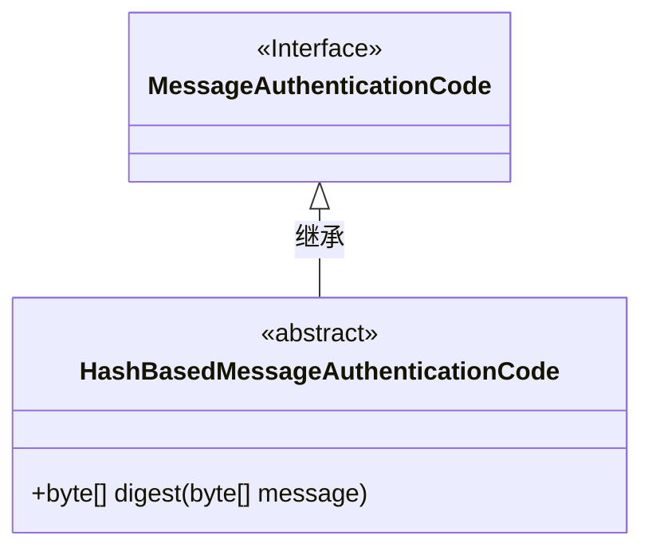
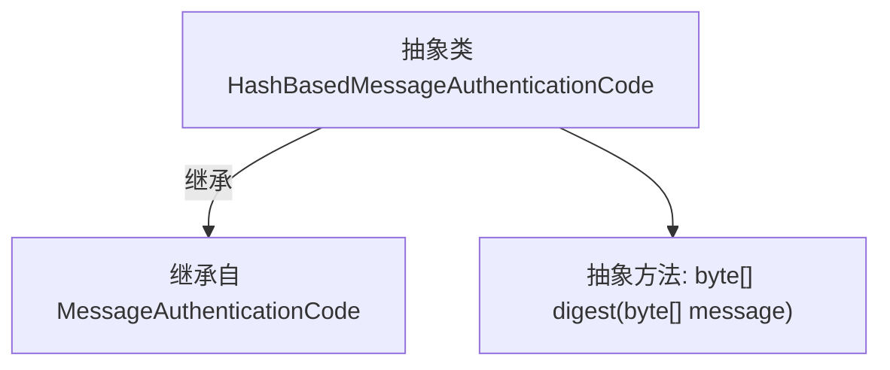

# 基础信息

|      |      |
|------|------|
| 名称 | HashBasedMessageAuthenticationCode |
| 编码语言 | .java |
| 代码路径 | WeFe/mpc/mpc-common/src/main/java/com/welab/wefe/mpc/pir/protocol/ro/mac/HashBasedMessageAuthenticationCode.java |
| 包名 | com.welab.wefe.mpc.pir.protocol.ro.mac |
| 依赖项 | [] |
| 概述说明 | 抽象类HashBasedMessageAuthenticationCode继承自MessageAuthenticationCode，定义了摘要方法digest，接收字节数组消息并返回字节数组摘要。 |

# 说明

这段内容定义了一个名为HashBasedMessageAuthenticationCode的抽象类，继承自MessageAuthenticationCode类。该类包含一个抽象方法digest，接收一个byte数组类型的message参数，并返回一个byte数组。该抽象类主要用于基于哈希算法的消息认证码功能，要求子类必须实现digest方法来完成具体的消息摘要计算。

# 类列表 Class Summary

| 名称   | 类型  | 说明 |
|-------|------|-------------|
| HashBasedMessageAuthenticationCode | class | 抽象类HashBasedMessageAuthenticationCode继承自MessageAuthenticationCode，定义了摘要方法digest，接收字节数组消息并返回字节数组结果。 |

## 类 HashBasedMessageAuthenticationCode

|      |      |
|------|------|
| 访问范围 | public abstract |
| 类型 | class |
| 名称 | HashBasedMessageAuthenticationCode |
| 说明 | 抽象类HashBasedMessageAuthenticationCode继承自MessageAuthenticationCode，定义了摘要方法digest，接收字节数组消息并返回字节数组结果。 |

### UML类图

这段类图展示了一个密码学相关的类结构。HashBasedMessageAuthenticationCode 是一个抽象类，继承自 MessageAuthenticationCode 接口。它定义了一个抽象方法 digest，用于对输入消息生成消息认证码。这种结构常用于实现基于哈希算法的消息认证功能，为具体实现类提供了基础框架。

### 内部方法调用关系图

该流程图展示了`HashBasedMessageAuthenticationCode`抽象类的结构，它继承自`MessageAuthenticationCode`基类，并声明了一个名为`digest`的抽象方法。图中清晰体现了类之间的继承关系和抽象方法的定义，符合面向对象设计中抽象类作为基类模板的特性。箭头方向准确表达了从子类指向父类的继承关系，以及类对自身方法的包含关系。

### 字段列表 Field List

| 名称  | 类型  | 说明 |
|-------|-------|------|

### 方法列表

| 名称  | 类型  | 说明 |
|-------|-------|------|
| digest | byte[] | 抽象方法digest接收字节数组message，返回其摘要结果的字节数组。 |

