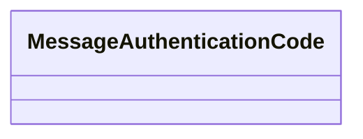
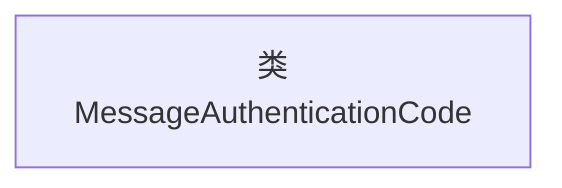

# 基础信息

|      |      |
|------|------|
| 名称 | MessageAuthenticationCode |
| 编码语言 | .java |
| 代码路径 | WeFe/mpc/mpc-common/src/main/java/com/welab/wefe/mpc/pir/protocol/ro/mac/MessageAuthenticationCode.java |
| 包名 | com.welab.wefe.mpc.pir.protocol.ro.mac |
| 依赖项 | [] |
| 概述说明 | 消息认证码类，用于数据完整性验证。 |

# 说明

这是一个名为MessageAuthenticationCode的公开Java类，用于实现消息认证码功能。该类目前为空实现，未包含任何成员变量或方法，但为后续实现消息认证码算法（如HMAC）提供了基础框架结构。作为安全相关类，它通常用于验证数据完整性和真实性。

# 类列表 Class Summary

| 名称   | 类型  | 说明 |
|-------|------|-------------|
| MessageAuthenticationCode | class | 消息认证码类，用于数据完整性验证和身份认证。 |

## 类 MessageAuthenticationCode

|      |      |
|------|------|
| 访问范围 | public |
| 类型 | class |
| 名称 | MessageAuthenticationCode |
| 说明 | 消息认证码类，用于数据完整性验证和身份认证。 |

### UML类图

这段类图展示了一个名为MessageAuthenticationCode的空类结构。该类目前没有定义任何属性或方法，仅作为消息认证码的基础框架存在。在密码学中，消息认证码通常用于验证消息的完整性和真实性，后续可扩展添加密钥管理、哈希计算和验证等核心功能。该图清晰地反映了当前最简化的类结构，为后续功能扩展提供了基础框架。

### 内部方法调用关系图

这段流程图描述了一个名为MessageAuthenticationCode的空类结构。图中仅包含一个节点表示类本身，由于该类未定义任何属性或方法，因此没有其他关联节点。这种结构通常作为代码框架的起点，后续可扩展添加MAC算法相关的属性和方法（如密钥管理、哈希计算、验证逻辑等）。当前图示反映了最基础的类声明状态，符合面向对象编程中类的初始定义形式。

### 字段列表 Field List

| 名称  | 类型  | 说明 |
|-------|-------|------|

### 方法列表

| 名称  | 类型  | 说明 |
|-------|-------|------|

