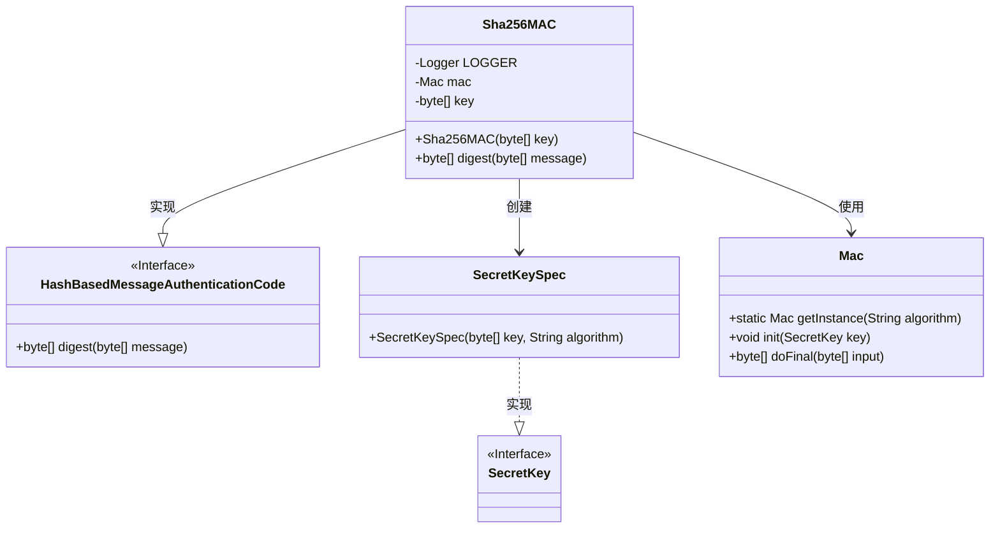
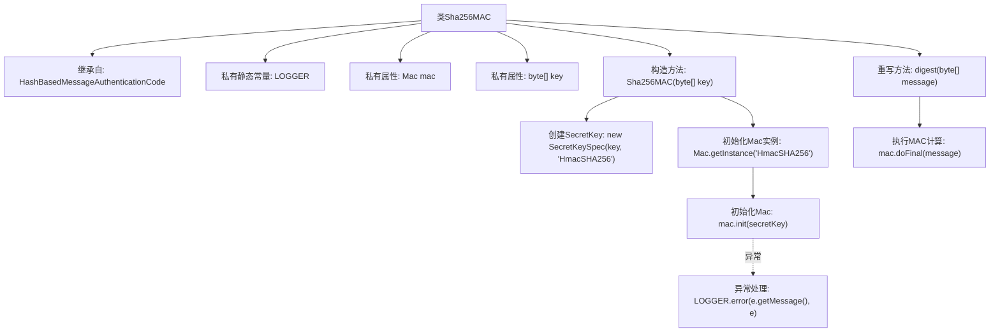

# 基础信息

|      |      |
|------|------|
| 名称 | Sha256MAC |
| 编码语言 | .java |
| 代码路径 | WeFe/mpc/mpc-common/src/main/java/com/welab/wefe/mpc/pir/protocol/ro/mac/Sha256MAC.java |
| 包名 | com.welab.wefe.mpc.pir.protocol.ro.mac |
| 依赖项 | ['org.slf4j.Logger', 'org.slf4j.LoggerFactory', 'javax.crypto.Mac', 'javax.crypto.SecretKey', 'javax.crypto.spec.SecretKeySpec'] |
| 概述说明 | Sha256MAC类基于HmacSHA256算法实现消息认证码功能，通过密钥初始化Mac实例并提供digest方法生成消息摘要。 |

# 说明

Sha256MAC类继承自HashBasedMessageAuthenticationCode，实现了基于SHA-256算法的消息认证码功能。该类包含一个Mac实例和密钥字节数组作为成员变量。构造函数接收密钥字节数组，使用HmacSHA256算法模式创建SecretKeySpec密钥，并初始化Mac实例。若初始化失败会记录错误日志。digest方法接收消息字节数组，调用Mac实例的doFinal方法生成认证码并返回。整个类专注于提供SHA-256算法的消息认证功能。

# 类列表 Class Summary

| 名称   | 类型  | 说明 |
|-------|------|-------------|
| Sha256MAC | class | Sha256MAC类基于HmacSHA256算法实现消息认证码功能，通过密钥初始化并生成消息摘要。 |

## 类 Sha256MAC

|      |      |
|------|------|
| 访问范围 | public |
| 类型 | class |
| 名称 | Sha256MAC |
| 说明 | Sha256MAC类基于HmacSHA256算法实现消息认证码功能，通过密钥初始化并生成消息摘要。 |

### UML类图

该类图展示了SHA-256消息认证码的实现结构。Sha256MAC类实现了HashBasedMessageAuthenticationCode接口，核心功能是通过Mac类进行消息摘要计算。它使用SecretKeySpec创建密钥，并捕获初始化过程中的异常。整个设计遵循了加密服务的标准模式，通过依赖Java加密体系的核心类来实现安全功能，同时保持了良好的异常处理机制。

### 内部方法调用关系图

该流程图展示了Sha256MAC类的完整结构和工作流程。类继承自HashBasedMessageAuthenticationCode，包含LOGGER常量和mac/key属性。构造方法中完成HmacSHA256算法的密钥初始化和Mac实例配置，并通过异常处理记录错误。digest方法委托mac实例执行最终的消息认证码计算。整个流程突出了密钥处理、算法初始化和异常处理等关键安全操作环节。

### 字段列表 Field List

| 名称  | 类型  | 说明 |
|-------|-------|------|
| mac | Mac | 声明一个名为mac的Mac类对象。 |
| LOGGER = LoggerFactory.getLogger(Sha256MAC.class) | Logger | 定义了一个私有静态不可变日志记录器实例，用于Sha256MAC类的日志输出。 |
| key | byte[] | 声明一个字节数组变量key。 |

### 方法列表

| 名称  | 类型  | 说明 |
|-------|-------|------|
| digest | byte[] | 该方法接收字节数组消息，使用MAC算法生成并返回其摘要字节数组。 |

