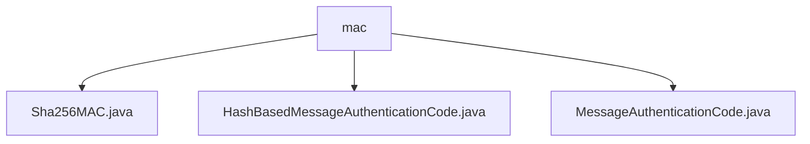

# 基础信息

|      |      |
|------|------|
| 名称 | mac |
| 编码语言 | .java |
| 代码路径 | WeFe/mpc/mpc-common/src/main/java/com/welab/wefe/mpc/pir/protocol/ro/mac |
| 包名 | docs.mpc.mpc-common.src.main.java.com.welab.wefe.mpc.pir.protocol.ro.mac |
| 概述说明 | Sha256MAC类继承HashBasedMessageAuthenticationCode，实现SHA-256消息认证码功能，包含密钥和Mac实例，提供digest方法生成认证码。HashBasedMessageAuthenticationCode是抽象类，要求子类实现digest方法。MessageAuthenticationCode是基础框架类，用于消息认证码功能。 |

# 说明

## 概述  
该模块实现基于哈希算法的消息认证码(MAC)功能，核心职责是为数据完整性和真实性验证提供安全支持。采用三层继承结构：顶层MessageAuthenticationCode作为基础框架，中间层HashBasedMessageAuthenticationCode定义抽象摘要方法，底层Sha256MAC实现SHA-256算法的具体认证逻辑。  

关键数据结构包括密钥字节数组和消息字节数组，通过SecretKeySpec转换密钥格式。外部依赖仅涉及Java标准库的Mac和加密相关类。例如Sha256MAC使用HmacSHA256算法模式初始化Mac实例，并通过doFinal生成认证码。  

## 主要业务场景  
模块适用于需要数据防篡改验证的安全通信场景，类似HTTPS的完整性校验机制。典型流程为：初始化时配置密钥，处理阶段对输入消息生成认证码。例如在多方安全计算中，可通过SHA-256算法确保传输数据未被篡改。  

交互模式统一为密钥初始化+消息摘要两步操作，支持字节数组作为通用数据载体。所有实现均遵循"密钥-消息-认证码"的基础模型，如Sha256MAC继承抽象类后实现具体哈希计算逻辑，形成完整的消息认证链条。

### 包内部结构视图

该流程图展示了mac目录下的三个Java文件：Sha256MAC.java、HashBasedMessageAuthenticationCode.java和MessageAuthenticationCode.java。这三个文件都直接隶属于mac目录，没有更深层次的嵌套关系，属于同一层级的实现类文件。

# 文件列表

| 名称   | 类型  | 说明 |
|-------|------|-------------|
| [Sha256MAC.java](Sha256MAC.md) | file | Sha256MAC类基于HmacSHA256算法实现消息认证码功能，通过密钥初始化Mac实例并提供digest方法生成消息摘要。 |
| [HashBasedMessageAuthenticationCode.java](HashBasedMessageAuthenticationCode.md) | file | 抽象类HashBasedMessageAuthenticationCode继承自MessageAuthenticationCode，定义了摘要方法digest，接收字节数组消息并返回字节数组摘要。 |
| [MessageAuthenticationCode.java](MessageAuthenticationCode.md) | file | 消息认证码类，用于数据完整性验证。 |

