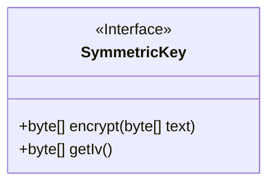
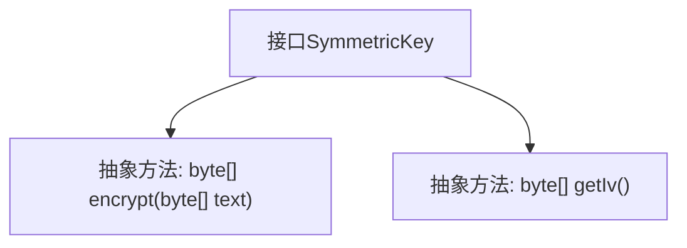

# 基础信息

|      |      |
|------|------|
| 名称 | SymmetricKey |
| 编码语言 | .java |
| 代码路径 | WeFe/mpc/mpc-common/src/main/java/com/welab/wefe/mpc/pir/protocol/se/SymmetricKey.java |
| 包名 | com.welab.wefe.mpc.pir.protocol.se |
| 依赖项 | [] |
| 概述说明 | 对称密钥接口定义加密方法，输入输出均为字节数组，并提供获取初始化向量的方法。 |

# 说明

该内容定义了一个名为SymmetricKey的公开接口，包含两个核心方法。encrypt方法接收字节数组形式的明文输入，返回加密后的字节数组结果。getIv方法用于获取初始化向量（IV），返回IV的字节数组表示。该接口明确了对称密钥加密的基本功能要求，强调数据加密和初始化向量获取能力，适用于需要对称加密的场景。

# 类列表 Class Summary

| 名称   | 类型  | 说明 |
|-------|------|-------------|
| SymmetricKey | interface | 对称密钥接口定义加密方法：encrypt处理字节数组，getIv获取初始化向量。 |

## 类 SymmetricKey

|      |      |
|------|------|
| 访问范围 | public |
| 类型 | interface |
| 名称 | SymmetricKey |
| 说明 | 对称密钥接口定义加密方法：encrypt处理字节数组，getIv获取初始化向量。 |

### UML类图

这段代码定义了一个名为`SymmetricKey`的接口，该接口规定了对称加密算法需要实现的两个核心方法：`encrypt`用于加密字节数组数据，返回加密后的字节数组；`getIv`用于获取初始化向量(IV)。接口通过`<<Interface>>`标记明确其抽象性质，两个方法均为公有方法，体现了对称加密中数据加密和密钥管理的核心功能。该接口可作为不同对称加密算法（如AES、DES等）的统一抽象层。

### 内部方法调用关系图

这段流程图展示了SymmetricKey接口的结构，该接口定义了两个核心抽象方法：encrypt用于加密字节数组，getIv用于获取初始化向量。作为对称密钥加密的抽象规范，所有实现该接口的类都必须提供这两个方法的具体实现。图中清晰呈现了接口与方法之间的从属关系，突出了接口作为行为契约的特性。

### 字段列表 Field List

| 名称  | 类型  | 说明 |
|-------|-------|------|

### 方法列表

| 名称  | 类型  | 说明 |
|-------|-------|------|
| encrypt | byte[] | 加密函数，输入输出均为字节数组。 |
| getIv | byte[] | 获取初始化向量（IV）的字节数组方法。 |

