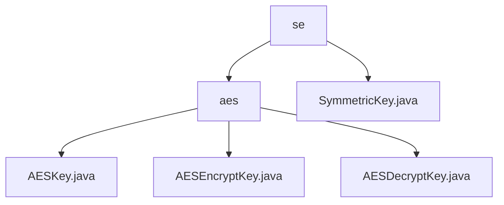

# 基础信息

|      |      |
|------|------|
| 名称 | se |
| 编码语言 | .java |
| 代码路径 | WeFe/mpc/mpc-common/src/main/java/com/welab/wefe/mpc/pir/protocol/se |
| 包名 | docs.mpc.mpc-common.src.main.java.com.welab.wefe.mpc.pir.protocol.se |
| 概述说明 | AES对称加密模块，含密钥管理、加解密功能，支持自动IV生成和严格匹配，适用于隐私保护场景。依赖Java加密扩展，遵循SymmetricKey接口规范。 |

# 说明

## 概述  
该模块实现AES对称加密全流程，核心职责为密钥管理与加解密操作。通过SymmetricKey接口规范加密行为，抽象类AESKey派生加密/解密子类，关键数据结构含16字节IV和密钥字节数组，采用AES/CBC/PKCS5Padding标准。外部依赖仅Java Cryptography Extension。例如IV自动补全机制类似TLS随机数策略，确保安全性。

## 主要业务场景  
支持自动生成IV加密与显式IV解密两种模式，统一通过encrypt方法交互。典型场景包括安全多方计算，例如加密时不足16字节IV触发随机生成，解密需严格匹配原IV。完整覆盖密钥生成、数据加解密及异常处理，类似HTTPS握手流程。API类型聚焦SymmetricKey接口的encrypt/getIv方法。

### 包内部结构视图

该流程图展示了SE协议目录下的层级结构，顶层为"se"文件夹，包含"aes"子目录和"SymmetricKey.java"文件。"aes"目录下进一步包含三个AES相关的密钥类文件：AESKey.java、AESEncryptKey.java和AESDecryptKey.java，清晰地呈现了对称加密协议模块的文件组织关系。

# 文件列表

| 名称   | 类型  | 说明 |
|-------|------|-------------|
| [SymmetricKey.java](SymmetricKey.md) | file | 对称密钥接口定义加密方法，输入输出均为字节数组，并提供获取初始化向量的方法。 |
| [aes](aes/_module.md) | package | AESKey抽象类封装AES密钥和IV，含key、iv和cipher变量，构造函数处理IV生成。AESEncryptKey和AESDecryptKey分别实现加密和解密，使用AES/CBC/PKCS5Padding模式，提供构造、初始化和操作功能，异常通过日志记录。 |

