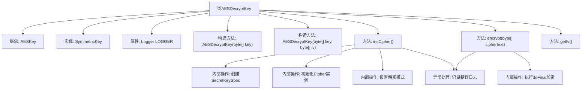

# 基础信息

|      |      |
|------|------|
| 名称 | AESDecryptKey |
| 编码语言 | .java |
| 代码路径 | WeFe/mpc/mpc-common/src/main/java/com/welab/wefe/mpc/pir/protocol/se/aes/AESDecryptKey.java |
| 包名 | com.welab.wefe.mpc.pir.protocol.se.aes |
| 依赖项 | ['com.welab.wefe.mpc.pir.protocol.se.SymmetricKey', 'org.slf4j.Logger', 'org.slf4j.LoggerFactory', 'javax.crypto.Cipher', 'javax.crypto.spec.IvParameterSpec', 'javax.crypto.spec.SecretKeySpec', 'java.security.Key'] |
| 概述说明 | AES解密密钥类，继承AESKey并实现SymmetricKey接口，提供解密初始化、加密方法（实际用于解密）及获取IV功能，含异常处理日志记录。 |

# 说明

AESDecryptKey类继承自AESKey并实现SymmetricKey接口，用于AES解密操作。该类包含两个构造函数，分别接受密钥或密钥加初始化向量作为参数。核心方法initCipher初始化解密用的Cipher实例，使用AES/CBC/PKCS5Padding模式。encrypt方法执行解密操作并返回明文，getIv方法返回初始化向量。异常处理通过LOGGER记录错误日志。

# 类列表 Class Summary

| 名称   | 类型  | 说明 |
|-------|------|-------------|
| AESDecryptKey | class | AES解密密钥类，继承AESKey并实现SymmetricKey接口，提供解密初始化、加密方法及IV获取功能，异常时记录日志。 |


## 类 AESDecryptKey

|      |      |
|------|------|
| 访问范围 | public |
| 类型 | class |
| 名称 | AESDecryptKey |
| 说明 | AES解密密钥类，继承AESKey并实现SymmetricKey接口，提供解密初始化、加密方法及IV获取功能，异常时记录日志。 |


### UML类图

```mermaid
classDiagram
    class AESKey {
        -byte[] key
        -byte[] iv
        -Cipher cipher
        +AESKey(byte[] key, byte[] iv)
    }

    class AESDecryptKey {
        -static Logger LOGGER
        +AESDecryptKey(byte[] key)
        +AESDecryptKey(byte[] key, byte[] iv)
        +initCipher() void
        +encrypt(byte[] ciphertext) byte[]
        +getIv() byte[]
    }

    <<Interface>> SymmetricKey {
        <<abstract>>
        +initCipher() void
        +encrypt(byte[] ciphertext) byte[]
        +getIv() byte[]
    }

    AESKey <|-- AESDecryptKey
    SymmetricKey <|.. AESDecryptKey
```

该类图展示了AESDecryptKey继承自AESKey并实现SymmetricKey接口的结构。AESDecryptKey包含解密初始化、加密操作和获取初始化向量的方法，通过LOGGER记录异常。AESKey作为父类提供密钥和初始化向量存储基础，SymmetricKey接口定义了对称密钥的基本操作规范。


### 内部方法调用关系图



这段代码流程图展示了AESDecryptKey类的完整结构，该类继承自AESKey并实现SymmetricKey接口。核心流程包括两个构造函数初始化密钥和IV向量，initCipher()方法通过SecretKeySpec和Cipher实例配置AES/CBC/PKCS5Padding解密模式，encrypt()方法执行实际解密操作并处理异常。所有异常均通过LOGGER记录错误信息，getIv()提供IV向量访问。流程图清晰呈现了类继承关系、方法调用链和异常处理路径。

### 字段列表 Field List

| 名称  | 类型  | 说明 |
|-------|-------|------|
| LOGGER = LoggerFactory.getLogger(AESDecryptKey.class) | Logger | 定义了一个名为LOGGER的私有静态常量日志记录器，用于AESDecryptKey类的日志输出。 |

### 方法列表

| 名称  | 类型  | 说明 |
|-------|-------|------|
| initCipher | void | 初始化AES解密器，使用CBC模式和PKCS5填充，处理异常并记录日志。 |
| encrypt | byte[] | 该方法用于加密字节数组，调用cipher.doFinal处理输入数据，异常时记录错误并返回空字节数组。 |
| getIv | byte[] | 方法返回当前对象的iv字节数组。 |


