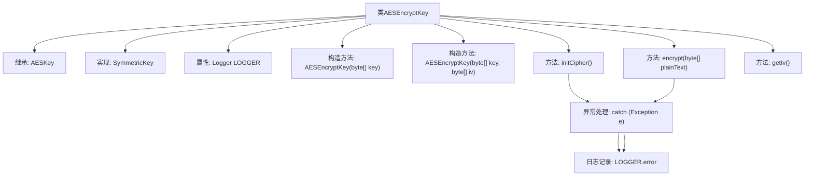

# 基础信息

|      |      |
|------|------|
| 名称 | AESEncryptKey |
| 编码语言 | .java |
| 代码路径 | WeFe/mpc/mpc-common/src/main/java/com/welab/wefe/mpc/pir/protocol/se/aes/AESEncryptKey.java |
| 包名 | com.welab.wefe.mpc.pir.protocol.se.aes |
| 依赖项 | ['com.welab.wefe.mpc.pir.protocol.se.SymmetricKey', 'org.slf4j.Logger', 'org.slf4j.LoggerFactory', 'javax.crypto.Cipher', 'javax.crypto.spec.IvParameterSpec', 'javax.crypto.spec.SecretKeySpec', 'java.security.Key'] |
| 概述说明 | AESEncryptKey类实现对称密钥加密，继承AESKey，支持初始化加密器和执行加密操作，使用AES/CBC/PKCS5Padding模式，含错误日志记录。 |

# 说明

AESEncryptKey类继承自AESKey并实现SymmetricKey接口，用于AES加密操作。该类包含两个构造函数，分别接受密钥和可选的初始化向量IV。初始化方法initCipher配置AES/CBC/PKCS5Padding加密模式。encrypt方法执行加密并返回结果，出错时记录日志并返回空数组。getIv方法返回初始化向量。所有异常均通过日志记录器捕获并记录。

# 类列表 Class Summary

| 名称   | 类型  | 说明 |
|-------|------|-------------|
| AESEncryptKey | class | AES加密密钥类，继承AESKey并实现SymmetricKey接口，支持密钥和IV初始化，提供加密方法和IV获取功能，使用AES/CBC/PKCS5Padding模式。 |


## 类 AESEncryptKey

|      |      |
|------|------|
| 访问范围 | public |
| 类型 | class |
| 名称 | AESEncryptKey |
| 说明 | AES加密密钥类，继承AESKey并实现SymmetricKey接口，支持密钥和IV初始化，提供加密方法和IV获取功能，使用AES/CBC/PKCS5Padding模式。 |


### UML类图

```mermaid
classDiagram
    class AESKey {
        -byte[] key
        -byte[] iv
        -Cipher cipher
        +AESKey(byte[] key, byte[] iv)
    }

    class AESEncryptKey {
        -static Logger LOGGER
        +AESEncryptKey(byte[] key)
        +AESEncryptKey(byte[] key, byte[] iv)
        +void initCipher()
        +byte[] encrypt(byte[] plainText)
        +byte[] getIv()
    }

    <<Interface>> SymmetricKey {
        <<interface>>
        +void initCipher()
        +byte[] encrypt(byte[] plainText)
        +byte[] getIv()
    }

    AESKey <|-- AESEncryptKey
    SymmetricKey <|.. AESEncryptKey
```

类图描述：AESEncryptKey类继承自AESKey基类并实现了SymmetricKey接口，用于AES加密操作。它包含初始化密码器(initCipher)、加密数据(encrypt)和获取初始化向量(getIv)等方法，通过SecretKeySpec和Cipher实现AES/CBC/PKCS5Padding加密算法。LOGGER用于记录异常信息，体现了健壮的错误处理机制。


### 内部方法调用关系图



这段代码展示了一个AES加密密钥类，继承自AESKey并实现SymmetricKey接口。主要功能包括初始化加密器(initCipher)、执行加密(encrypt)和获取初始化向量(getIv)。流程图清晰呈现了类结构、构造方法、核心方法调用链及异常处理路径，其中加密操作和初始化过程都包含异常捕获和日志记录机制。

### 字段列表 Field List

| 名称  | 类型  | 说明 |
|-------|-------|------|
| LOGGER = LoggerFactory.getLogger(AESEncryptKey.class) | Logger | AESEncryptKey类中定义了一个静态不可变的日志记录器实例。 |

### 方法列表

| 名称  | 类型  | 说明 |
|-------|-------|------|
| initCipher | void | 初始化AES加密器，使用CBC模式和PKCS5填充，捕获异常并记录日志。 |
| encrypt | byte[] | 加密方法：输入字节数组，使用cipher加密，异常时记录日志并返回空数组。 |
| getIv | byte[] | 获取IV（初始化向量）的字节数组方法。 |


