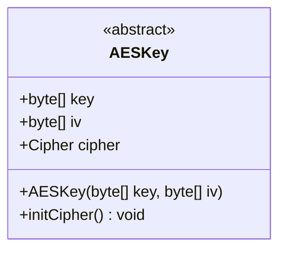
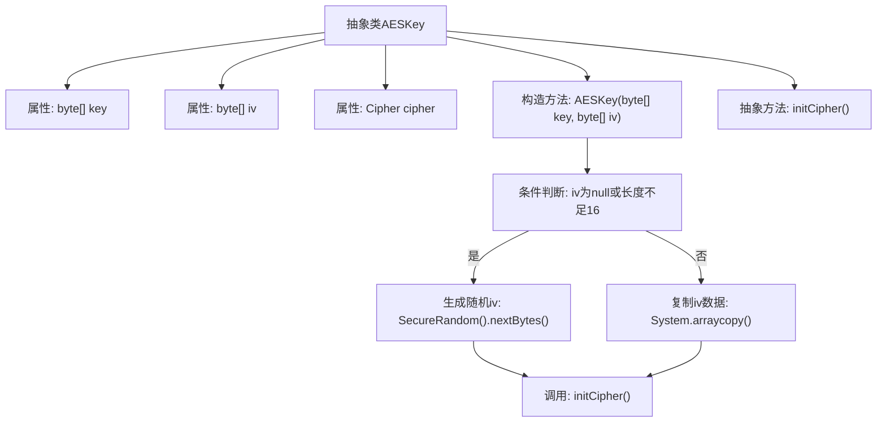

# 基础信息

|      |      |
|------|------|
| 名称 | AESKey |
| 编码语言 | .java |
| 代码路径 | WeFe/mpc/mpc-common/src/main/java/com/welab/wefe/mpc/pir/protocol/se/aes/AESKey.java |
| 包名 | com.welab.wefe.mpc.pir.protocol.se.aes |
| 依赖项 | ['javax.crypto.Cipher', 'java.security.SecureRandom'] |
| 概述说明 | AESKey抽象类包含密钥、16字节IV和Cipher对象，构造函数处理IV初始化并调用抽象方法initCipher。 |

# 说明

这是一个抽象类AESKey，用于封装AES加密相关的密钥和初始化向量。类中包含三个成员变量：key字节数组存储密钥，iv字节数组存储16字节初始化向量，cipher对象用于加密操作。构造函数接收key和iv参数，若iv为空或不足16字节则生成随机iv，否则复制前16字节。抽象方法initCipher需子类实现以初始化cipher。

# 类列表 Class Summary

| 名称   | 类型  | 说明 |
|-------|------|-------------|
| AESKey | class | AESKey抽象类包含key、iv和cipher字段，构造函数初始化key和16字节iv（随机生成或复制输入），并调用抽象方法initCipher。 |

## 类 AESKey

|      |      |
|------|------|
| 访问范围 | public abstract |
| 类型 | class |
| 名称 | AESKey |
| 说明 | AESKey抽象类包含key、iv和cipher字段，构造函数初始化key和16字节iv（随机生成或复制输入），并调用抽象方法initCipher。 |

### UML类图

这段代码定义了一个抽象类 `AESKey`，用于管理AES加密所需的密钥和初始化向量(iv)。类中包含三个公有字段：`key` 存储加密密钥，`iv` 存储16字节的初始化向量，`cipher` 存储加密器实例。构造函数接收密钥和iv参数，如果iv为空或不足16字节，则使用安全随机数生成器填充。抽象方法 `initCipher()` 需要子类实现具体的加密器初始化逻辑。该类为AES加密提供了基础框架，强制子类完成加密器初始化工作。

### 内部方法调用关系图

该流程图展示了AESKey抽象类的结构和初始化流程。类包含三个属性和一个构造方法，其中iv初始化时会检查输入参数，若无效则生成随机字节，否则复制前16字节。最后调用抽象方法initCipher()完成密码器初始化。流程清晰展现了对象构造时的条件分支和最终抽象方法调用。

### 字段列表 Field List

| 名称  | 类型  | 说明 |
|-------|-------|------|
| key | byte[] | 声明一个名为key的字节数组变量。 |
| iv | byte[] | 声明一个名为iv的字节数组类型的公共变量。 |
| cipher | Cipher | 声明一个名为cipher的Cipher类公共变量。 |

### 方法列表

| 名称  | 类型  | 说明 |
|-------|-------|------|
| initCipher | void | 抽象方法initCipher，用于初始化密码器。 |

