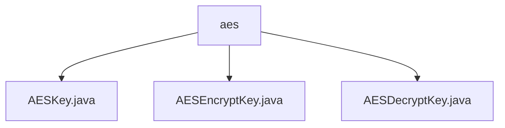

# 基础信息

|      |      |
|------|------|
| 名称 | aes |
| 编码语言 | .java |
| 代码路径 | WeFe/mpc/mpc-common/src/main/java/com/welab/wefe/mpc/pir/protocol/se/aes |
| 包名 | docs.mpc.mpc-common.src.main.java.com.welab.wefe.mpc.pir.protocol.se.aes |
| 概述说明 | AESKey抽象类封装AES密钥和IV，含key、iv和cipher变量，构造函数处理IV生成。AESEncryptKey和AESDecryptKey分别实现加密和解密，使用AES/CBC/PKCS5Padding模式，提供构造、初始化和操作功能，异常通过日志记录。 |

# 说明

## 概述  
该模块提供AES对称加密的完整实现，核心职责包括密钥管理和加解密操作。抽象类AESKey封装基础密钥结构，子类AESEncryptKey和AESDecryptKey分别实现加密/解密功能，均遵循SymmetricKey接口规范。关键数据结构包含密钥字节数组和16字节初始化向量（IV），采用AES/CBC/PKCS5Padding标准模式。外部依赖仅涉及Java Cryptography Extension。例如，IV自动补全机制确保加密安全性，类似TLS协议的随机数生成策略。

## 主要业务场景  
模块支持两种典型应用：数据加密时自动生成IV（类似HTTPS握手），解密时需显式传入IV。交互模式统一通过encrypt方法执行操作，异常通过日志记录器处理。例如加密场景中，不足16字节的IV会触发随机生成；解密场景要求严格匹配加密时的IV。完整功能覆盖密钥生成、数据加解密及异常处理，适用于安全多方计算等隐私保护场景。

### 包内部结构视图

该流程图展示了AES加密协议相关的三个关键类文件在aes目录下的层级关系。AESKey.java、AESEncryptKey.java和AESDecryptKey.java三个文件都直接位于aes目录中，没有更深层次的子目录结构，这三个文件共同构成了AES加密协议的基础实现组件。

# 文件列表

| 名称   | 类型  | 说明 |
|-------|------|-------------|
| [AESKey.java](AESKey.md) | file | AESKey抽象类包含密钥、16字节IV和Cipher对象，构造函数处理IV初始化并调用抽象方法initCipher。 |
| [AESEncryptKey.java](AESEncryptKey.md) | file | AESEncryptKey类实现对称密钥加密，继承AESKey，支持初始化加密器和执行加密操作，使用AES/CBC/PKCS5Padding模式，含错误日志记录。 |
| [AESDecryptKey.java](AESDecryptKey.md) | file | AES解密密钥类，继承AESKey并实现SymmetricKey接口，提供解密初始化、加密方法（实际用于解密）及获取IV功能，含异常处理日志记录。 |

