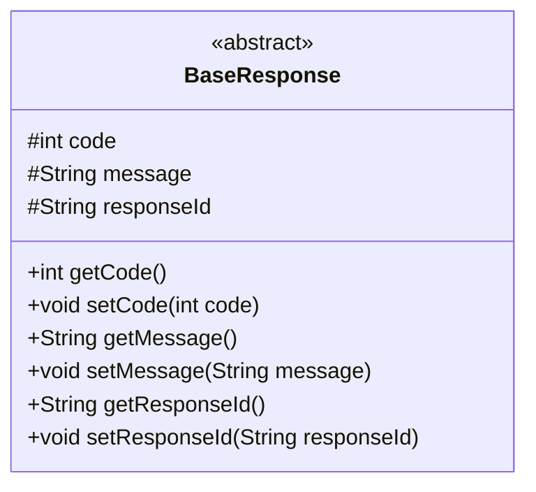
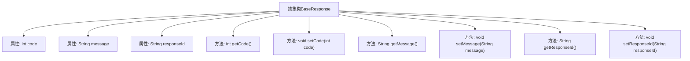

# 基础信息

|      |      |
|------|------|
| 名称 | BaseResponse |
| 编码语言 | .java |
| 代码路径 | WeFe/mpc/mpc-common/src/main/java/com/welab/wefe/mpc/pir/request/BaseResponse.java |
| 包名 | com.welab.wefe.mpc.pir.request |
| 依赖项 | [] |
| 概述说明 | 抽象类BaseResponse包含code、message、responseId三个属性及对应的getter和setter方法。 |

# 说明

BaseResponse是一个抽象类，定义了三个受保护的成员变量：code、message和responseId。code是整型，message和responseId是字符串类型。类中提供了这三个变量的getter和setter方法，分别用于获取和设置它们的值。getCode返回code的值，setCode用于设置code的值。getMessage返回message的值，setMessage用于设置message的值。getResponseId返回responseId的值，setResponseId用于设置responseId的值。

# 类列表 Class Summary

| 名称   | 类型  | 说明 |
|-------|------|-------------|
| BaseResponse | class | 抽象类BaseResponse包含code、message、responseId三个属性及其getter和setter方法。 |

## 类 BaseResponse

|      |      |
|------|------|
| 访问范围 | public abstract |
| 类型 | class |
| 名称 | BaseResponse |
| 说明 | 抽象类BaseResponse包含code、message、responseId三个属性及其getter和setter方法。 |

### UML类图

该类图展示了一个抽象基类BaseResponse，包含三个受保护的字段（code、message、responseId）及其对应的getter和setter方法。作为抽象类，它旨在为具体响应类提供通用结构，封装响应状态码、消息和唯一标识符等基础属性，便于派生类扩展特定功能。所有字段和方法都使用#号表示protected可见性，符合面向对象设计的封装原则。

### 内部方法调用关系图

这段代码定义了一个抽象类BaseResponse，包含三个受保护的属性（code、message、responseId）和对应的getter/setter方法。流程图展示了类与属性/方法之间的从属关系，所有方法都直接关联到抽象类，没有内部调用关系。该设计为响应对象提供了基础结构，支持状态码、消息和响应ID的标准操作。

### 字段列表 Field List

| 名称  | 类型  | 说明 |
|-------|-------|------|
| code | int | 受保护的整型变量code。 |
| message | String | 受保护的字符串类型变量message。 |
| responseId | String | 声明了一个受保护的字符串类型变量responseId。 |

### 方法列表

| 名称  | 类型  | 说明 |
|-------|-------|------|
| setMessage | void | 设置消息内容的方法，将输入参数message赋值给当前对象的message属性。 |
| getCode | int | 这是一个Java方法，返回整型变量code的值。 |
| setResponseId | void | 这是一个Java方法，用于设置类的responseId属性值。方法接收一个字符串参数responseId，并将其赋值给类的同名成员变量。 |
| getResponseId | String | 方法返回responseId字符串。 |
| getMessage | String | 这是一个Java方法，返回字符串类型的message变量值。 |
| setCode | void | 设置整型变量code的值。 |

