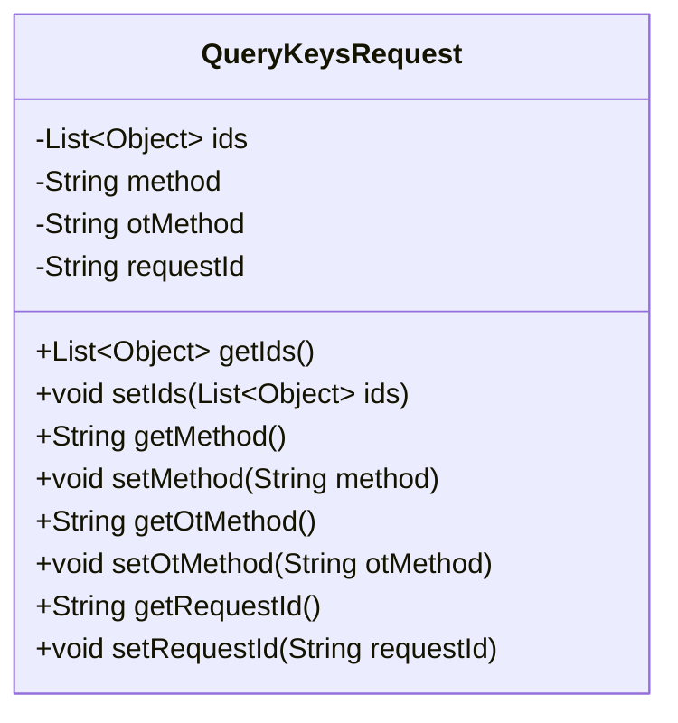
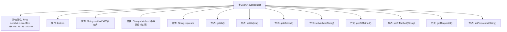

# 基础信息

|      |      |
|------|------|
| 名称 | QueryKeysRequest |
| 编码语言 | .java |
| 代码路径 | WeFe/mpc/mpc-common/src/main/java/com/welab/wefe/mpc/pir/request/QueryKeysRequest.java |
| 包名 | com.welab.wefe.mpc.pir.request |
| 依赖项 | ['java.io.Serializable', 'java.util.List'] |
| 概述说明 | QueryKeysRequest类包含ids列表、id加密方式method、不经意传输实现otMethod和请求ID requestId字段及其getter/setter方法。 |

# 说明

QueryKeysRequest是一个可序列化的Java类，用于封装查询密钥请求的相关信息。该类包含四个主要属性：ids是一个对象列表，表示需要查询的ID集合；method字段描述ID的加密方式，支持明文、MD5或SHA256三种类型；otMethod字段指定不经意传输的实现方式，支持naorpinkas_ot或huack_ot两种选项；requestId用于标识请求的唯一ID。类中为每个属性提供了标准的getter和setter方法，便于访问和修改这些字段的值。

# 类列表 Class Summary

| 名称   | 类型  | 说明 |
|-------|------|-------------|
| QueryKeysRequest | class | QueryKeysRequest类包含ids列表、id加密方式method、不经意传输实现otMethod和请求ID requestId字段，提供各字段的getter和setter方法。 |

## 类 QueryKeysRequest

|      |      |
|------|------|
| 访问范围 | public |
| 类型 | class |
| 名称 | QueryKeysRequest |
| 说明 | QueryKeysRequest类包含ids列表、id加密方式method、不经意传输实现otMethod和请求ID requestId字段，提供各字段的getter和setter方法。 |

### UML类图

这段代码定义了一个名为QueryKeysRequest的类，实现了Serializable接口，用于表示查询密钥的请求。该类包含四个私有字段：ids（对象列表）、method（加密方式）、otMethod（不经意传输实现方法）和requestId（请求ID），并提供了相应的getter和setter方法。这个类主要用于封装客户端向服务器发送的密钥查询请求参数，支持不同的加密方式和传输协议。

### 内部方法调用关系图

这段流程图展示了QueryKeysRequest类的完整结构，包含1个静态序列化ID属性和4个实例属性（ids列表、method加密方式字段、otMethod传输协议字段、requestId请求标识），以及对应的8个getter/setter方法。所有属性均为私有字段并通过公共方法暴露访问接口，符合JavaBean规范，主要用于封装密钥查询请求的参数数据，支持不同加密方式和传输协议的配置。

### 字段列表 Field List

| 名称  | 类型  | 说明 |
|-------|-------|------|
| serialVersionUID = 1335229126255217344L | long | 声明一个私有静态不可变的长整型序列化版本ID，值为1335229126255217344。 |
| otMethod | String | 声明一个私有字符串变量otMethod。 |
| ids | List<Object> | 私有对象列表ids。 |
| requestId | String | 私有字符串类型变量requestId，用于唯一标识请求。 |
| method | String | 私有字符串类型方法变量 |

### 方法列表

| 名称  | 类型  | 说明 |
|-------|-------|------|
| getMethod | String | 这是一个Java方法，返回名为method的字符串变量。 |
| setIds | void | 这是一个Java方法，用于设置对象的ids属性，接收一个Object类型的List作为参数。 |
| setMethod | void | 设置方法属性的公共函数，参数为字符串类型。 |
| getIds | List<Object> | 该方法返回一个包含对象ID的列表。 |
| getOtMethod | String | 获取otMethod值的公共方法。 |
| setOtMethod | void | 设置OT方法，将输入参数赋值给类变量otMethod。 |
| getRequestId | String | 获取请求ID的方法，返回字符串类型的requestId。 |
| setRequestId | void | 定义了一个公共方法setRequestId，用于设置当前对象的requestId属性值。参数为字符串类型。 |

