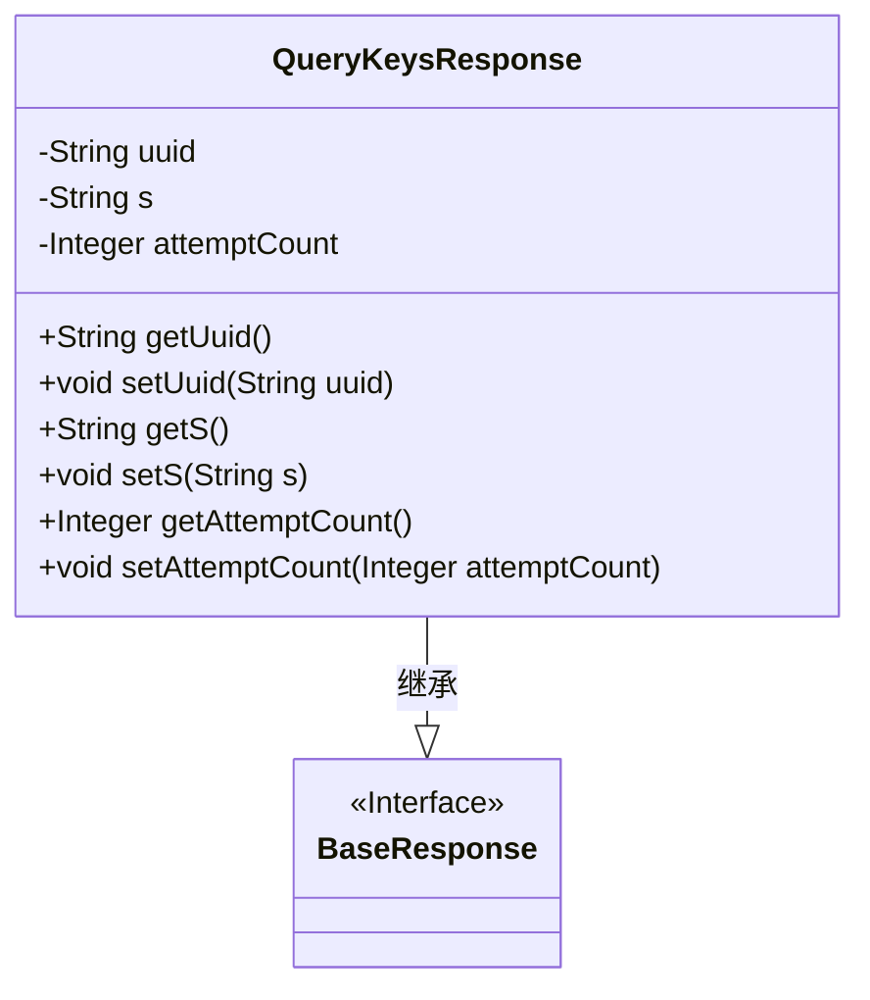
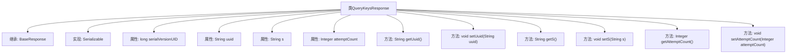

# 基础信息

|      |      |
|------|------|
| 名称 | QueryKeysResponse |
| 编码语言 | .java |
| 代码路径 | WeFe/mpc/mpc-common/src/main/java/com/welab/wefe/mpc/pir/request/QueryKeysResponse.java |
| 包名 | com.welab.wefe.mpc.pir.request |
| 依赖项 | ['java.io.Serializable'] |
| 概述说明 | QueryKeysResponse类继承BaseResponse，包含uuid、s和attemptCount三个属性及其getter/setter方法。 |

# 说明

QueryKeysResponse类继承自BaseResponse并实现Serializable接口，包含三个私有字段：uuid（字符串类型）、s（字符串类型）和attemptCount（整数类型）。该类提供了这三个字段的getter和setter方法，用于获取和设置字段值。serialVersionUID用于序列化版本控制。

# 类列表 Class Summary

| 名称   | 类型  | 说明 |
|-------|------|-------------|
| QueryKeysResponse | class | QueryKeysResponse类继承BaseResponse，包含uuid、s和attemptCount三个属性及其getter/setter方法，实现Serializable接口。 |

## 类 QueryKeysResponse

|      |      |
|------|------|
| 访问范围 | public |
| 类型 | class |
| 名称 | QueryKeysResponse |
| 说明 | QueryKeysResponse类继承BaseResponse，包含uuid、s和attemptCount三个属性及其getter/setter方法，实现Serializable接口。 |

### UML类图

这段类图展示了QueryKeysResponse类继承自BaseResponse接口的结构。QueryKeysResponse包含三个私有字段(uuid、s、attemptCount)及其对应的getter/setter方法，实现了序列化接口并拥有固定的serialVersionUID。作为响应对象，它通过继承BaseResponse接口获得基础响应特性，同时扩展了特定业务字段用于处理密钥查询场景，体现了面向对象设计中"对扩展开放"的原则。

### 内部方法调用关系图

该流程图展示了QueryKeysResponse类的结构，包括其继承关系、实现的接口、属性以及方法。QueryKeysResponse继承自BaseResponse类并实现了Serializable接口，包含三个私有属性（uuid、s、attemptCount）及其对应的getter和setter方法。serialVersionUID用于序列化版本控制。整个类设计用于封装查询密钥的响应数据，支持序列化传输。

### 字段列表 Field List

| 名称  | 类型  | 说明 |
|-------|-------|------|
| uuid | String | 声明一个私有字符串变量uuid。 |
| attemptCount | Integer | 私有整型变量，记录尝试次数。 |
| s | String | 声明一个私有字符串变量s。 |
| serialVersionUID = 2217113747124783613L | long | 声明一个私有静态不可变的长整型序列化版本ID，值为2217113747124783613。 |

### 方法列表

| 名称  | 类型  | 说明 |
|-------|-------|------|
| getAttemptCount | Integer | 获取尝试次数的整数值。 |
| setS | void | 这是一个Java方法，用于设置类成员变量s的值。方法名为setS，接受一个字符串参数s，并将其赋值给当前对象的s属性。 |
| getUuid | String | 方法返回字符串类型的uuid值。 |
| getS | String | 这是一个Java方法，返回字符串变量s的值。 |
| setUuid | void | 这是一个Java方法，用于设置对象的uuid属性值。方法接受一个字符串参数uuid，并将其赋值给对象的uuid成员变量。 |
| setAttemptCount | void | 设置尝试次数的公共方法，参数为整数类型。 |

