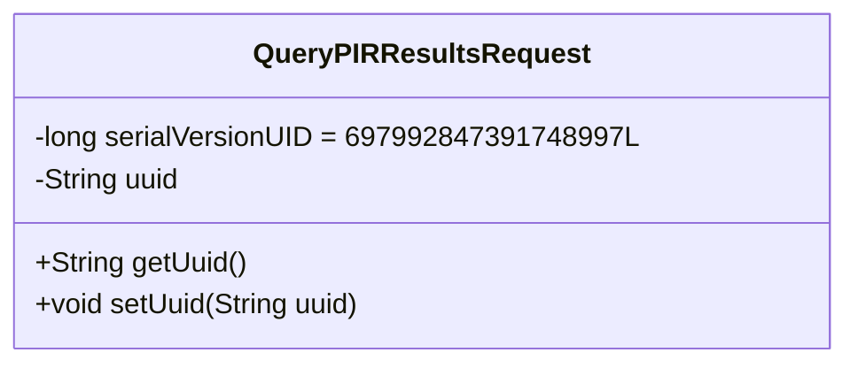
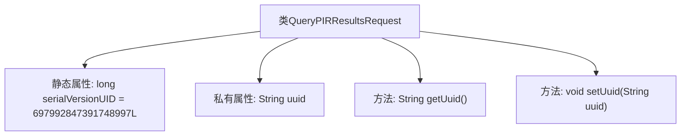

# 基础信息

|      |      |
|------|------|
| 名称 | QueryPIRResultsRequest |
| 编码语言 | .java |
| 代码路径 | WeFe/mpc/mpc-common/src/main/java/com/welab/wefe/mpc/pir/request/QueryPIRResultsRequest.java |
| 包名 | com.welab.wefe.mpc.pir.request |
| 依赖项 | ['java.io.Serializable'] |
| 概述说明 | 序列化类QueryPIRResultsRequest，包含UUID字段及其getter和setter方法。 |

# 说明

这是一个名为QueryPIRResultsRequest的Java类，实现了Serializable接口以确保可序列化。该类包含一个私有静态常量serialVersionUID，用于版本控制，值为697992847391748997L。主要属性是一个私有的字符串类型uuid，提供了对应的getter和setter方法用于访问和修改该属性。这个类可能用于封装查询PIR结果的请求参数。

# 类列表 Class Summary

| 名称   | 类型  | 说明 |
|-------|------|-------------|
| QueryPIRResultsRequest | class | 这是一个Java类，实现了Serializable接口，用于查询PIR结果请求，包含UUID字段及其getter和setter方法。 |

## 类 QueryPIRResultsRequest

|      |      |
|------|------|
| 访问范围 | public |
| 类型 | class |
| 名称 | QueryPIRResultsRequest |
| 说明 | 这是一个Java类，实现了Serializable接口，用于查询PIR结果请求，包含UUID字段及其getter和setter方法。 |

### UML类图

这段代码定义了一个名为`QueryPIRResultsRequest`的类，实现了`Serializable`接口，用于序列化请求数据。类中包含一个私有静态常量`serialVersionUID`用于版本控制，以及一个私有字符串字段`uuid`存储唯一标识符。提供了`getUuid()`和`setUuid()`方法用于访问和修改`uuid`字段。这是一个典型的Java数据传输对象（DTO）设计，用于在网络或进程间传递查询结果请求信息。

### 内部方法调用关系图

这段流程图描述了QueryPIRResultsRequest类的结构，它是一个实现了Serializable接口的Java类。类中包含一个静态的serialVersionUID用于序列化版本控制，以及一个私有的uuid字符串属性。提供了getUuid()和setUuid()两个方法分别用于获取和设置uuid值。整个类结构简单清晰，主要用于封装查询PIR结果的请求数据。

### 字段列表 Field List

| 名称  | 类型  | 说明 |
|-------|-------|------|
| uuid | String | 声明一个私有字符串变量uuid。 |
| serialVersionUID = 697992847391748997L | long | 声明一个私有静态不可变的长整型序列化版本号697992847391748997L。 |

### 方法列表

| 名称  | 类型  | 说明 |
|-------|-------|------|
| getUuid | String | 方法返回字符串类型的uuid值。 |
| setUuid | void | 这是一个Java方法，用于设置对象的uuid属性值。方法接收一个字符串参数uuid，并将其赋值给对象的uuid成员变量。 |

