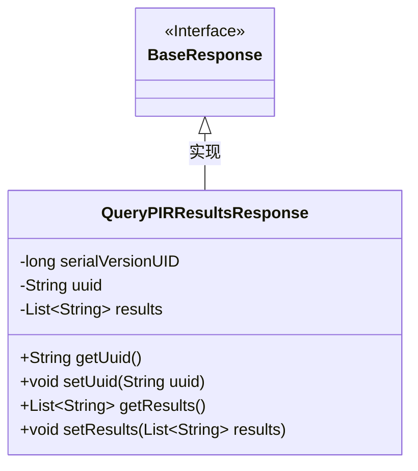
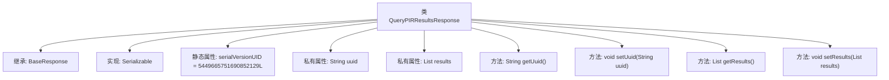

# 基础信息

|      |      |
|------|------|
| 名称 | QueryPIRResultsResponse |
| 编码语言 | .java |
| 代码路径 | WeFe/mpc/mpc-common/src/main/java/com/welab/wefe/mpc/pir/request/QueryPIRResultsResponse.java |
| 包名 | com.welab.wefe.mpc.pir.request |
| 依赖项 | ['java.io.Serializable', 'java.util.List'] |
| 概述说明 | QueryPIRResultsResponse类继承BaseResponse，包含uuid和results字段及其getter/setter方法，实现序列化接口。 |

# 说明

该内容描述了一个名为QueryPIRResultsResponse的Java类，继承自BaseResponse并实现Serializable接口。类中包含一个serialVersionUID字段用于序列化控制，以及两个主要属性：uuid（字符串类型）和results（字符串列表类型）。提供了这两个属性的getter和setter方法，用于获取和设置它们的值。

# 类列表 Class Summary

| 名称   | 类型  | 说明 |
|-------|------|-------------|
| QueryPIRResultsResponse | class | QueryPIRResultsResponse类继承BaseResponse，包含uuid和results字段及其getter/setter方法，实现序列化接口。 |

## 类 QueryPIRResultsResponse

|      |      |
|------|------|
| 访问范围 | public |
| 类型 | class |
| 名称 | QueryPIRResultsResponse |
| 说明 | QueryPIRResultsResponse类继承BaseResponse，包含uuid和results字段及其getter/setter方法，实现序列化接口。 |

### UML类图

这段代码定义了一个`QueryPIRResultsResponse`类，该类继承自`BaseResponse`接口并实现了`Serializable`接口。类中包含一个序列化ID、UUID字符串和字符串列表结果，提供了获取和设置这些属性的公有方法。类图清晰地展示了继承关系和类成员结构，体现了响应对象的数据封装特性。

### 内部方法调用关系图

这段代码定义了一个名为QueryPIRResultsResponse的类，该类继承自BaseResponse并实现了Serializable接口。类中包含两个私有属性：uuid和results，分别用于存储唯一标识符和结果列表。提供了对应的getter和setter方法来访问和修改这些属性。serialVersionUID用于确保序列化版本的一致性。整体结构清晰，符合JavaBean规范，适用于数据传输和持久化场景。

### 字段列表 Field List

| 名称  | 类型  | 说明 |
|-------|-------|------|
| results | List<String> | 私有字符串列表变量results。 |
| uuid | String | 私有字符串变量uuid |
| serialVersionUID = 5449665751690852129L | long | 定义了一个私有静态不可变的序列化版本ID，值为5449665751690852129L。 |

### 方法列表

| 名称  | 类型  | 说明 |
|-------|-------|------|
| setUuid | void | 设置UUID值的方法，将参数赋值给成员变量uuid。 |
| getUuid | String | 方法返回字符串类型的uuid变量值。 |
| getResults | List<String> | 该方法返回一个字符串列表results。 |
| setResults | void | 设置结果列表的方法，将输入参数赋值给类成员变量results。 |

