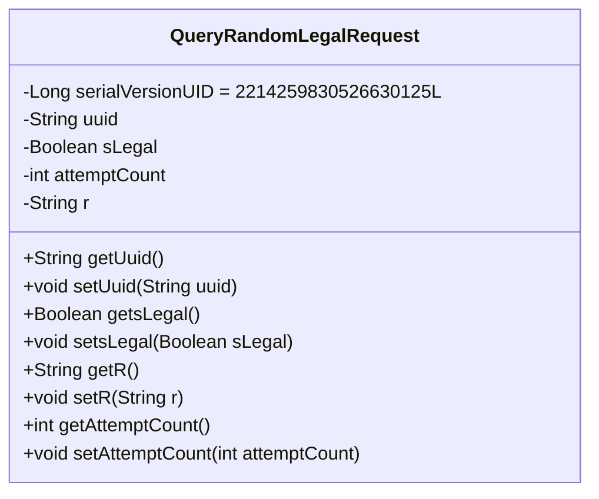
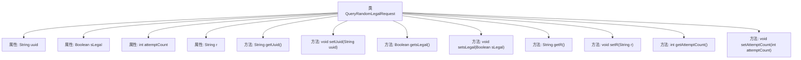

# 基础信息

|      |      |
|------|------|
| 名称 | QueryRandomLegalRequest |
| 编码语言 | .java |
| 代码路径 | WeFe/mpc/mpc-common/src/main/java/com/welab/wefe/mpc/pir/request/QueryRandomLegalRequest.java |
| 包名 | com.welab.wefe.mpc.pir.request |
| 依赖项 | ['java.io.Serializable'] |
| 概述说明 | QueryRandomLegalRequest类实现Serializable接口，包含uuid、sLegal、attemptCount和r字段，提供对应的getter和setter方法。 |

# 说明

QueryRandomLegalRequest是一个可序列化的Java类，用于封装查询随机合法请求的相关数据。该类包含四个私有字段：uuid（字符串类型）、sLegal（布尔类型）、attemptCount（整型）和r（字符串类型）。每个字段都有对应的getter和setter方法，用于访问和修改字段值。该类实现了Serializable接口，并定义了serialVersionUID用于版本控制。

# 类列表 Class Summary

| 名称   | 类型  | 说明 |
|-------|------|-------------|
| QueryRandomLegalRequest | class | 这是一个可序列化的Java类QueryRandomLegalRequest，包含uuid、sLegal、attemptCount和r四个属性，以及对应的getter和setter方法。 |

## 类 QueryRandomLegalRequest

|      |      |
|------|------|
| 访问范围 | public |
| 类型 | class |
| 名称 | QueryRandomLegalRequest |
| 说明 | 这是一个可序列化的Java类QueryRandomLegalRequest，包含uuid、sLegal、attemptCount和r四个属性，以及对应的getter和setter方法。 |

### UML类图

该代码定义了一个名为QueryRandomLegalRequest的类，实现了Serializable接口，表明其实例可被序列化。类中包含四个私有字段：uuid（字符串类型）、sLegal（布尔类型）、attemptCount（整型）和r（字符串类型），以及对应的getter和setter方法。serialVersionUID字段用于版本控制，确保序列化和反序列化时的兼容性。这个类主要用于封装查询随机合法请求的相关数据，通过getter和setter方法提供对这些数据的访问和修改。

### 内部方法调用关系图

这段代码定义了一个名为QueryRandomLegalRequest的可序列化类，包含四个私有属性：uuid、sLegal、attemptCount和r。类中为每个属性提供了对应的getter和setter方法，用于获取和设置属性值。流程图清晰地展示了类与属性、方法之间的层级关系，所有方法均直接关联到主类，没有嵌套调用关系。该类的设计主要用于封装请求数据，并通过序列化实现数据传输或持久化。

### 字段列表 Field List

| 名称  | 类型  | 说明 |
|-------|-------|------|
| r | String | 私有字符串变量r的声明。 |
| attemptCount | int | 私有整型变量，记录尝试次数。 |
| sLegal | Boolean | 布尔类型私有变量sLegal，表示合法性状态。 |
| uuid | String | 私有字符串变量uuid，用于存储唯一标识符。 |
| serialVersionUID = 2214259830526630125L | long | 声明一个私有静态不可变的长整型序列化版本ID，值为2214259830526630125。 |

### 方法列表

| 名称  | 类型  | 说明 |
|-------|-------|------|
| getsLegal | Boolean | 获取sLegal布尔值的公共方法。 |
| setUuid | void | 设置UUID字符串值的方法。 |
| setsLegal | void | 这是一个Java方法，用于设置布尔类型的sLegal属性值。方法名为setsLegal，接受一个Boolean参数。 |
| getUuid | String | 该方法返回字符串类型的uuid变量值。 |
| getR | String | 这是一个Java方法，返回字符串类型的成员变量r的值。 |
| setR | void | 设置字符串属性r的值。 |
| getAttemptCount | int | 获取尝试次数的整数值。 |
| setAttemptCount | void | 设置尝试次数的公共方法，参数为整型attemptCount，赋值给类成员变量attemptCount。 |

