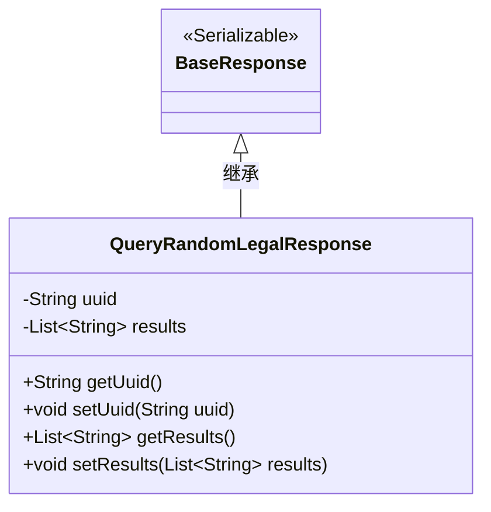
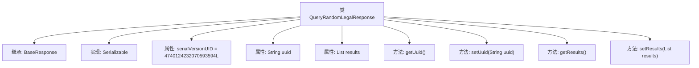

# 基础信息

|      |      |
|------|------|
| 名称 | QueryRandomLegalResponse |
| 编码语言 | .java |
| 代码路径 | WeFe/mpc/mpc-common/src/main/java/com/welab/wefe/mpc/pir/request/QueryRandomLegalResponse.java |
| 包名 | com.welab.wefe.mpc.pir.request |
| 依赖项 | ['java.io.Serializable', 'java.util.List'] |
| 概述说明 | QueryRandomLegalResponse类继承BaseResponse，包含uuid和可为空的results列表，提供getter/setter方法。 |

# 说明

QueryRandomLegalResponse类继承BaseResponse并实现Serializable接口，包含序列化ID字段serialVersionUID。该类定义了两个私有成员变量：uuid字符串和results字符串列表，其中results可为空。提供了getter和setter方法用于访问和修改这两个变量。

# 类列表 Class Summary

| 名称   | 类型  | 说明 |
|-------|------|-------------|
| QueryRandomLegalResponse | class | QueryRandomLegalResponse类继承BaseResponse，包含uuid和可为空的results列表，提供getter/setter方法。 |

## 类 QueryRandomLegalResponse

|      |      |
|------|------|
| 访问范围 | public |
| 类型 | class |
| 名称 | QueryRandomLegalResponse |
| 说明 | QueryRandomLegalResponse类继承BaseResponse，包含uuid和可为空的results列表，提供getter/setter方法。 |

### UML类图

这段类图展示了QueryRandomLegalResponse类继承自BaseResponse基类并实现了Serializable接口的结构。QueryRandomLegalResponse包含私有字段uuid（字符串类型）和results（字符串列表类型），以及对应的getter/setter方法。BaseResponse标记为可序列化接口，作为父类提供基础响应功能。子类通过继承关系扩展了特定业务逻辑，用于处理包含UUID标识符和可能为空的结果列表的随机查询响应。

### 内部方法调用关系图

该流程图展示了QueryRandomLegalResponse类的结构，包括其继承BaseResponse和实现Serializable接口的关系。类中包含serialVersionUID序列化标识、uuid字符串属性和results列表属性，以及对应的getter和setter方法。所有属性和方法通过箭头与主类关联，清晰地呈现了类的组成和层级关系。

### 字段列表 Field List

| 名称  | 类型  | 说明 |
|-------|-------|------|
| serialVersionUID = 4740124232070593594L | long | 定义序列化版本UID为4740124232070593594L，确保类版本兼容性。 |
| results | List<String> | 私有字符串列表变量results。 |
| uuid | String | 私有字符串变量uuid，用于存储唯一标识符。 |

### 方法列表

| 名称  | 类型  | 说明 |
|-------|-------|------|
| getUuid | String | 获取uuid字符串值的方法。 |
| getResults | List<String> | 该方法返回一个字符串列表results。 |
| setResults | void | 设置结果列表的方法，将输入列表赋值给类变量results。 |
| setUuid | void | 设置UUID字符串值的方法。 |

