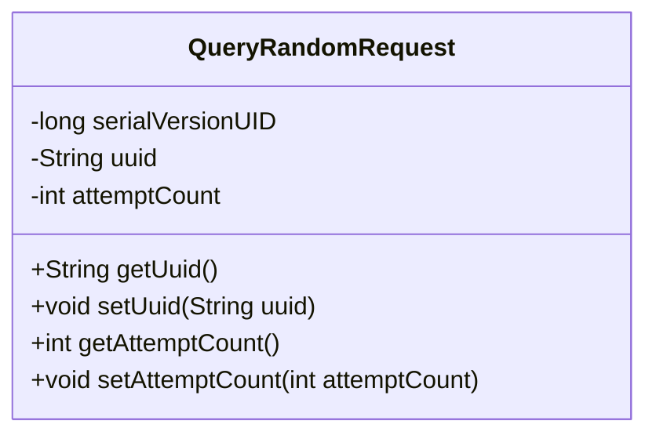
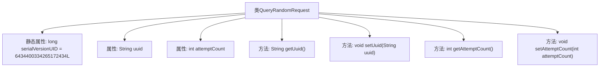

# 基础信息

|      |      |
|------|------|
| 名称 | QueryRandomRequest |
| 编码语言 | .java |
| 代码路径 | WeFe/mpc/mpc-common/src/main/java/com/welab/wefe/mpc/pir/request/QueryRandomRequest.java |
| 包名 | com.welab.wefe.mpc.pir.request |
| 依赖项 | ['java.io.Serializable'] |
| 概述说明 | 可序列化类QueryRandomRequest，包含uuid和attemptCount属性及对应getter/setter方法。 |

# 说明

这是一个名为QueryRandomRequest的Java类，实现了Serializable接口以便序列化。类中包含两个私有成员变量：uuid（字符串类型）和attemptCount（整型），分别用于存储唯一标识和尝试次数。提供了这两个变量的getter和setter方法用于访问和修改。类中还定义了一个静态的serialVersionUID字段，用于控制序列化版本兼容性。

# 类列表 Class Summary

| 名称   | 类型  | 说明 |
|-------|------|-------------|
| QueryRandomRequest | class | QueryRandomRequest是可序列化类，包含uuid字符串和attemptCount整数字段，提供getter和setter方法。 |

## 类 QueryRandomRequest

|      |      |
|------|------|
| 访问范围 | public |
| 类型 | class |
| 名称 | QueryRandomRequest |
| 说明 | QueryRandomRequest是可序列化类，包含uuid字符串和attemptCount整数字段，提供getter和setter方法。 |

### UML类图

该代码定义了一个名为QueryRandomRequest的类，实现了Serializable接口，表明其实例可序列化。类中包含两个私有字段：uuid（字符串类型）和attemptCount（整型），分别用于存储唯一标识和尝试次数。提供了标准的getter和setter方法用于字段访问和修改。serialVersionUID字段用于版本控制，确保序列化兼容性。这是一个典型的数据传输对象(DTO)设计，适用于网络传输或持久化场景。

### 内部方法调用关系图

该流程图展示了QueryRandomRequest类的完整结构，包含一个静态序列化ID和两个成员变量(uuid和attemptCount)，以及对应的getter/setter方法。类实现了Serializable接口，通过serialVersionUID支持序列化版本控制。所有方法均围绕核心属性展开，形成标准的数据封装结构，适用于网络传输或持久化场景。

### 字段列表 Field List

| 名称  | 类型  | 说明 |
|-------|-------|------|
| attemptCount | int | 私有整型变量，记录尝试次数。 |
| serialVersionUID = 6434400334265172434L | long | 定义了一个私有静态不可变的序列化版本ID，值为6434400334265172434L。 |
| uuid | String | 声明一个私有字符串变量uuid。 |

### 方法列表

| 名称  | 类型  | 说明 |
|-------|-------|------|
| setAttemptCount | void | 设置尝试次数的公共方法，参数为整型attemptCount，赋值给类成员变量attemptCount。 |
| getUuid | String | 方法返回字符串类型的uuid变量值。 |
| setUuid | void | 设置对象的UUID值。 |
| getAttemptCount | int | 获取尝试次数的整数值方法。 |

