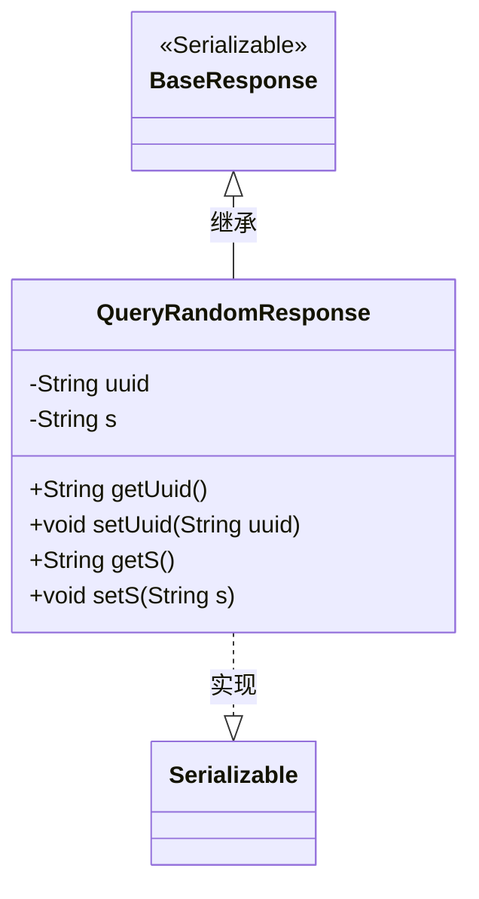
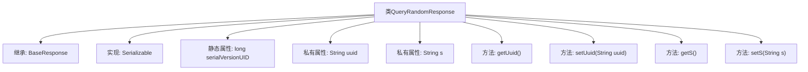

# 基础信息

|      |      |
|------|------|
| 名称 | QueryRandomResponse |
| 编码语言 | .java |
| 代码路径 | WeFe/mpc/mpc-common/src/main/java/com/welab/wefe/mpc/pir/request/QueryRandomResponse.java |
| 包名 | com.welab.wefe.mpc.pir.request |
| 依赖项 | ['java.io.Serializable'] |
| 概述说明 | QueryRandomResponse类继承BaseResponse并实现Serializable接口，包含uuid和s两个字符串属性及其getter/setter方法，序列化ID为9183224785171833749L。 |

# 说明

该内容定义了一个名为QueryRandomResponse的Java类，继承自BaseResponse并实现了Serializable接口。类中包含两个私有字符串字段uuid和s，分别通过getter和setter方法进行访问和修改。该类使用serialVersionUID字段进行序列化版本控制。整体结构为典型的数据传输对象，用于封装响应数据。

# 类列表 Class Summary

| 名称   | 类型  | 说明 |
|-------|------|-------------|
| QueryRandomResponse | class | QueryRandomResponse类继承BaseResponse，包含uuid和s两个字符串属性及其getter/setter方法，实现Serializable接口。 |

## 类 QueryRandomResponse

|      |      |
|------|------|
| 访问范围 | public |
| 类型 | class |
| 名称 | QueryRandomResponse |
| 说明 | QueryRandomResponse类继承BaseResponse，包含uuid和s两个字符串属性及其getter/setter方法，实现Serializable接口。 |

### UML类图

这段类图展示了QueryRandomResponse继承自BaseResponse并实现Serializable接口的结构。QueryRandomResponse包含两个私有字符串属性uuid和s，以及对应的getter和setter方法。BaseResponse被标记为可序列化接口，QueryRandomResponse通过继承获得基类特性，同时自身也实现了序列化功能，表明该类的实例可以被序列化传输或存储。整个设计体现了简单的数据封装和继承关系，适用于需要序列化的响应对象场景。

### 内部方法调用关系图

该流程图展示了`QueryRandomResponse`类的结构，它是一个继承自`BaseResponse`并实现`Serializable`接口的类。类中包含两个私有属性`uuid`和`s`，以及对应的getter和setter方法。静态属性`serialVersionUID`用于序列化版本控制。整个类设计简洁，主要用于封装随机查询响应数据，支持序列化传输。

### 字段列表 Field List

| 名称  | 类型  | 说明 |
|-------|-------|------|
| serialVersionUID = 9183224785171833749L | long | 定义了一个私有静态常量serialVersionUID，值为9183224785171833749L，用于序列化版本控制。 |
| s | String | 声明一个私有字符串变量s。 |
| uuid | String | 私有字符串变量uuid，用于存储唯一标识符。 |

### 方法列表

| 名称  | 类型  | 说明 |
|-------|-------|------|
| setUuid | void | 设置UUID字符串值的方法。 |
| getUuid | String | 获取uuid字符串的方法，直接返回成员变量uuid的值。 |
| getS | String | 方法getS返回字符串s的值。 |
| setS | void | 这是一个Java方法，用于设置字符串类型变量s的值。方法名为setS，接受一个字符串参数s，并将其赋值给当前对象的s属性。 |

