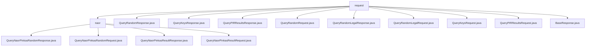

# 基础信息

|      |      |
|------|------|
| 名称 | request |
| 编码语言 | .java |
| 代码路径 | WeFe/mpc/mpc-common/src/main/java/com/welab/wefe/mpc/pir/request |
| 包名 | docs.mpc.mpc-common.src.main.java.com.welab.wefe.mpc.pir.request |
| 概述说明 | 该模块基于Naor-Pinkas协议实现隐私信息检索，包含随机数请求/响应和结果请求/响应四类操作，支持动态条件组合和批量结果返回，依赖JCE加密库和基础响应类。 |

# 说明

## 概述  
该模块实现基于Naor-Pinkas协议的隐私信息检索(PIR)功能，核心职责是通过两阶段交互实现加密查询与结果返回。接口规范包含六类主要操作：随机数查询(QueryRandomRequest/Response)、密钥查询(QueryKeysRequest/Response)、结果查询(QueryPIRResultsRequest/Response)及其合法性验证(QueryRandomLegalRequest/Response)。关键数据结构包括会话标识(uuid)、模幂参数(s)、密钥材料(results)和查询条件(ids/method)，依赖BaseResponse基类和JCE加密库。例如随机数响应中s字段需配合uuid实现挑战-响应机制，结果密文采用列表结构严格对齐原始ID顺序。

## 主要业务场景  
典型流程分为三步骤：客户端先通过QueryKeysRequest提交ID集合及加密方式（如MD5/SHA256），获取随机数(s/uuid)；再经QueryRandomRequest验证合法性；最终用QueryPIRResultsRequest提取加密结果。交互模式类似零知识证明，服务端维护uuid会话状态并执行OT协议（支持Naor-Pinkas/Huack两种算法）。功能完整性体现在动态条件组合和批量处理能力，例如attemptCount字段实现查询重试机制。主要应用于联邦学习中的隐私数据联合计算，API设计采用分层结构：传输层处理十六进制字符串，业务层封装List<Object>类型条件集合。

### 包内部结构视图

该流程图展示了MPC项目中PIR请求模块的层级结构。顶层是request目录，包含多个直接子文件和naor子目录。naor目录下又包含4个与Naor-Pinkas协议相关的请求/响应文件。整体结构清晰反映了PIR请求处理的模块化设计，其中基础请求类与特定协议实现分离。

# 文件列表

| 名称   | 类型  | 说明 |
|-------|------|-------------|
| [QueryRandomResponse.java](QueryRandomResponse.md) | file | QueryRandomResponse类继承BaseResponse并实现Serializable接口，包含uuid和s两个字符串属性及其getter/setter方法，序列化ID为9183224785171833749L。 |
| [QueryKeysResponse.java](QueryKeysResponse.md) | file | QueryKeysResponse类继承BaseResponse，包含uuid、s和attemptCount三个属性及其getter/setter方法。 |
| [QueryPIRResultsResponse.java](QueryPIRResultsResponse.md) | file | QueryPIRResultsResponse类继承BaseResponse，包含uuid和results字段及其getter/setter方法，实现序列化接口。 |
| [QueryRandomRequest.java](QueryRandomRequest.md) | file | 可序列化类QueryRandomRequest，包含uuid和attemptCount属性及对应getter/setter方法。 |
| [QueryRandomLegalResponse.java](QueryRandomLegalResponse.md) | file | QueryRandomLegalResponse类继承BaseResponse，包含uuid和可为空的results列表，提供getter/setter方法。 |
| [QueryRandomLegalRequest.java](QueryRandomLegalRequest.md) | file | QueryRandomLegalRequest类实现Serializable接口，包含uuid、sLegal、attemptCount和r字段，提供对应的getter和setter方法。 |
| [QueryKeysRequest.java](QueryKeysRequest.md) | file | QueryKeysRequest类包含ids列表、id加密方式method、不经意传输实现otMethod和请求ID requestId字段及其getter/setter方法。 |
| [QueryPIRResultsRequest.java](QueryPIRResultsRequest.md) | file | 序列化类QueryPIRResultsRequest，包含UUID字段及其getter和setter方法。 |
| [BaseResponse.java](BaseResponse.md) | file | 抽象类BaseResponse包含code、message、responseId三个属性及对应的getter和setter方法。 |
| [naor](naor/_module.md) | package | QueryNaorPinkasRandomResponse类继承BaseResponse，含uuid、g、p、secret和randoms字段。QueryNaorPinkasRandomRequest类封装查询条件列表。QueryNaorPinkasResultResponse类继承BaseResponse，含uuid和encryptResults字段。QueryNaorPinkasResultRequest类封装uuid和pk字段。 |

