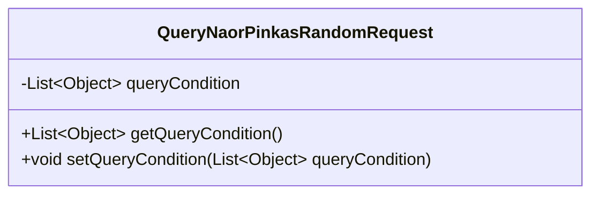
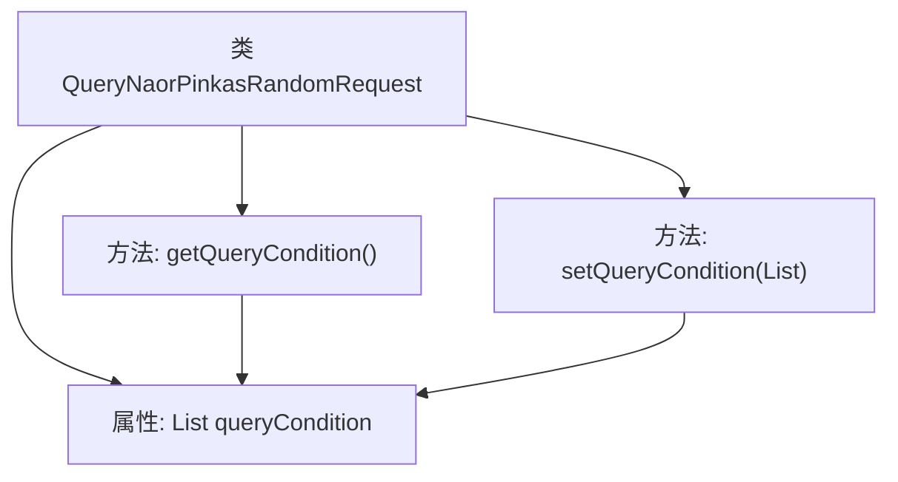

# 基础信息

|      |      |
|------|------|
| 名称 | QueryNaorPinkasRandomRequest |
| 编码语言 | .java |
| 代码路径 | WeFe/mpc/mpc-common/src/main/java/com/welab/wefe/mpc/pir/request/naor/QueryNaorPinkasRandomRequest.java |
| 包名 | com.welab.wefe.mpc.pir.request.naor |
| 依赖项 | ['java.util.List'] |
| 概述说明 | QueryNaorPinkasRandomRequest类包含一个Object类型的List查询条件，提供getter和setter方法。 |

# 说明

QueryNaorPinkasRandomRequest 是一个 Java 类，用于封装查询条件。该类包含一个私有成员变量 queryCondition，类型为 List<Object>，用于存储查询条件列表。提供了 getQueryCondition 和 setQueryCondition 两个公共方法，分别用于获取和设置 queryCondition 的值。这个类主要用于处理随机查询请求，通过列表形式灵活地传递不同类型的查询条件参数。

# 类列表 Class Summary

| 名称   | 类型  | 说明 |
|-------|------|-------------|
| QueryNaorPinkasRandomRequest | class | QueryNaorPinkasRandomRequest类包含一个queryCondition列表，提供get和set方法操作该列表。 |

## 类 QueryNaorPinkasRandomRequest

|      |      |
|------|------|
| 访问范围 | public |
| 类型 | class |
| 名称 | QueryNaorPinkasRandomRequest |
| 说明 | QueryNaorPinkasRandomRequest类包含一个queryCondition列表，提供get和set方法操作该列表。 |

### UML类图

这段类图描述了一个名为QueryNaorPinkasRandomRequest的简单Java类，该类包含一个私有成员变量queryCondition（类型为List<Object>）以及对应的公有getter和setter方法。该类的主要功能是封装查询条件列表，通过标准访问器方法提供对内部列表数据的读写操作，体现了基本的封装原则。类结构简洁明了，适合作为数据传输对象使用。

### 内部方法调用关系图

这段代码定义了一个名为QueryNaorPinkasRandomRequest的类，包含一个List类型的queryCondition属性和对应的getter/setter方法。流程图展示了类与属性、方法之间的层级关系，以及方法对属性的访问路径。这是一个典型的Java Bean类设计，用于封装查询条件数据，通过getter/setter方法提供对私有属性的安全访问。

### 字段列表 Field List

| 名称  | 类型  | 说明 |
|-------|-------|------|
| queryCondition | List<Object> | 定义了一个私有列表变量queryCondition，用于存储查询条件对象。 |

### 方法列表

| 名称  | 类型  | 说明 |
|-------|-------|------|
| getQueryCondition | List<Object> | 方法返回查询条件列表。 |
| setQueryCondition | void | 这是一个Java方法，用于设置查询条件列表。方法接收一个Object类型的List参数，并将其赋值给类的queryCondition成员变量。 |

