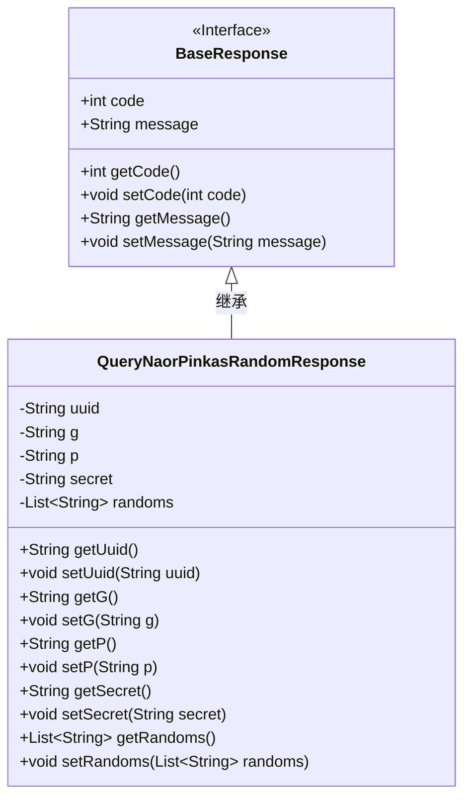

# 基础信息

|      |      |
|------|------|
| 名称 | QueryNaorPinkasRandomResponse |
| 编码语言 | .java |
| 代码路径 | WeFe/mpc/mpc-common/src/main/java/com/welab/wefe/mpc/pir/request/naor/QueryNaorPinkasRandomResponse.java |
| 包名 | com.welab.wefe.mpc.pir.request.naor |
| 依赖项 | ['java.util.List', 'com.welab.wefe.mpc.pir.request.BaseResponse'] |
| 概述说明 | QueryNaorPinkasRandomResponse类包含uuid、底数g、模数p、服务器密钥secret和随机大数列表randoms等字段，提供getter和setter方法。 |

# 说明

该代码定义了一个名为QueryNaorPinkasRandomResponse的类，继承自BaseResponse。类中包含以下关键字段：uuid作为唯一标识符，g表示底数，p表示模数，secret是服务器密钥的g^a形式，randoms是一个十六进制字符串列表，其大小比混淆ids少1。此外，类提供了所有字段的标准getter和setter方法，以及从父类继承的code和message字段的相关方法。

# 类列表 Class Summary

| 名称   | 类型  | 说明 |
|-------|------|-------------|
| QueryNaorPinkasRandomResponse | class | QueryNaorPinkasRandomResponse类包含UUID、底数g、模数p、服务器密钥secret和随机数列表randoms等字段，用于处理Naor-Pinkas协议的随机响应。 |

## 类 QueryNaorPinkasRandomResponse

|      |      |
|------|------|
| 访问范围 | public |
| 类型 | class |
| 名称 | QueryNaorPinkasRandomResponse |
| 说明 | QueryNaorPinkasRandomResponse类包含UUID、底数g、模数p、服务器密钥secret和随机数列表randoms等字段，用于处理Naor-Pinkas协议的随机响应。 |

### UML类图

类图描述：
QueryNaorPinkasRandomResponse类继承自BaseResponse接口，实现了基础的响应码和消息功能，并扩展了Naor-Pinkas随机响应协议所需的字段，包括UUID标识、底数g、模数p、服务器密钥secret以及随机数列表randoms。该类提供了完整的getter/setter方法用于字段访问，主要用于密码学协议中的安全参数传递场景。

### 内部方法调用关系图

```mermaid
graph TD
    A["类QueryNaorPinkasRandomResponse"]
    B["继承自: BaseResponse"]
    C["属性: String uuid"]
    D["属性: String g"]
    E["属性: String p"]
    F["属性: String secret"]
    G["属性: List<String> randoms"]
    H["方法: String getUuid()"]
    I["方法: void setUuid(String uuid)"]
    J["方法: String getG()"]
    K["方法: void setG(String g)"]
    L["方法: String getP()"]
    M["方法: void setP(String p)"]
    N["方法: String getSecret()"]
    O["方法: void setSecret(String secret)"]
    P["方法: List<String> getRandoms()"]
    Q["方法: void setRandoms(List<String> randoms)"]
    R["方法: int getCode()"]
    S["方法: void setCode(int code)"]
    T["方法: String getMessage()"]
    U["方法: void setMessage(String message)"]

    A --> B
    A --> C
    A --> D
    A --> E
    A --> F
    A --> G
    A --> H
    A --> I
    A --> J
    A --> K
    A --> L
    A --> M
    A --> N
    A --> O
    A --> P
    A --> Q
    A --> R
    A --> S
    A --> T
    A --> U
```

该流程图展示了QueryNaorPinkasRandomResponse类的完整结构，包括其继承关系和所有属性与方法。该类继承自BaseResponse，包含5个核心属性（uuid、g、p、secret、randoms）和对应的getter/setter方法，以及从父类继承的code/message相关方法。图中清晰呈现了类成员之间的层级关系，属性用方框表示，方法用圆角矩形表示，继承关系用实线箭头标注。

### 字段列表 Field List

| 名称  | 类型  | 说明 |
|-------|-------|------|
| g | String | 声明了一个私有字符串变量g。 |
| p | String | 私有字符串变量p |
| randoms | List<String> | 声明一个私有字符串列表变量randoms。 |
| uuid | String | 声明一个私有字符串变量uuid。 |
| secret | String | 私有字符串类型变量secret。 |

### 方法列表

| 名称  | 类型  | 说明 |
|-------|-------|------|
| getG | String | 获取字符串类型变量g的值的方法。 |
| getUuid | String | 方法getUuid返回字符串类型的uuid值。 |
| getP | String | 这是一个Java方法，返回私有变量p的值。 |
| setUuid | void | 这是一个Java方法，用于设置对象的uuid属性值。方法接收一个字符串参数uuid，并将其赋值给当前对象的uuid字段。 |
| setSecret | void | 设置secret属性的方法，将传入的secret参数赋值给当前对象的secret成员变量。 |
| getSecret | String | 获取secret字符串的方法。 |
| getRandoms | List<String> | 获取随机字符串列表的方法。 |
| setP | void | 这是一个Java方法，用于设置类属性p的值。方法名为setP，接受一个字符串参数p，并将其赋值给类的成员变量this.p。 |
| setG | void | 设置字符串类型变量g的值。 |
| setRandoms | void | Java方法：设置随机字符串列表参数。 |
| getCode | int | 这是一个Java方法，返回整型变量code的值。 |
| setCode | void | 这是一个Java方法，用于设置类成员变量code的值。方法接受一个整数参数code，并将其赋值给当前对象的code属性。 |
| getMessage | String | 获取message字符串的方法。 |
| setMessage | void | 这是一个Java方法，用于设置类的message属性值。方法接收一个字符串参数message，并将其赋值给类的成员变量message。 |

