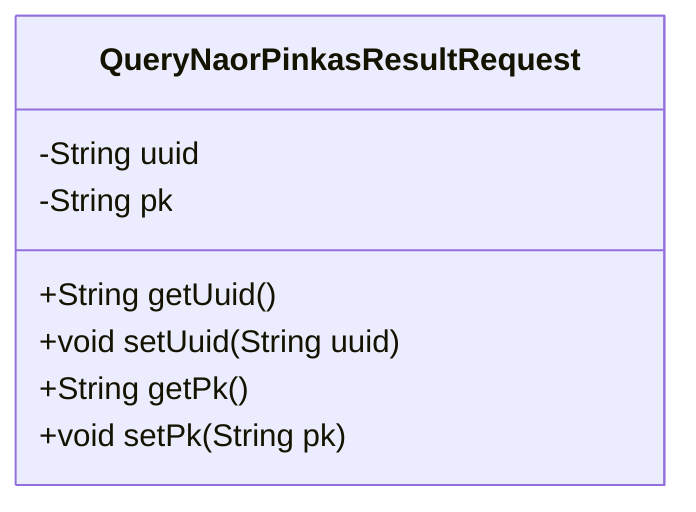
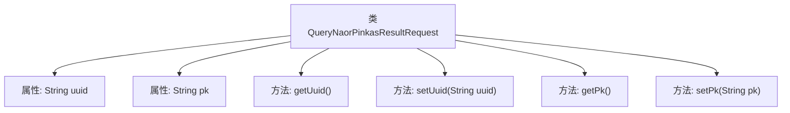

# 基础信息

|      |      |
|------|------|
| 名称 | QueryNaorPinkasResultRequest |
| 编码语言 | .java |
| 代码路径 | WeFe/mpc/mpc-common/src/main/java/com/welab/wefe/mpc/pir/request/naor/QueryNaorPinkasResultRequest.java |
| 包名 | com.welab.wefe.mpc.pir.request.naor |
| 依赖项 | [] |
| 概述说明 | QueryNaorPinkasResultRequest类包含uuid和pk两个字符串属性，分别有对应的getter和setter方法。 |

# 说明

这是一个名为QueryNaorPinkasResultRequest的Java类，用于封装查询Naor-Pinkas协议结果的请求数据。该类包含两个私有字符串字段：uuid用于唯一标识请求，pk代表公钥信息（注释中标注为pk0）。提供了标准的getter和setter方法来访问和修改这两个字段的值。

# 类列表 Class Summary

| 名称   | 类型  | 说明 |
|-------|------|-------------|
| QueryNaorPinkasResultRequest | class | QueryNaorPinkasResultRequest类包含uuid和pk字段，提供getter和setter方法。 |

## 类 QueryNaorPinkasResultRequest

|      |      |
|------|------|
| 访问范围 | public |
| 类型 | class |
| 名称 | QueryNaorPinkasResultRequest |
| 说明 | QueryNaorPinkasResultRequest类包含uuid和pk字段，提供getter和setter方法。 |

### UML类图

该代码定义了一个名为QueryNaorPinkasResultRequest的类，用于封装查询Naor-Pinkas协议结果的请求数据。类中包含两个私有字段：uuid（唯一标识符）和pk（公钥），并提供了对应的getter和setter方法用于访问和修改这些字段的值。这是一个典型的数据传输对象（DTO），用于在不同层之间传递查询参数。

### 内部方法调用关系图

这段代码定义了一个名为QueryNaorPinkasResultRequest的类，包含两个私有属性uuid和pk，以及对应的getter和setter方法。流程图展示了类与属性、方法之间的层级关系，其中uuid用于唯一标识，pk可能代表公钥或其他关键数据。所有方法均围绕这两个属性的读写操作展开，形成标准的Java Bean结构。

### 字段列表 Field List

| 名称  | 类型  | 说明 |
|-------|-------|------|
| pk | String | 私有字符串类型主键字段。 |
| uuid | String | 声明一个私有字符串变量uuid。 |

### 方法列表

| 名称  | 类型  | 说明 |
|-------|-------|------|
| getPk | String | 获取主键值的方法，返回字符串类型变量pk。 |
| getUuid | String | 方法返回字符串类型的uuid变量值。 |
| setUuid | void | 设置UUID的方法，将传入的字符串赋值给对象的uuid属性。 |
| setPk | void | 这是一个Java方法，用于设置类的私有成员变量pk的值。方法接收一个字符串参数pk，并将其赋值给当前对象的pk属性。 |

