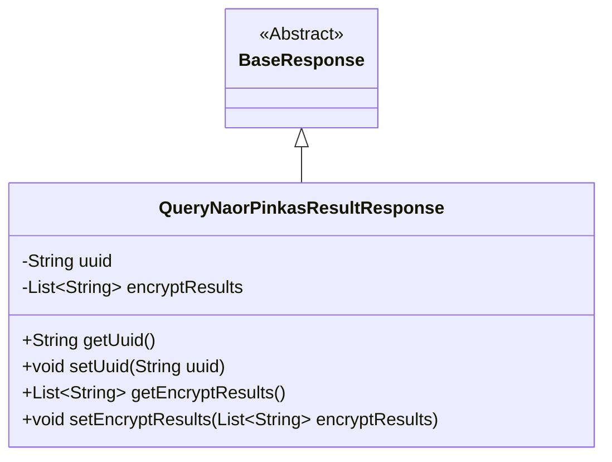
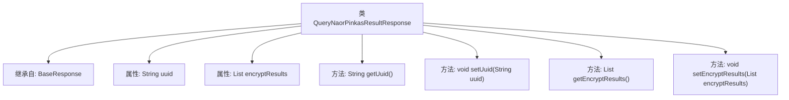

# 基础信息

|      |      |
|------|------|
| 名称 | QueryNaorPinkasResultResponse |
| 编码语言 | .java |
| 代码路径 | WeFe/mpc/mpc-common/src/main/java/com/welab/wefe/mpc/pir/request/naor/QueryNaorPinkasResultResponse.java |
| 包名 | com.welab.wefe.mpc.pir.request.naor |
| 依赖项 | ['java.util.List', 'com.welab.wefe.mpc.pir.request.BaseResponse'] |
| 概述说明 | QueryNaorPinkasResultResponse类继承BaseResponse，包含uuid和encryptResults字段，后者存储十六进制密文和AES填充字符串列表。 |

# 说明

QueryNaorPinkasResultResponse类继承自BaseResponse，包含两个主要属性：uuid和encryptResults。uuid是一个字符串类型字段，用于唯一标识。encryptResults是一个字符串列表，存储加密结果集，其大小与混淆ids相同，每个元素格式为十六进制密文和十六进制AES算法填充字符串的组合，用分号分隔。类提供了这两个属性的getter和setter方法。

# 类列表 Class Summary

| 名称   | 类型  | 说明 |
|-------|------|-------------|
| QueryNaorPinkasResultResponse | class | QueryNaorPinkasResultResponse类继承BaseResponse，包含uuid和encryptResults属性，后者存储十六进制密文和AES填充字符串的列表。 |

## 类 QueryNaorPinkasResultResponse

|      |      |
|------|------|
| 访问范围 | public |
| 类型 | class |
| 名称 | QueryNaorPinkasResultResponse |
| 说明 | QueryNaorPinkasResultResponse类继承BaseResponse，包含uuid和encryptResults属性，后者存储十六进制密文和AES填充字符串的列表。 |

### UML类图

这段类图展示了QueryNaorPinkasResultResponse继承自抽象基类BaseResponse的结构。子类包含两个私有字段：uuid字符串和encryptResults字符串列表，并提供了标准的getter/setter方法。其中encryptResults字段存储十六进制格式的加密数据，每个元素包含密文和AES填充字符串的组合。类关系清晰地体现了继承层次和封装特性，符合JavaBean规范的数据封装模式。

### 内部方法调用关系图

该流程图展示了QueryNaorPinkasResultResponse类的结构，该类继承自BaseResponse，包含两个私有属性uuid和encryptResults，分别用于存储唯一标识符和加密结果集。类中提供了四个公共方法，包括获取和设置uuid的getUuid()和setUuid()方法，以及获取和设置加密结果集的getEncryptResults()和setEncryptResults()方法。流程图清晰地呈现了类的继承关系和成员方法之间的调用关系。

### 字段列表 Field List

| 名称  | 类型  | 说明 |
|-------|-------|------|
| encryptResults | List<String> | 私有字符串列表，存储加密结果。 |
| uuid | String | 声明一个私有字符串变量uuid。 |

### 方法列表

| 名称  | 类型  | 说明 |
|-------|-------|------|
| getEncryptResults | List<String> | 该方法返回一个字符串列表，包含加密结果。 |
| getUuid | String | 获取uuid字符串的方法，直接返回成员变量uuid的值。 |
| setUuid | void | 这是一个Java方法，用于设置对象的uuid属性。方法接收一个字符串参数uuid，并将其赋值给对象的uuid成员变量。 |
| setEncryptResults | void | Java方法：设置加密结果列表，将输入参数赋值给类成员变量encryptResults。 |

