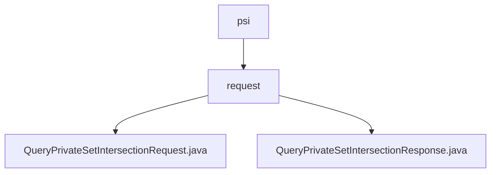

# 基础信息

|      |      |
|------|------|
| 名称 | psi |
| 编码语言 | .java |
| 代码路径 | WeFe/mpc/mpc-common/src/main/java/com/welab/wefe/mpc/psi |
| 包名 | docs.mpc.mpc-common.src.main.java.com.welab.wefe.mpc.psi |
| 概述说明 | QueryPrivateSetIntersectionRequest类封装私有集合交集请求参数，含clientIds等字段及getter/setter。QueryPrivateSetIntersectionResponse类表示响应结果，含加密ID列表、状态码等字段及getter/setter。 |

# 说明

## 概述  
该模块核心职责是处理私有集合交集(PSI)查询的请求与响应封装，类似数据交换协议模式。接口规范包含QueryPrivateSetIntersectionRequest请求类（含p参数、clientIds列表等字段）和QueryPrivateSetIntersectionResponse响应类（含加密ID列表、批次状态等字段）。关键数据结构包括客户端ID列表、批次控制参数和PSI类型标识。外部依赖仅涉及JSON序列化库。例如请求类使用JSONField注解处理字段映射。

## 主要业务场景  
模块支持分批次PSI查询场景，通过currentBatch和batchSize实现数据流式处理。交互模式为请求-响应模型，例如客户端提交带类型标识的请求，服务端返回加密结果和批次状态。典型应用包括跨机构数据安全比对，通过clientIds实现多方标识匹配。API类型为POJO实体类，集成案例表现为请求/响应对象的序列化传输。例如响应类通过hasNextBatch标志控制查询终止条件。

### 包内部结构视图

该流程图展示了WeFe项目中mpc-common模块下PSI相关请求处理的文件结构。根节点为psi目录，包含request子目录，该子目录下包含两个Java文件：QueryPrivateSetIntersectionRequest和QueryPrivateSetIntersectionResponse，分别处理私有集合交集查询的请求和响应逻辑。

# 文件列表

| 名称   | 类型  | 说明 |
|-------|------|-------------|
| [request](request/_module.md) | package | QueryPrivateSetIntersectionRequest类封装私有集合交集请求参数，含clientIds等字段及getter/setter。QueryPrivateSetIntersectionResponse类表示响应结果，含加密ID列表、状态码等字段及getter/setter。 |

