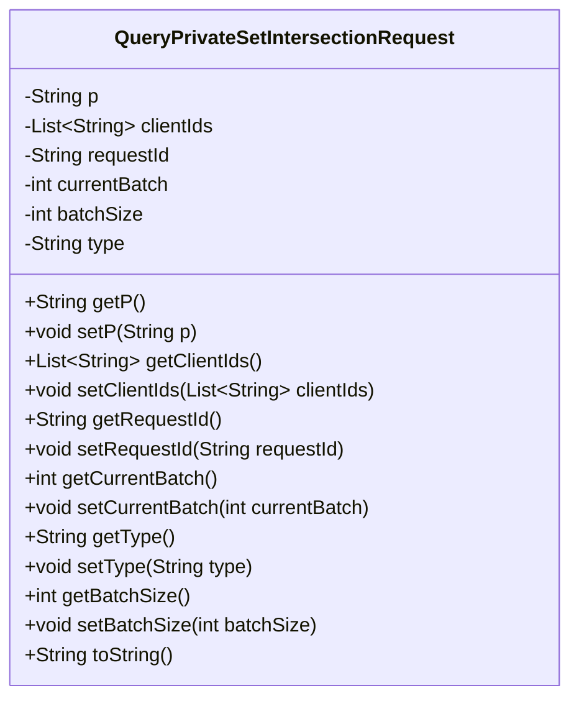

# 基础信息

|      |      |
|------|------|
| 名称 | QueryPrivateSetIntersectionRequest |
| 编码语言 | .java |
| 代码路径 | WeFe/mpc/mpc-common/src/main/java/com/welab/wefe/mpc/psi/request/QueryPrivateSetIntersectionRequest.java |
| 包名 | com.welab.wefe.mpc.psi.request |
| 依赖项 | ['java.util.List', 'com.alibaba.fastjson.annotation.JSONField'] |
| 概述说明 | QueryPrivateSetIntersectionRequest类包含私有集合交集查询请求的参数：p、clientIds、requestId、currentBatch、batchSize和type，提供各字段的getter和setter方法。 |

# 说明

这是一个名为QueryPrivateSetIntersectionRequest的Java类，用于封装私有集合交集查询请求的相关参数。类中包含以下字段：字符串p，客户端ID列表clientIds（使用JSONField注解），请求ID字符串requestId，表示当前批次的整型currentBatch，表示批次大小的整型batchSize，以及表示PSI类型的字符串type。类提供了所有字段的getter和setter方法，并重写了toString方法用于输出对象信息。

# 类列表 Class Summary

| 名称   | 类型  | 说明 |
|-------|------|-------------|
| QueryPrivateSetIntersectionRequest | class | QueryPrivateSetIntersectionRequest类包含私有集交集查询请求参数：p、clientIds、requestId、currentBatch、batchSize和type，提供各字段的getter和setter方法。 |

## 类 QueryPrivateSetIntersectionRequest

|      |      |
|------|------|
| 访问范围 | public |
| 类型 | class |
| 名称 | QueryPrivateSetIntersectionRequest |
| 说明 | QueryPrivateSetIntersectionRequest类包含私有集交集查询请求参数：p、clientIds、requestId、currentBatch、batchSize和type，提供各字段的getter和setter方法。 |

### UML类图

这段代码定义了一个名为QueryPrivateSetIntersectionRequest的Java类，用于封装私有集合交集查询请求的相关参数。该类包含7个私有字段：p、clientIds、requestId、currentBatch、batchSize和type，分别表示请求参数、客户端ID列表、请求ID、当前批次、批次大小和PSI类型。每个字段都有对应的getter和setter方法，以及重写的toString方法用于输出对象信息。这个类主要用于数据传输，将相关参数组织成一个对象以便于处理和传递。

### 内部方法调用关系图

```mermaid
graph TD
    A["类QueryPrivateSetIntersectionRequest"]
    B["属性: String p"]
    C["属性: List<String> clientIds"]
    D["属性: String requestId"]
    E["属性: int currentBatch"]
    F["属性: int batchSize"]
    G["属性: String type"]
    H["方法: String getP()"]
    I["方法: void setP(String p)"]
    J["方法: List<String> getClientIds()"]
    K["方法: void setClientIds(List<String> clientIds)"]
    L["方法: String getRequestId()"]
    M["方法: void setRequestId(String requestId)"]
    N["方法: int getCurrentBatch()"]
    O["方法: void setCurrentBatch(int currentBatch)"]
    P["方法: String getType()"]
    Q["方法: void setType(String type)"]
    R["方法: int getBatchSize()"]
    S["方法: void setBatchSize(int batchSize)"]
    T["重写方法: String toString()"]

    A --> B
    A --> C
    A --> D
    A --> E
    A --> F
    A --> G
    A --> H
    A --> I
    A --> J
    A --> K
    A --> L
    A --> M
    A --> N
    A --> O
    A --> P
    A --> Q
    A --> R
    A --> S
    A --> T
```

这段代码定义了一个名为QueryPrivateSetIntersectionRequest的Java类，主要用于封装私有集合交集查询请求的相关参数。类中包含7个私有属性（p、clientIds、requestId、currentBatch、batchSize、type）及其对应的getter/setter方法，以及重写的toString方法。其中clientIds属性使用了JSONField注解指定序列化时的字段名，currentBatch和batchSize属性有中文注释说明其用途。该类典型用于处理PSI（Private Set Intersection）协议中的请求数据封装。

### 字段列表 Field List

| 名称  | 类型  | 说明 |
|-------|-------|------|
| clientIds | List<String> | JSON字段映射：client_ids对应私有列表clientIds。 |
| currentBatch | int | 当前批次变量，整型私有。 |
| requestId | String | 私有字符串变量requestId，用于存储请求标识。 |
| p | String | 私有字符串变量p。 |
| batchSize | int | 私有整型变量batchSize，用于定义批量大小。 |
| type | String | 声明一个私有字符串变量type。 |

### 方法列表

| 名称  | 类型  | 说明 |
|-------|-------|------|
| setP | void | 这是一个Java方法，用于设置类属性p的值。方法名为setP，接受一个字符串参数p，并将其赋值给当前对象的p属性。 |
| setClientIds | void | 方法setClientIds用于设置clientIds列表，参数为字符串列表clientIds。 |
| getCurrentBatch | int | 获取当前批次数值的方法，直接返回currentBatch变量值。 |
| setBatchSize | void | 这是一个Java方法，用于设置批量处理的大小。方法接收一个整数参数batchSize，并将其赋值给类的成员变量batchSize。 |
| toString | String | 重写toString方法，返回包含p、requestId、currentBatch、batchSize和type的QueryPrivateSetIntersectionRequest对象信息。 |
| getType | String | 这是一个Java方法，返回字符串类型的变量type的值。 |
| setType | void | 方法setType用于设置对象的type属性，参数为字符串类型。 |
| getBatchSize | int | 获取batchSize的整数值。 |
| setRequestId | void | 设置请求ID的方法，将传入的requestId赋值给当前对象的requestId属性。 |
| getClientIds | List<String> | 获取客户端ID列表的方法，直接返回存储的clientIds列表。 |
| getP | String | 这是一个Java方法，返回字符串类型的成员变量p的值。 |
| getRequestId | String | 获取请求ID的方法，返回字符串类型的requestId。 |
| setCurrentBatch | void | 设置当前批次的方法，将输入参数currentBatch赋值给类的同名成员变量。 |

