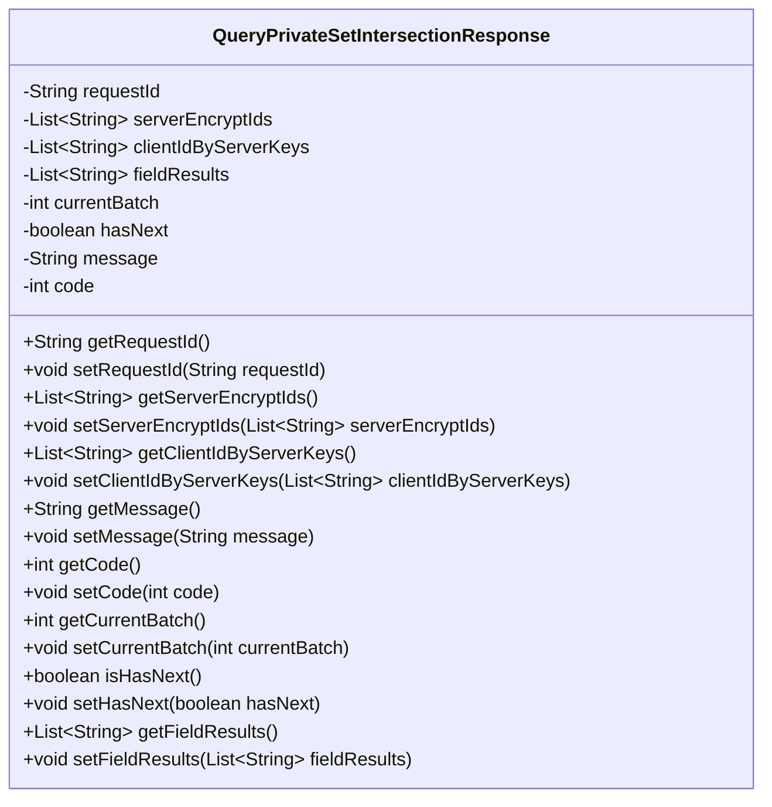

# 基础信息

|      |      |
|------|------|
| 名称 | QueryPrivateSetIntersectionResponse |
| 编码语言 | .java |
| 代码路径 | WeFe/mpc/mpc-common/src/main/java/com/welab/wefe/mpc/psi/request/QueryPrivateSetIntersectionResponse.java |
| 包名 | com.welab.wefe.mpc.psi.request |
| 依赖项 | ['java.util.List'] |
| 概述说明 | 私有集合交集查询响应类，包含请求ID、加密ID列表、客户端ID列表、字段结果、当前批次、是否有下一批次、消息和状态码。 |

# 说明

QueryPrivateSetIntersectionResponse类用于表示私有集合交集查询的响应结果。包含请求ID、服务器加密ID列表、客户端ID列表、字段结果列表等数据。同时记录当前批次号、是否有下一批次标志、状态消息和状态码。提供所有字段的getter和setter方法，支持对响应数据的读取和修改。

# 类列表 Class Summary

| 名称   | 类型  | 说明 |
|-------|------|-------------|
| QueryPrivateSetIntersectionResponse | class | 私有集交集查询响应类，包含请求ID、加密ID列表、客户端ID列表、字段结果、当前批次、是否有下一批次、消息和状态码。 |

## 类 QueryPrivateSetIntersectionResponse

|      |      |
|------|------|
| 访问范围 | public |
| 类型 | class |
| 名称 | QueryPrivateSetIntersectionResponse |
| 说明 | 私有集交集查询响应类，包含请求ID、加密ID列表、客户端ID列表、字段结果、当前批次、是否有下一批次、消息和状态码。 |

### UML类图

这段代码定义了一个名为QueryPrivateSetIntersectionResponse的类，用于封装私有集合交集查询的响应数据。该类包含多个私有字段，如请求ID、服务器加密ID列表、客户端ID列表、字段结果列表、当前批次、是否有下一个批次标志、消息和状态码等，并提供了相应的getter和setter方法。这些字段和方法共同构成了一个完整的响应对象，用于在私有集合交集计算过程中传递和操作数据。

### 内部方法调用关系图

```mermaid
graph TD
    A["类QueryPrivateSetIntersectionResponse"]
    B["属性: String requestId"]
    C["属性: List<String> serverEncryptIds"]
    D["属性: List<String> clientIdByServerKeys"]
    E["属性: List<String> fieldResults"]
    F["属性: int currentBatch"]
    G["属性: boolean hasNext"]
    H["属性: String message"]
    I["属性: int code"]
    J["方法: getRequestId()"]
    K["方法: setRequestId(String)"]
    L["方法: getServerEncryptIds()"]
    M["方法: setServerEncryptIds(List<String>)"]
    N["方法: getClientIdByServerKeys()"]
    O["方法: setClientIdByServerKeys(List<String>)"]
    P["方法: getMessage()"]
    Q["方法: setMessage(String)"]
    R["方法: getCode()"]
    S["方法: setCode(int)"]
    T["方法: getCurrentBatch()"]
    U["方法: setCurrentBatch(int)"]
    V["方法: isHasNext()"]
    W["方法: setHasNext(boolean)"]
    X["方法: getFieldResults()"]
    Y["方法: setFieldResults(List<String>)"]

    A --> B
    A --> C
    A --> D
    A --> E
    A --> F
    A --> G
    A --> H
    A --> I
    A --> J
    A --> K
    A --> L
    A --> M
    A --> N
    A --> O
    A --> P
    A --> Q
    A --> R
    A --> S
    A --> T
    A --> U
    A --> V
    A --> W
    A --> X
    A --> Y
```

该流程图展示了`QueryPrivateSetIntersectionResponse`类的完整结构，包含8个私有属性和14个公共方法。所有属性均为封装类型，通过getter/setter方法进行访问控制，主要用于存储和传输私有集合交集计算的响应数据，包括请求ID、加密ID列表、批次状态和结果字段等核心信息。类设计符合JavaBean规范，支持链式操作和数据封装。

### 字段列表 Field List

| 名称  | 类型  | 说明 |
|-------|-------|------|
| message | String | 私有字符串变量message |
| hasNext | boolean | 布尔变量hasNext，表示是否存在下一个元素。 |
| clientIdByServerKeys | List<String> | 私有字符串列表，存储由服务器密钥生成的客户端ID。 |
| serverEncryptIds | List<String> | 私有字符串列表，存储服务器加密ID。 |
| requestId | String | 私有字符串变量requestId，用于存储请求标识。 |
| currentBatch | int | 当前批次号变量声明 |
| fieldResults | List<String> | 私有字符串列表字段，存储结果数据。 |
| code | int | 私有整型变量code |

### 方法列表

| 名称  | 类型  | 说明 |
|-------|-------|------|
| getServerEncryptIds | List<String> | 获取服务器加密ID列表的方法。 |
| setMessage | void | 设置消息内容的方法，将输入字符串赋值给类的message变量。 |
| getCode | int | 方法返回整型变量code的值。 |
| getCurrentBatch | int | 获取当前批次值的方法，返回整型变量currentBatch。 |
| getClientIdByServerKeys | List<String> | 获取与服务器密钥关联的客户端ID列表。 |
| setCurrentBatch | void | 这是一个Java方法，用于设置当前批次的值。方法接受一个整数参数currentBatch，并将其赋值给类的成员变量currentBatch。 |
| setRequestId | void | 设置请求ID的方法，将传入的requestId赋值给当前对象的requestId属性。 |
| setClientIdByServerKeys | void | 设置客户端ID列表方法，通过服务器密钥列表参数赋值给类成员变量clientIdByServerKeys。 |
| getRequestId | String | 获取请求ID的方法，返回字符串类型的requestId。 |
| setCode | void | 设置整型变量code的值。 |
| setServerEncryptIds | void | 设置服务器加密ID列表的方法，将输入参数赋值给类成员变量serverEncryptIds。 |
| isHasNext | boolean | 该方法返回布尔值hasNext，表示是否存在下一个元素。 |
| setHasNext | void | 设置是否还有下一页的布尔值。 |
| getFieldResults | List<String> | 方法返回字符串列表fieldResults。 |
| setFieldResults | void | Java方法：设置字段结果列表，参数为字符串列表fieldResults。 |
| getMessage | String | 获取message字符串的方法。 |

