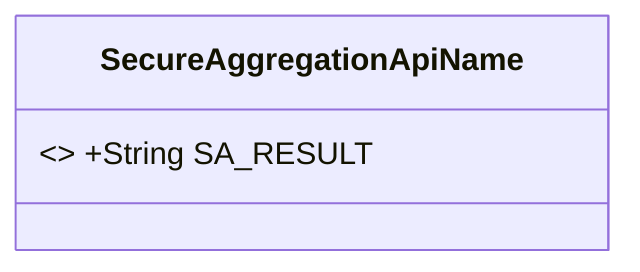
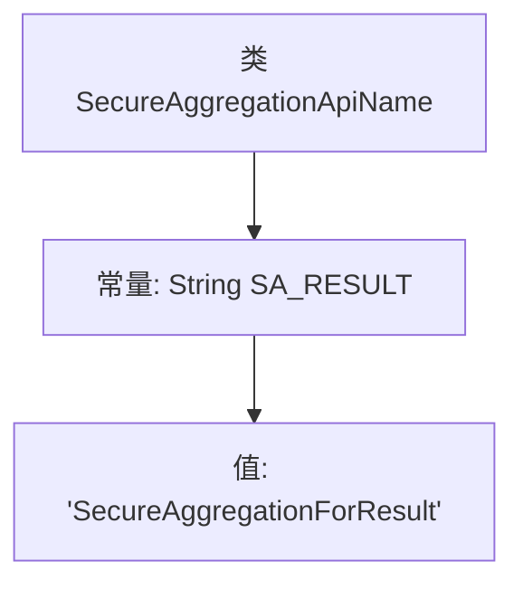

# 基础信息

|      |      |
|------|------|
| 名称 | SecureAggregationApiName |
| 编码语言 | .java |
| 代码路径 | WeFe/mpc/mpc-common/src/main/java/com/welab/wefe/mpc/sa/SecureAggregationApiName.java |
| 包名 | com.welab.wefe.mpc.sa |
| 依赖项 | [] |
| 概述说明 | SecureAggregationApiName类定义了一个公共静态字符串常量SA_RESULT，值为"SecureAggregationForResult"。 |

# 说明

该内容定义了一个名为SecureAggregationApiName的公共类，其中包含一个静态常量字符串SA_RESULT，其值为SecureAggregationForResult。这个类可能用于安全聚合相关的API命名或结果标识。

# 类列表 Class Summary

| 名称   | 类型  | 说明 |
|-------|------|-------------|
| SecureAggregationApiName | class | SecureAggregationApiName类定义了一个公共静态常量SA_RESULT，值为"SecureAggregationForResult"。 |

## 类 SecureAggregationApiName

|      |      |
|------|------|
| 访问范围 | public |
| 类型 | class |
| 名称 | SecureAggregationApiName |
| 说明 | SecureAggregationApiName类定义了一个公共静态常量SA_RESULT，值为"SecureAggregationForResult"。 |

### UML类图

这段代码定义了一个名为`SecureAggregationApiName`的类，其中包含一个公有静态常量`SA_RESULT`，其值为"SecureAggregationForResult"。该类主要用于存储与安全聚合API相关的常量名称，便于在代码中统一引用。由于类仅包含常量定义且无实例方法，其设计意图是作为工具类使用。类图中用`<<final>>`标注了常量的不可变性特征，符合Java常量命名规范。

### 内部方法调用关系图

该流程图描述了SecureAggregationApiName类的结构，该类仅包含一个公开静态常量SA_RESULT，其值为字符串"SecureAggregationForResult"。这是一个典型的常量定义类，用于集中管理API名称等固定字符串，避免代码中硬编码。图中清晰展示了类与常量的从属关系及常量的具体赋值内容。

### 字段列表 Field List

| 名称  | 类型  | 说明 |
|-------|-------|------|
| SA_RESULT = "SecureAggregationForResult" | String | 定义了一个公共静态常量字符串SA_RESULT，值为"SecureAggregationForResult"。 |

### 方法列表

| 名称  | 类型  | 说明 |
|-------|-------|------|

